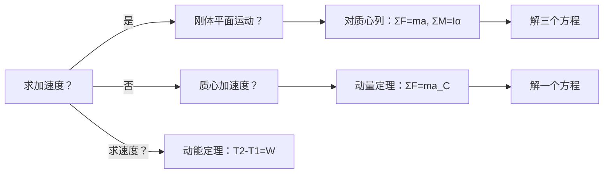

工程力学

# 目录
- [[#第1章 点的运动学]]
- [[#第2章 刚体基本运动]]
- [[#第3章 点的合成运动]]
- [[#第4章 刚体平面运动]]
- [[#第5章 力和力偶]]
- [[#第6章 力系的简化]]
- [[#第7章 约束和受力分析]]
- [[#第8章 刚体与刚体系的平衡]]
- [[#第9章 质点动力学]]
- [[#第10章 动力学普遍定理]]
- [[#第11章 分析力学基础]]

## 补充
向量叉乘
向量a,b
叉乘计算
$\begin{bmatrix}i&j&k \\a_x & a_y & a_z \\ b_x & b_y & b_z \end{bmatrix}$

# 第1章 点的运动学
1. 曲率
$k = {d\theta \over ds}$
2. 曲率半径
$\rho = {1 \over k}$
3. 弧坐标，定轨迹
给定点的运动轨迹，只需一个广义坐标即可确定位置
弧坐标，在轨迹上选一点为坐标原点，规定正方向，弧长即为坐标
4. 弧坐标下的运动分析
$\dot s$是对距离求导，s是轨迹上离原点的距离
    1. 速度
  $\vec v = \dot{s}(t) \vec \tau, \vec \tau$是单位切向量，
    2. 加速度
    对速度求导
  $\vec a = \ddot s(t) \vec \tau + \dot s \dot{\vec \tau}$
  其中，第一项为切向加速度，第二项为法向加速度，法向加速度的大小又为${\dot s ^2 \over \rho}$

什么时候使用矢量法，直角坐标系法，自然坐标系法

# 第2章 刚体基本运动
## 2.1 平动
1. 刚体上的任意直线的方向始终保持不变，移动前后的直线平行
2. 各点的轨迹相似，速度和加速度完全相同，可以转化为点的运动。
## 2.2 定轴转动
1. 定义：至少有某一线段的绝对位置始终保持不变（比如它的轴）
2. 运动方程$\phi = \phi (t)$
从z轴的正向看，逆时针为正，顺时针为负
3. 将三维刚体投影为二维平面
## 2.3 角速度和角加速度的矢量表示
## 2.4 点的速度和加速度的矢量积表示
1. 加速度分解
	切向加速度：$\vec{a}_{t} = \vec{\alpha}\times \vec{r}$
	法向加速度：$\vec{a}_{n} = \vec{\omega} \times \vec{v}$

# 第3章 点的合成运动
## 3.1 基本概念
1. 基本概念
	一点：研究点
	两系：定参考系、动参考系
	三运动：绝对运动、相对运动和牵连运动
	    绝对运动(absolute motion):动点  定系的运动。（点的运动）
	    相对运动(relative motion):动点  动系的运动。（点的运动）
	    牵连运动(convected motion):动系  定系的运动。（刚体的运动）

2. 概念补充
	- 动点在绝对运动中的轨迹、速度和加速度称为动点的绝对轨迹、绝对速度$\vec v_a$和绝对加速度$\vec a_a$。
	- 动点在相对运动中的轨迹、速度和加速度称为动点的相对轨迹、相对速度$\vec v_r$和相对加速度$\vec a_r$。
	- 动参考系不是一个点，因此为了讨论牵连运动，定义在任意瞬时，动参考系上与动点重合的那一点(瞬时重合点)称为牵连点，牵连点不是动系上的一个固定点。
	- 牵连运动中，动系上牵连点的速度和加速度称为牵连速度$\vec v_e$和牵连加速度$\vec a_e$。
	- 假设分析t1时刻，这时牵连点M1在动系中就是确定的，即使下一时刻t2中M1不再和动点重合；如果选取每一时刻动点重合点作为牵连运动轨迹，就会分析称绝对运动轨迹！

3. 要素的选择
原则:
(1)动点对动系要有相对运动，即动点与动系不能选在同一刚体上;
(2)动点的相对轨迹要容易确定，最好为直线或圆弧。
具体选择：
(1)选择持续(固定)接触点为动点;
(2)动系固连在瞬时重合点所在的物体上，这样相对运动轨迹就很容易确定;
(3)对没有持续接触点的问题，一般不选择瞬时接触点为动点。根据选择原则具体问题具体分析。

## 3.2 点的速度合成定理
1. 定理
在任意瞬时，总有动点的绝对速度等于相对速度与牵连速度的矢量和
$$
\vec v_a = \vec v_r + \vec v_e
$$
2. 解题步骤
    1. 选定三要素
    2. 根据定理列出方程，大小和方向，一共有六个量，可以解出两个未知量（通常将不需要的量投影为0，方便计算）

## 3.3 点的加速度合成定理
### 3.3.1 牵连运动为**平移**时的加速度合成定理  
| **内容**                | **表达式**                              | **物理意义**                                  | **关键条件**               |
|-------------------------|----------------------------------------|---------------------------------------------|--------------------------|
| **绝对加速度** $\vec{a}_a$ | $\vec{a}_a = \vec{a}_e + \vec{a}_r$    | 绝对加速度 = 牵连加速度（动系平移） + 相对加速度 | 牵连运动为**平移**（$\vec{\omega}_e = 0$） |
| **公式说明**            | - $\vec{a}_e$：动系上与动点重合的点的加速度- $\vec{a}_r$：动点相对于动系的加速度 | 无额外项！**科氏加速度为0**（因牵连运动无转动） | **考试高频点**：平移时无需考虑科氏加速度！ |

### 3.3.2 牵连运动为**转动**时的加速度合成定理  
| **内容**                | **表达式**                              | **物理意义**                                  | **关键条件**               |
|-------------------------|----------------------------------------|---------------------------------------------|--------------------------|
| **绝对加速度** $\vec{a}_a$ | $\vec{a}_a = \vec{a}_e + \vec{a}_r + \vec{a}_c$ | 绝对加速度 = 牵连加速度 + 相对加速度 + **科氏加速度** | 牵连运动为**转动**（$\vec{\omega}_e \neq 0$） |
| **科氏加速度** $\vec{a}_c$ | $\vec{a}_c = 2 \vec{\omega}_e \times \vec{v}_r$ | 由牵连转动与相对运动共同产生，**方向垂直于 $\vec{\omega}_e$ 和 $\vec{v}_r$** | **易错点**：大小 $a_c = 2 \omega v_r \sin\theta$（$\theta$ 为 $\vec{\omega}_e$ 与 $\vec{v}_r$ 夹角） |

# 第4章 刚体平面运动

### 二、核心公式（必背！）

设刚体上两点 $A$ 和 $B$，其中 $A$ 为**基点**，则 $B$ 点的加速度为：

$$
\boxed{
\vec{a}_B = \vec{a}_A + \vec{a}_{B/A}^{\,t} + \vec{a}_{B/A}^{\,n}
}
$$

其中：
- $\vec{a}_A$：基点 $A$ 的**绝对加速度**；
- $\vec{a}_{B/A}^{\,t}$：$B$ 相对于 $A$ 的**切向加速度**（由角加速度引起）；
- $\vec{a}_{B/A}^{\,n}$：$B$ 相对于 $A$ 的**法向加速度**（由角速度引起，指向 $A$）。

#### 分量表达式（矢量形式）：
$$
\begin{aligned}
\vec{a}_{B/A}^{\,t} &= \vec{\alpha} \times \vec{r}_{B/A} \\
\vec{a}_{B/A}^{\,n} &= \vec{\omega} \times (\vec{\omega} \times \vec{r}_{B/A}) = -\omega^2 \vec{r}_{B/A}
\end{aligned}
$$

> 其中：
> - $\vec{r}_{B/A}$：从 $A$ 指向 $B$ 的位置矢量（在刚体上固定）；
> - $\vec{\omega}$：刚体角速度（垂直于运动平面，$\omega = \dot{\theta}$）；
> - $\vec{\alpha} = \dot{\vec{\omega}}$：刚体角加速度。

# 第5章 力和力偶
# 第6章 力系的简化
# 第7章 约束和受力分析

|约束类型|图示特征|能限制的运动|约束力特点|自由度减少数|典型工程实例|
|---|---|---|---|---|---|
|1. 柔索约束   （绳、链条、皮带）|只能受拉|沿柔索伸长方向的位移|拉力，沿柔索中心线背离被约束物体|1|吊车钢丝绳、缆绳、传送带|
|2. 光滑接触面约束|两物体表面光滑接触|沿接触面法向的压入运动|法向压力，沿公法线指向被约束物体|1|齿轮啮合（忽略摩擦）、球靠在墙上、滚子与导轨|
|3. 光滑铰链约束   （固定铰/连接铰）|圆柱销连接|x、y 方向平动（平面内）||2|门窗合页、连杆铰接点|
|4. 固定端约束   （夹支端）|物体一端完全嵌固|平动 + 转动||3|电线杆埋入地下、悬臂梁根部|
|5. 活动铰支座   （辊轴支座）|支座下带滚轮|垂直于支撑面的位移|单个法向力，垂直于支撑面|1|桥梁活动支座、热膨胀允许滑动的管道支架|
|6. 固定铰支座|销钉固定于基础|x、y 方向平动||2|门底合页、桁架端部支座|
|7. 二力杆（链杆）约束|两端铰接、自重不计、无外力|沿杆轴线以外的运动|沿杆轴线的拉力或压力|1|桁架腹杆、千斤顶连杆|
|8. 中间铰链   （内部铰、连接铰）|连接两个构件的销钉，不与地基相连|相对平动（x、y方向）||2（对整体系统）|多跨静定梁的中间连接处、三铰刚架的顶铰、复合机构连接点|
|9. 滑动轴承/径向轴承|轴穿入轴承孔|径向（x、y）位移||2|电机转子轴承|
|10. 止推轴承|轴向+径向固定|x、y、z 平动 + 绕 x、y 转动|三个正交力 + 两个力偶（空间）|5|汽车变速箱主轴|

# 第8章 刚体与刚体系的平衡
# 第9章 质点动力学
# 第10章 动力学普遍定理

以下是对**动力学普遍定理**的系统梳理，以**公式为核心、用法为关键、工程应用为导向**，整理为清晰的 **Markdown 笔记**。内容严格遵循《理论力学》教材体系，突出**期末高频考点**和**解题易错点**，助你高效复习。

---

## 🔬 动力学普遍定理核心公式与用法（期末必背！）

> **核心思想**：  
> **动量定理 → 质心运动定理（等价）**  
> **动量矩定理 → 转动微分方程（等价）**  
> **动能定理 → 能量法（求解速度/加速度）**

---

### 一、动量定理与质心运动定理（矢量形式）

#### 1. **动量定理**（对任意固定点 O）
$$
\boxed{\frac{d\vec{p}}{dt} = \sum \vec{F}_e}
$$
- $\vec{p} = m \vec{v}_C$：系统动量（$\vec{v}_C$ 为质心速度）
- $\sum \vec{F}_e$：**所有外力的矢量和**
- **用法**：  
  - 求**质心加速度**（$\vec{a}_C = \frac{1}{m} \sum \vec{F}_e$）  
  - **守恒条件**：$\sum \vec{F}_e = 0 \implies \vec{p} = \text{常矢量}$（如火箭喷气、碰撞问题）

#### 2. **质心运动定理**（标量形式，平面问题）
$$
\begin{aligned}
\sum F_{ex} &= m a_{Cx} \\
\sum F_{ey} &= m a_{Cy}
\end{aligned}
$$
- **用法**：  
  - 直接求质心加速度（**无需分析内力**！）  
  - **守恒条件**：$\sum F_{ex} = 0 \implies v_{Cx} = \text{常量}$；$\sum F_{ey} = 0 \implies v_{Cy} = \text{常量}$

> ✅ **工程应用**：  
> - 人船问题（质心位置不变）  
> - 火箭推进（动量守恒）  
> - 碰撞问题（动量守恒求碰撞后速度）

---

### 二、动量矩定理（对固定点 O）

#### 1. **动量矩定理**（对固定点 O）
$$
\boxed{\frac{d\vec{H}_O}{dt} = \sum \vec{M}_O(\vec{F}_e)}
$$
- $\vec{H}_O = \vec{r}_C \times m \vec{v}_C + \vec{H}_C$：对 O 点的动量矩  
- $\sum \vec{M}_O(\vec{F}_e)$：所有外力对 O 点的力矩矢量和
- **用法**：  
  - 求**角加速度**（$\alpha = \frac{d\omega}{dt}$）  
  - **守恒条件**：$\sum \vec{M}_O(\vec{F}_e) = 0 \implies \vec{H}_O = \text{常矢量}$（如地球自转、陀螺仪）

#### 2. **对质心 C 的动量矩定理**（更常用！）
$$
\boxed{\frac{d\vec{H}_C}{dt} = \sum \vec{M}_C(\vec{F}_e)}
$$
- $\vec{H}_C = I_C \vec{\omega}$：对质心的动量矩（$I_C$ 为转动惯量）
- **用法**：  
  - **刚体平面运动**的微分方程核心！  
  - **守恒条件**：$\sum \vec{M}_C(\vec{F}_e) = 0 \implies \vec{H}_C = \text{常矢量}$（如匀速转动的飞轮）

> ✅ **工程应用**：  
> - 旋转机械（飞轮、涡轮）的角加速度计算  
> - 陀螺仪导航（动量矩守恒）

---

### 三、刚体转动微分方程（核心！）

#### 1. **刚体定轴转动**（轴通过质心）
$$
\boxed{I_C \alpha = \sum M_C}
$$
- $I_C$：对质心的转动惯量（单位：kg·m²）  
- $\alpha = \frac{d\omega}{dt}$：角加速度  
- **用法**：  
  - 直接求角加速度（$\alpha = \frac{\sum M_C}{I_C}$）  
  - **注意**：$\sum M_C$ 为**所有外力对质心的力矩**（含约束力矩）

#### 2. **刚体平面运动**（一般情况）
$$
\begin{aligned}
\sum F_{ex} &= m a_{Cx} \\
\sum F_{ey} &= m a_{Cy} \\
\sum M_C &= I_C \alpha
\end{aligned}
$$
- **用法**：  
  - **三个方程解三个未知量**（$a_{Cx}, a_{Cy}, \alpha$）  
  - **关键**：对质心列方程！避免求约束力（如轴承力）

> ✅ **工程应用**：  
> - 车轮滚动（纯滚动条件 $a_C = \alpha R$）  
> - 机械臂运动分析  
> - 滚动圆盘的加速度计算

---

### 四、动能定理（求解速度/加速度的利器）

#### 1. **动能定理**（系统）
$$
T_2 - T_1 = W_{1 \to 2}^e + W_{1 \to 2}^i
$$
- $T = \frac{1}{2} m v_C^2 + \frac{1}{2} I_C \omega^2$：系统动能  
- $W_{1 \to 2}^e$：**所有外力做功**  
- $W_{1 \to 2}^i$：**所有非保守内力做功**（如摩擦力，常为 0）

#### 2. **功能原理**（保守力系统）
$$
T_2 + V_2 = T_1 + V_1
$$
- $V$：势能（重力势能 $V = mgh$，弹性势能 $V = \frac{1}{2} k x^2$）  
- **用法**：  
  - 求**速度**（避免求加速度，更简便！）  
  - **守恒条件**：$W_{1 \to 2}^i = 0$ 且 $\sum \vec{F}_e$ 为保守力

> ✅ **工程应用**：  
> - 摆锤问题（求最低点速度）  
> - 弹簧-质量系统（求振幅）  
> - 机械能守恒的判断（如滑轮系统）

---

## ⚠️ 五、关键对比与易错点（期末必看！）

| 定理 | 核心公式 | 常见错误 | 正确用法 |
|------|----------|----------|----------|
| **动量定理** | $\frac{d\vec{p}}{dt} = \sum \vec{F}_e$ | 忽略外力（如把约束力当内力） | **只考虑外力**！ |
| **动量矩定理** | $\frac{d\vec{H}_C}{dt} = \sum \vec{M}_C$ | 对固定点列方程（应选质心） | **优先对质心列方程**！ |
| **刚体平面运动** | $\sum F_x = m a_{Cx}, \sum M_C = I_C \alpha$ | 混淆 $a_C$ 与 $\alpha$ | **三个方程解三个未知量** |
| **动能定理** | $T_2 - T_1 = W_{\text{外力}}$ | 未计算动能（漏掉转动部分） | **$T = \frac{1}{2} m v_C^2 + \frac{1}{2} I_C \omega^2$** |

✅ 总结：动力学定理使用流程图

# 第11章 分析力学基础
1. 在矢量力学中，通过约束力来表征约束。在分析力学中，通过约束方程来表征。
   - 矢量力学需要显式考虑约束力，如绳子张力、支持力等
   - 分析力学通过约束方程 $f(r_1,r_2,...,r_n,t)=0$ 隐含处理约束
   - 分析力学通过引入广义坐标，自动满足约束条件，无需单独求解约束力

2. 完整约束
   - 约束方程仅与位置坐标和时间有关，不涉及速度
   - 数学形式：$f(q_1,q_2,...,q_n,t)=0$
   - 每个完整约束可减少系统一个自由度
   - 例如：刚性杆约束 $x^2+y^2=l^2$，质点在固定曲面上的运动

3. 双边约束
   - 约束方程以等式形式给出
   - 系统必须严格满足约束条件
   - 例如：$x^2+y^2=R^2$（质点必须在圆周上）
   - 与单侧约束（不等式形式，如 $x^2+y^2 \leq R^2$）不同，不允许偏离约束面

4. 理想约束
   - 约束反力在任意虚位移上所做的虚功之和为零：$\sum \vec{R_i} \cdot \delta \vec{r_i} = 0$
   - 常见理想约束：光滑接触面、光滑铰链、无重刚杆、不可伸长柔索
   - 非理想约束例子：滑动摩擦、可伸缩弹簧
   - 理想约束下，约束力不会出现在拉格朗日方程中

5. 第二类拉格朗日方程
   - 标准形式：$\frac{d}{dt}\left(\frac{\partial L}{\partial \dot{q}_i}\right) - \frac{\partial L}{\partial q_i} = 0$
   - 其中 $L = T - V$ 为拉格朗日函数，$T$ 为动能，$V$ 为势能
   - 非保守系统：$\frac{d}{dt}\left(\frac{\partial L}{\partial \dot{q}_i}\right) - \frac{\partial L}{\partial q_i} = Q_i$
   - 适用于完整约束系统，自动消除理想约束力

6. 用法
   1. 分析约束类型，确定系统自由度
   2. 选择合适的广义坐标 $q_1,q_2,...,q_n$
   3. 用广义坐标表示系统动能 $T$ 和势能 $V$
   4. 构建拉格朗日函数 $L = T - V$
   5. 对每个广义坐标应用拉格朗日方程
   6. 求解得到的运动微分方程
   - 优势：无需计算约束力，适用于任意坐标系，形式统一
   - 适用范围：完整约束系统，可扩展至非保守系统和场论
   7. 用法补充
   常量主动力可以看做保守力，加入到势能的计算中；
   势能的计算可以使用势能的变化量，因为与零势能点的选取有关，最后只剩变化量与坐标有关，其余常量在求导时略去

# 材料力学
> 材料力学将讨论力的内效应，也就是物体将作为变形体被分析

1. 基本概念
2. 两种形变
弹性变形：可恢复
塑形变形：不可恢复
3. 任务
强度问题（断裂，塑性变形）
刚度问题（弹性，抵抗变形的能力）
稳定性要求
## 基本假设
1. 连续性假设
材料无空隙地填充于整个构件
2. 均匀性假设
构件内每一处的力学性能相同
3. 各向同性假设
构件任一处材料沿各个方向的力学性能相同
4. 小变形假设
无论变形还是变形引起的位移，都远小于构件的最小尺寸。
这样的变形仅用于计算力，而不影响运动方程 
要点：原始尺寸原理：列平衡方程时，忽略变形，用变形前的形状和尺寸
数值分析线性化：变形分析时用直线替代曲线
## 构件的分类
1. 分类
杆、板、壳、块
主要研究杆件，一个方向长度远大于其它两个方向
2. 杆的两个主要几何因素
	1. 横截面：垂直于长度方向
	2. 轴线：各个横截面形心的连线
# 内力分析
## 内力与基本变形
1. 内力
由外力引起的，杆件内部各部分之间相互作用力的***改变量***称为附加内力，简称内力
大小随着外力的改变而变化，大小和分布方式与杆件的强度、刚度和稳定性有关
2. 分析内力
假象截面，在截面上有分布力，
先向形心化简成一个主矢和主矩
再各自沿三个轴线方向分解
其中平行轴线方向的分量为轴力 $F_N$、扭矩$T$
垂直轴线方向的分量为剪力$F_{sy}\ F_{sz}$、弯矩$M_y\ M_z$
3. 
## 内力方程与内力图
> 最后要能够跳过内力方程直接画出内力图，这样最直观

1. 轴力方程
同一位置的两个截面上的内力分量必须有相同的正负号
规定，指向截面外的轴力为正，向内为负
列平衡方程求未知量的时候，依然可以假设其为正方向
2. 轴力图
	1. 分界，分段点在外力作用的地方
	2. 整幅图从0开始，到0结束
	3. 突变大小是外力大小
	4. 突变方向看外力，与轴力方向的规定相同
3. 扭矩方程与扭矩图
$M = 9549\frac{p}{n}$
其中功率的单位是千瓦，转速的单位是转每分钟
方向规定与轴力相同
画图规则通用
4. 剪力方程、弯矩方程、剪力图、弯矩图
剪力：
绕研究对象***顺时针***为正剪力，反之为负
左上右下为正，左指的是在保留段的左面
弯矩：
在观察视角，使研究对象下凸的为正弯矩，上凸的为负弯矩
左顺右逆为正
5. 控制截面
6. 剪力、弯矩和外力的关系
$\frac{dF_s(x)}{dx}=q(x)$
$\frac{dM(x)}{dx}=F_s(x)$
$\frac{d^2M(x)}{dx^2}=q(x)$
先根据外力画出剪力的分布，再根据剪力和弯矩的关系画出弯矩
分布力为0，剪力水平，弯矩水平或一次
分布力非0，剪力一次，弯矩二次
集中力，剪力突变，弯矩折线
集中力偶，剪力水平，弯矩一次
注意，集中力偶的剪力图是直线，但弯矩图会再在有力偶的地方突变

# 应力分析
## 
1. 平均应力
某截面内平均应力 $p_{av} = \frac{\Delta F}{\Delta A}$
单位Pa
2. 点的应力
面积趋于零 $p_{av} = \lim_{\Delta A\to 0} \frac{\Delta F}{\Delta A}$
正应力（轴向力）$\sigma = \frac{\Delta F_N}{\Delta A}$
切应力、剪应力（剪向力）$\tau = \frac{\Delta F_S}{\Delta A}$
3. 单元体
	为了分析点的应力，绕该点截取无穷小的正方体，称为单元体
	- 单元体的每个面上的应力时均匀的
	- 相互平行的截面上，应力大小相同，
4. 主单元体
各个面上只有正应力的单元体
5. 主平面
切应力为0的平面
6. 主应力
主平面上的正应力
排序按照代数大小排序
7. 三向应力状态
三个主应力都不为零
同理，二向，单向
8. 1
在单元体上，切应力和正应力大小相同，方向共同指向或背离交线
9. 1
## 平面应力状态的解析法
1. 方向规定
切应力对单元体内任意一点取矩
2. 任意斜截面的切应力和正应力计算公式
任意斜截面上的正应力和切应力公式如下：
$$
\sigma_{\alpha} = \frac{\sigma_x + \sigma_y}{2} + \frac{\sigma_x - \sigma_y}{2} \cos 2\alpha - \tau_{xy} \sin 2\alpha
$$
$$
\tau_{\alpha} = \frac{\sigma_x - \sigma_y}{2} \sin 2\alpha + \tau_{xy} \cos 2\alpha
$$
3. 应力极值
对上面公式中对角度求导即可求得
正应力极值，切应力一定为0
切应力极值，正应力不一定为0
这两个面的夹角为45度

## 13.2 广义胡克定律
1. 变形
形状或几何尺寸发生的变化
2. 位移
受力后点的位置的改变
3. 区别与关系
有变形就有位移
有位移不一定有变形
由于变形体受到外力的位置不同变形会不同，因此在变形体不能随意等效力系
4. 变形
**泊松比关系式**：
   $$
   \varepsilon_{\perp} = -\mu \varepsilon_x
   $$
**线应变定义**：
   $$
   \varepsilon_x = \frac{du}{dx}
   $$
切应变：直角的改变量
**横向应变（y 方向）**：
   $$
   \varepsilon_y = -\frac{dv}{dy}
   $$
**横向应变（z 方向）**：
   $$
   \varepsilon_z = -\frac{dw}{dz}
$$
注：图中“$\varepsilon_{\perp}$”表示横向应变，“$\mu$”为泊松比，“$\varepsilon_x$”为（正）线应变。下方手写标注“0.5”、“0.3”可能是泊松比的示例值。
5. 应力与应变
应力 = 弹性模量（剪切模量）×应变量
6. 广义胡克定律
7. 叠加法
正应变只和正应力有关
切应变只和切应力有关
因此对于一般应力状态，可以利用叠加法求得各个方向的应变
8. 主应变
主单元体三个方向上的应变

# 第十四章 刚度和强度分析
## 14.1 
1. 失效
2. 许用应力
塑形材料失效
脆性材料失效
3. 安全系数
4. 强度条件
5. 刚度条件
## 14.2 基本变形下的强度和刚度
1. 平面假设
拉，压杆轴力横截面的应力均匀分布，即相等
2. 拉压杆的变形
拉压刚度
3. 连接件的强度
由于实际受力复杂难计算，工程中常用假定计算法
假设应力在截面上均匀分布
4. 挤压
挤压面
挤压力
计算时用挤压面的投影面（有效挤压面）
5. 扭转
扭转切应力
6. 扭转变形（了解）
7. 弯曲
受弯矩，不受剪力
只有正应力，没有切应力
正应力一半是拉，一半是压
8. 1
9. 1
10. 1

### 未分类
1. 单位向量$\vec e$
$\vec e \cdot \vec e = 1$
求导$2(\vec e \cdot \vec e \prime) = 0$
即 $\vec e \prime \perp \vec e$, 但$\vec e \prime$不一定为0
2. 词头一般用在分母
3. 0.1~1000规则
4. 力的作用效应
内效应：形变
外效应：运动状态
5. 约束的类型与分类
    1. 自由体：在空间中任意运动的物体
    2. 非自由体：运动受限的物体
    3. 约束：限制运动的条件(可用方程表示)
    4. 约束体：约束非自由体运动的物体
    5. 约束方程：约束条件的数学表达式
    6. 约束力：约束体作用在非自由体上的力
    7. 自由度数 = 广义坐标数
    = 系统坐标数 - 约束方程数

