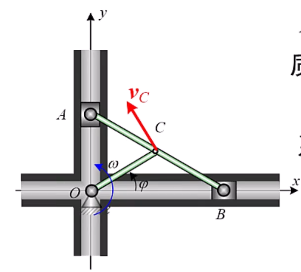
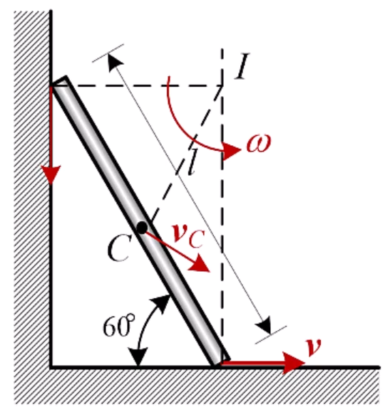

工程力学

# 目录
- [[#第1章 点的运动学]]
- [[#第2章 刚体基本运动]]
- [[#第3章 点的合成运动]]
- [[#第4章 刚体平面运动]]
- [[#第5章 力和力偶]]
- [[#第6章 力系的简化]]
- [[#第7章 约束和受力分析]]
- [[#第8章 刚体与刚体系的平衡]]
- [[#第9章 质点动力学]]
- [[#第10章 动力学普遍定理]]
- [[#第11章 分析力学基础]]

## 补充
向量叉乘
向量a,b
叉乘计算
$\begin{bmatrix}i&j&k \\a_x & a_y & a_z \\ b_x & b_y & b_z \end{bmatrix}$

# 第1章 点的运动学
1. 曲率
$k = {d\theta \over ds}$
2. 曲率半径
$\rho = {1 \over k}$
3. 弧坐标，定轨迹
给定点的运动轨迹，只需一个广义坐标即可确定位置
弧坐标，在轨迹上选一点为坐标原点，规定正方向，弧长即为坐标
4. 弧坐标下的运动分析
$\dot s$是对距离求导，s是轨迹上离原点的距离
    1. 速度
  $\vec v = \dot{s}(t) \vec \tau, \vec \tau$是单位切向量，
    2. 加速度
    对速度求导
  $\vec a = \ddot s(t) \vec \tau + \dot s \dot{\vec \tau}$
  其中，第一项为切向加速度，第二项为法向加速度，法向加速度的大小又为${\dot s ^2 \over \rho}$

什么时候使用矢量法，直角坐标系法，自然坐标系法

# 第2章 刚体基本运动
## 2.1 平动
1. 刚体上的任意直线的方向始终保持不变，移动前后的直线平行
2. 各点的轨迹相似，速度和加速度完全相同，可以转化为点的运动。
## 2.2 定轴转动
1. 定义：至少有某一线段的绝对位置始终保持不变（比如它的轴）
2. 运动方程$\phi = \phi (t)$
从z轴的正向看，逆时针为正，顺时针为负
3. 将三维刚体投影为二维平面
## 2.3

# 第3章 点的合成运动
## 3.1 基本概念
1. 基本概念
一点：研究点
两系：定参考系、动参考系
三运动：绝对运动、相对运动和牵连运动
    绝对运动(absolute motion):动点  定系的运动。（点的运动）
    相对运动(relative motion):动点  动系的运动。（点的运动）
    牵连运动(convected motion):动系  定系的运动。（刚体的运动）
2. 概念补充
动点在绝对运动中的轨迹、速度和加速度称为动点的绝对轨迹、绝对速度$\vec v_a$和绝对加速度$\vec a_a$。
动点在相对运动中的轨迹、速度和加速度称为动点的相对轨迹、相对速度$\vec v_r$和相对加速度$\vec a_r$。
动参考系不是一个点，因此为了讨论牵连运动，定义在任意瞬时，动参考系上与动点重合的那一点(瞬时重合点)称为牵连点，牵连点不是动系上的一个固定点。
牵连运动中，动系上牵连点的速度和加速度称为牵连速度$\vec v_e$和牵连加速度$\vec a_e$。

3. 要素的选择
原则:
(1)动点对动系要有相对运动，即动点与动系不能选在同一刚体上;
(2)动点的相对轨迹要容易确定，最好为直线或圆弧。
具体选择：
(1)选择持续(固定)接触点为动点;
(2)动系固连在瞬时重合点所在的物体上，这样相对运动轨迹就很容易确定;
(3)对没有持续接触点的问题，一般不选择瞬时接触点为动点。根据选择原则具体问题具体分析。

## 3.2 点的速度合成定理
1. 定理
在任意瞬时，总有动点的绝对速度等于相对速度与牵连速度的矢量和
$$
\vec v_a = \vec v_r + \vec v_e
$$
2. 解题步骤
    1. 选定三要素
    2. 根据定理列出方程，大小和方向，一共有六个量，可以解出两个未知量（通常将不需要的量投影为0，方便计算）

# 第4章 刚体平面运动
# 第5章 力和力偶
# 第6章 力系的简化
# 第7章 约束和受力分析
# 第8章 刚体与刚体系的平衡
# 第9章 质点动力学
# 第10章 动力学普遍定理
## 动量定理
1. 质点的动量
    - **定义**：质点的质量与其速度的乘积称为 **质点的动量**。  
  某瞬时质量为 $m$ 的质点的动量 $\vec{p}$：  
  $$
      \vec{p} = m\vec{v}
      $$

    - **矢量性**：  
      质点的动量是**矢量**，方向与质点速度的方向一致。

    - **单位**：$\mathrm{kg \cdot m/s}$

    - **量纲**：$\mathrm{MLT^{-1}}$

2. 质点系的动量
    - **定义**：质点系的动量定义为质点系中各质点的动量的矢量和。  
  $$
      \vec{p} = \sum m_i \vec{v}_i
      $$

    - **与质心的关系**：

      - 根据质点系质心的矢径：  
  $$
        \vec{r}_C = \frac{\sum m_i \vec{r}_i}{\sum m_i} = \frac{\sum m_i \vec{r}_i}{M}
        $$

      - 两边对时间求导，得质心速度：  
  $$
        \vec{v}_C = \frac{\sum m_i \vec{v}_i}{M}
        $$

      - 代入动量表达式，可写为：  
  $$
        \vec{p} = M \vec{v}_C
        $$

    - 结论：  
      质点系的动量等于质点系的总质量乘以质心的速度。

3. 例题1
  仅AB块有质量，求该系统的动量
    - **核心公式**：  
  $$
      \vec{p} = M \vec{v}_C
      $$  
  其中 $M$ 为系统总质量，$\vec{v}_C$ 为质心速度。

    - **质心位置与速度**：  
  质心为点 $C$，其速度表达式为：  
  $$
      \vec{v}_C = -\omega l \sin\varphi \cdot \vec{i} + \omega l \cos\varphi \cdot \vec{j}
      $$

    - **系统质量**：  
  设 $m_A = m_B = m$，则  
	$$
      M = m_A + m_B = 2m
      $$

    - **系统动量计算**：  
	  $$
      \vec{p} = M \vec{v}_C = 2m \left( -\omega l \sin\varphi \, \vec{i} + \omega l \cos\varphi \, \vec{j} \right) \\
      \vec{p} = 2l\omega m (-\sin\varphi \, \vec{i} + \cos\varphi \, \vec{j})
      $$

    ✅ 解题思路总结：

    1. 确定系统由哪些质点构成（本例为 A 和 B）。
    2. 计算系统总质量 $M$，求出质心的位置
    3. 求出质心 C 的瞬时速度 $\vec{v}_C$（需结合几何关系和运动学分析）。
    4. 直接代入 $\vec{p} = M \vec{v}_C$ 得到系统总动量。

4. 例题2
 求匀质杆的动量
$$
\omega = \frac{v}{BI} = \frac{2v}{\sqrt{3}l}
$$

$$
v_C = \omega \cdot CI = \frac{2v}{\sqrt{3}l} \cdot \frac{l}{2} = \frac{\sqrt{3}}{3}v
$$

$$
p = m v_C = \frac{\sqrt{3}}{3} m v
$$

5. 冲量
	- **物理意义**：  
	  物体运动状态的改变不仅与作用其上的力有关，还与力作用的时间有关。
	
	- **定义**：  
	  把**力与其作用时间的乘积**称为 **冲量**，反映力在一段时间内对物体作用的累积效果。
	
	- **矢量性**：  
	  冲量是**矢量**，用 $\vec{I}$ 表示，方向与力的方向一致。
	
	- **计算公式**：
	
	  - 若力 $\vec{F}$ 为常矢量：  
		$$
	    \vec{I}_{12} = \vec{F}(t_2 - t_1) = \vec{F} \Delta t
	    $$
	
	  - 若力 $\vec{F}$ 随时间变化，则在微小时间段内：  
		$$
	    d\vec{I} = \vec{F} dt
	    $$  
	    总冲量为积分形式：  
		$$
	    \vec{I} = \int_{t_1}^{t_2} \vec{F} \, dt
	    $$
	
	- **单位**：$\mathrm{N \cdot s}$（牛顿·秒）

6. 质点的动量定理
	
	  - **基本推导**：  
	    一个质量为 $m$ 的质点受到力 $\vec{F}$ 的作用，根据牛顿第二定律：  
	    $$
	    m\vec{a} = \vec{F}
	    $$  
	    质点的加速度定义为：  
	    $$
	    \vec{a} = \frac{d\vec{v}}{dt}
	    $$  
	    代入得：  
	    $$
	    m\vec{a} = \vec{F} \quad \Rightarrow \quad \frac{d}{dt}(m\vec{v}) = \vec{F}
	    $$
	
	  - **动量形式表达**：  
	    定义动量 $\vec{p} = m\vec{v}$，则：  
	    $$
	    \frac{d\vec{p}}{dt} = \vec{F}
	    $$  
	    ➤ **物理意义**（红色强调）：  
	    作用在质点上的力 $\vec{F}$ 等于质点动量的变化率。
	
	  - **微分与积分形式**：
	
	    - 微分形式：  
	      $$
	      d\vec{p} = \vec{F} dt
	      $$
	
	    - 积分形式（从 $t_1$ 到 $t_2$）：  
	      $$
	      \vec{p}_2 - \vec{p}_1 = \int_{t_1}^{t_2} \vec{F} \, dt = \vec{I}
	      $$  
	      即：**质点动量的增量等于合外力在此段时间内的冲量**。

## 动量矩定理
## 功和动能定理

# 第11章 分析力学基础
1. 在矢量力学中，通过约束力来表征约束。在分析力学中，通过约束方程来表征。
   - 矢量力学需要显式考虑约束力，如绳子张力、支持力等
   - 分析力学通过约束方程 $f(r_1,r_2,...,r_n,t)=0$ 隐含处理约束
   - 分析力学通过引入广义坐标，自动满足约束条件，无需单独求解约束力

2. 完整约束
   - 约束方程仅与位置坐标和时间有关，不涉及速度
   - 数学形式：$f(q_1,q_2,...,q_n,t)=0$
   - 每个完整约束可减少系统一个自由度
   - 例如：刚性杆约束 $x^2+y^2=l^2$，质点在固定曲面上的运动

3. 双边约束
   - 约束方程以等式形式给出
   - 系统必须严格满足约束条件
   - 例如：$x^2+y^2=R^2$（质点必须在圆周上）
   - 与单侧约束（不等式形式，如 $x^2+y^2 \leq R^2$）不同，不允许偏离约束面

4. 理想约束
   - 约束反力在任意虚位移上所做的虚功之和为零：$\sum \vec{R_i} \cdot \delta \vec{r_i} = 0$
   - 常见理想约束：光滑接触面、光滑铰链、无重刚杆、不可伸长柔索
   - 非理想约束例子：滑动摩擦、可伸缩弹簧
   - 理想约束下，约束力不会出现在拉格朗日方程中

5. 第二类拉格朗日方程
   - 标准形式：$\frac{d}{dt}\left(\frac{\partial L}{\partial \dot{q}_i}\right) - \frac{\partial L}{\partial q_i} = 0$
   - 其中 $L = T - V$ 为拉格朗日函数，$T$ 为动能，$V$ 为势能
   - 非保守系统：$\frac{d}{dt}\left(\frac{\partial L}{\partial \dot{q}_i}\right) - \frac{\partial L}{\partial q_i} = Q_i$
   - 适用于完整约束系统，自动消除理想约束力

6. 用法
   1. 分析约束类型，确定系统自由度
   2. 选择合适的广义坐标 $q_1,q_2,...,q_n$
   3. 用广义坐标表示系统动能 $T$ 和势能 $V$
   4. 构建拉格朗日函数 $L = T - V$
   5. 对每个广义坐标应用拉格朗日方程
   6. 求解得到的运动微分方程
   - 优势：无需计算约束力，适用于任意坐标系，形式统一
   - 适用范围：完整约束系统，可扩展至非保守系统和场论
   7. 用法补充
   常量主动力可以看做保守力，加入到势能的计算中；
   势能的计算可以使用势能的变化量，因为与零势能点的选取有关，最后只剩变化量与坐标有关，其余常量在求导时略去

# 材料力学
> 材料力学将讨论力的内效应，也就是物体将作为变形体被分析

1. 基本概念
2. 两种形变
弹性变形：可恢复
塑形变形：不可恢复
3. 任务
强度问题（断裂，塑性变形）
刚度问题（弹性，抵抗变形的能力）
稳定性要求
## 基本假设
1. 连续性假设
材料无空隙地填充于整个构件
2. 均匀性假设
构件内每一处的力学性能相同
3. 各向同性假设
构件任一处材料沿各个方向的力学性能相同
4. 小变形假设
无论变形还是变形引起的位移，都远小于构件的最小尺寸。
这样的变形仅用于计算力，而不影响运动方程 
要点：原始尺寸原理：列平衡方程时，忽略变形，用变形前的形状和尺寸
数值分析线性化：变形分析时用直线替代曲线
## 构件的分类
1. 分类
杆、板、壳、块
主要研究杆件，一个方向长度远大于其它两个方向
2. 杆的两个主要几何因素
	1. 横截面：垂直于长度方向
	2. 轴线：各个横截面形心的连线
# 内力分析
## 内力与基本变形
1. 内力
由外力引起的，杆件内部各部分之间相互作用力的***改变量***称为附加内力，简称内力
大小随着外力的改变而变化，大小和分布方式与杆件的强度、刚度和稳定性有关
2. 分析内力
假象截面，在截面上有分布力，
先向形心化简成一个主矢和主矩
再各自沿三个轴线方向分解
其中平行轴线方向的分量为轴力 $F_N$、扭矩$T$
垂直轴线方向的分量为剪力$F_{sy}\ F_{sz}$、弯矩$M_y\ M_z$
3. 
## 内力方程与内力图
> 最后要能够跳过内力方程直接画出内力图，这样最直观

1. 轴力方程
同一位置的两个截面上的内力分量必须有相同的正负号
规定，指向截面外的轴力为正，向内为负
列平衡方程求未知量的时候，依然可以假设其为正方向
2. 轴力图
	1. 分界，分段点在外力作用的地方
	2. 整幅图从0开始，到0结束
	3. 突变大小是外力大小
	4. 突变方向看外力，与轴力方向的规定相同
3. 扭矩方程与扭矩图
$M = 9549\frac{p}{n}$
其中功率的单位是千瓦，转速的单位是转每分钟
方向规定与轴力相同
画图规则通用
4. 剪力方程、弯矩方程、剪力图、弯矩图
剪力：
绕研究对象***顺时针***为正剪力，反之为负
左上右下为正，左指的是在保留段的左面
弯矩：
在观察视角，使研究对象下凸的为正弯矩，上凸的为负弯矩
左顺右逆为正
5. 控制截面
6. 剪力、弯矩和外力的关系
$\frac{dF_s(x)}{dx}=q(x)$
$\frac{dM(x)}{dx}=F_s(x)$
$\frac{d^2M(x)}{dx^2}=q(x)$
先根据外力画出剪力的分布，再根据剪力和弯矩的关系画出弯矩
分布力为0，剪力水平，弯矩水平或一次
分布力非0，剪力一次，弯矩二次
集中力，剪力突变，弯矩折线
集中力偶，剪力水平，弯矩一次
注意，集中力偶的剪力图是直线，但弯矩图会再在有力偶的地方突变

### 未分类
1. 单位向量$\vec e$
$\vec e \cdot \vec e = 1$
求导$2(\vec e \cdot \vec e \prime) = 0$
即 $\vec e \prime \perp \vec e$, 但$\vec e \prime$不一定为0
2. 词头一般用在分母
3. 0.1~1000规则
4. 力的作用效应
内效应：形变
外效应：运动状态
5. 约束的类型与分类
    1. 自由体：在空间中任意运动的物体
    2. 非自由体：运动受限的物体
    3. 约束：限制运动的条件(可用方程表示)
    4. 约束体：约束非自由体运动的物体
    5. 约束方程：约束条件的数学表达式
    6. 约束力：约束体作用在非自由体上的力
    7. 自由度数 = 广义坐标数
    = 系统坐标数 - 约束方程数

