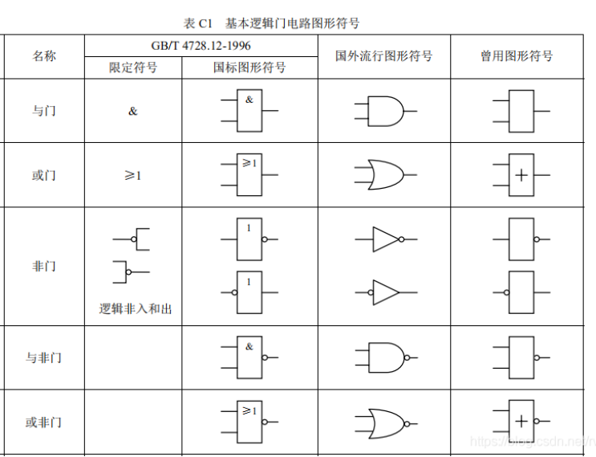
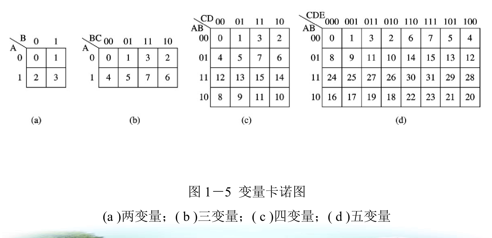

数字电路

# 第一章 逻辑代数基础
## 1.1 数制
1. 数制基本概念  
   - **十进制（Decimal, D）**：基数为 10，数码为 0–9。  
  例如：$256_{10} = 2 \times 10^2 + 5 \times 10^1 + 6 \times 10^0$。  
   - **二进制（Binary, B）**：基数为 2，数码为 0、1。  
  例如：$1101_2 = 1 \times 2^3 + 1 \times 2^2 + 0 \times 2^1 + 1 \times 2^0 = 13_{10}$。  
   - **八进制（Octal, O）**：基数为 8，数码为 0–7。  
  例如：$75_8 = 7 \times 8^1 + 5 \times 8^0 = 61_{10}$。  
   - **十六进制（Hexadecimal, H）**：基数为 16，数码为 0–9、A–F（A=10, B=11, …, F=15）。  
  例如：$2F_{16} = 2 \times 16^1 + 15 \times 16^0 = 47_{10}$。

2. 十进制 → 其他进制（整数部分）  
   - **方法**：除基取余，逆序排列。  
   - **步骤**：  
     (1) 将十进制数不断除以目标基数（2、8 或 16），记录每次余数；  
     (2) 直到商为 0；  
     (3) 将余数**从下往上读取**即为目标进制数。  
   - **示例**：$45_{10} \to$ 二进制  
  $$
  \begin{aligned}
  45 \div 2 &= 22\ \text{余}\ 1 \\
  22 \div 2 &= 11\ \text{余}\ 0 \\
  11 \div 2 &= 5\ \text{余}\ 1 \\
  5 \div 2 &= 2\ \text{余}\ 1 \\
  2 \div 2 &= 1\ \text{余}\ 0 \\
  1 \div 2 &= 0\ \text{余}\ 1 \\
  \Rightarrow 45_{10} &= 101101_2.
  \end{aligned}
  $$

3. 十进制 → 其他进制（小数部分）  
   - **方法**：乘基取整，顺序排列。  
   - **步骤**：  
     (1) 将十进制小数不断乘以目标基数；  
     (2) 取每次结果的整数部分；  
     (3) 直到小数部分为 0 或达到所需精度；  
	 (4) 从**上往下读取**即为小数部分
     (5) 整数部分按顺序排列即为目标进制小数。  
   - **示例**：$0.625_{10} \to$ 二进制  
  $$
  \begin{aligned}
  0.625 \times 2 &= 1.25 \quad \text{取整 } 1 \\
  0.25 \times 2 &= 0.5 \quad \text{取整 } 0 \\
  0.5 \times 2 &= 1.0 \quad \text{取整 } 1 \\
  \Rightarrow 0.625_{10} &= 0.101_2.
  \end{aligned}
  $$

4. 二进制 ↔ 八进制  
   - **原理**：$8 = 2^3$，每 3 位二进制对应 1 位八进制。  
   - **二进制 → 八进制**：  
     (1) 从小数点向左右分组，每 3 位一组（不足补 0）；  
     (2) 每组转为对应八进制数字。  
  示例：$110101.1011_2 \to$  
  分组：$110\ 101.\ 101\ 100$ → $6\ 5.\ 5\ 4$ → $65.54_8$。  
   - **八进制 → 二进制**：每位八进制数用 3 位二进制表示。  
  示例：$37.2_8 = 011\ 111.\ 010_2 = 11111.01_2$。

5. 二进制 ↔ 十六进制  
   - **原理**：$16 = 2^4$，每 4 位二进制对应 1 位十六进制。  
   - **二进制 → 十六进制**：  
     (1) 从小数点向左右分组，每 4 位一组（不足补 0）；  
     (2) 每组转为对应十六进制数字（10–15 用 A–F）。  
  示例：$11010110.1011_2 \to$  
  分组：$1101\ 0110.\ 1011$ → $D\ 6.\ B$ → $D6.B_{16}$。  
   - **十六进制 → 二进制**：每位十六进制数用 4 位二进制表示。  
  示例：$A3.F_{16} = 1010\ 0011.\ 1111_2 = 10100011.1111_2$。

6. 八进制 ↔ 十六进制  
   - **方法**：通过二进制中转。  
     步骤：八进制 → 二进制 → 十六进制（或反之）。  
   - **示例**：$75_8 \to$ 十六进制  
  $75_8 = 111\ 101_2 = 0011\ 1101_2 = 3D_{16}$。

7. 其他进制 → 十进制  
   - **方法**：按权展开求和。  
   - **公式**：对任意进制数 $(d_n d_{n-1} \dots d_0.d_{-1} d_{-2} \dots)_r$，其十进制值为  
  $$
  \sum_{k=-m}^{n} d_k \cdot r^k.
  $$  
   - **示例**：$1A.8_{16} = 1 \times 16^1 + 10 \times 16^0 + 8 \times 16^{-1} = 16 + 10 + 0.5 = 26.5_{10}$。

8. 代码的基本概念  
   在数字系统中，常用 0 和 1 的组合来表示不同的数字、符号、动作或事物，这一过程称为**编码**，这些组合称为**代码（Code）**。  

9. 8421BCD 码  
   - **定义**：BCD（Binary Coded Decimal）码即二—-十进制代码，用四位二进制数表示一位十进制数码。  
   - **特点**：  
     - 是一种最常用的 BCD 码；  
     - 属于**有权码**，四位的权值自左至右依次为 8、4、2、1；  
     - 只使用 0000 到 1001 共 10 个组合表示 0–9，其余组合无效。  
   - **编码表**：

	|十进制数|8421BCD码|
	|----------|---|
	|0        |0000        |
	| 1        | 0001        |
	| 2        | 0010        |
	| 3        | 0011        |
	| 4        | 0100        |
	| 5        | 0101        |
	| 6        | 0110        |
	| 7        | 0111        |
	| 8        | 1000        |
	| 9        | 1001        |

   - **示例**：将十进制数 $37_{10}$ 转换为 8421BCD 码：  
  $$
  3 \to 0011,\quad 7 \to 0111 \Rightarrow 37_{10} = 0011\ 0111_{BCD}.
  $$
  小数点相同

## 1.2 逻辑代数的基本运算和门电路
1. 逻辑变量
只有两种取值的变量：真或假、高或低、 1 或 0
2. 基本运算

	|运算|符号|含义|
	|---|---|---|
	|与|$+$|同时具备时，发生|
	|或|$\cdot$或省略|至少有一个具备时，发生|
	|非|$\overline {A}$|不具备时，发生|

3. 其它常见逻辑运算

	| 运算名称       | 符号   | 表达式                                      | 等价形式                     |
	|----------------|--------|---------------------------------------------|------------------------------|
	| 与非 (NAND)    | NAND   | $F = \overline{A \cdot B}$                 | $\overline{A} + \overline{B}$ |
	| 或非 (NOR)     | NOR    | $F = \overline{A + B}$                     | $\overline{A} \cdot \overline{B}$ |
	| 异或 (XOR)     | ⊕      | $F = A \oplus B$                           | $A\overline{B} + \overline{A}B$ |
	| 同或 (XNOR)    | ⊙      | $F = A \odot B$                            | $AB + \overline{A}\,\overline{B}$ |

4. 门电路
输出和输入之间具有一定逻辑关系的电路称为逻辑门电路，简称门电路。
常见的门电路逻辑符号

![[Pasted image 20260114224517.png]]

5. 三态门
能输出高电平，低电平和**高阻态**的逻辑门
6. 集电极开路与非门（oc门）

## 1.3 基本公式
1. $A+B\cdot C = (A+B)\cdot (A+C)$
$A + A \cdot B = A$

2. 摩根定律
$$
\quad \overline{A + B} = \overline{A} \cdot \overline{B}
$$
$$
\quad \overline{A \cdot B} = \overline{A} + \overline{B}
$$
3. 吸收律1
$A + \overline{A} \cdot B = A + B$
	- **证明**：
$$
	  \begin{aligned}
	  A + \overline{A} \cdot B &= (A + \overline{A}) \cdot (A + B) \\
	  &= 1 \cdot (A + B) \\
	  &= A + B
	  \end{aligned}
	  $$

	- **公式含义**：  
	  在一个“与或”表达式中，如果某一项的**反变量**是另一项的一个**因子**，则该因子可以省略。  
即：若存在形如 $X + \overline{X} \cdot Y$ 的结构，则可简化为 $X + Y$。

	- **应用示例**：
	- 

$$
A + B + (\overline{A} \cdot \overline{B}) \cdot C = A + B + \overline{A + B} \cdot C = A + B + C
$$
（注：此处利用了摩根定律 $\overline{A} \cdot \overline{B} = \overline{A + B}$，再结合吸收律扩展形式化简。）

2. 吸收律2
$A \cdot B + \overline{A} \cdot C = A \cdot B + \overline{A} \cdot C + B \cdot C$
- **证明**：
$$
\begin{aligned}
A \cdot B + \overline{A} \cdot C + B \cdot C &= A \cdot B + \overline{A} \cdot C + B \cdot C \cdot (A + \overline{A}) \\
&= A \cdot B + \overline{A} \cdot C + A \cdot B \cdot C + \overline{A} \cdot B \cdot C \\
&= (A \cdot B + A \cdot B \cdot C) + (\overline{A} \cdot C + \overline{A} \cdot B \cdot C) \\
&= A \cdot B + \overline{A} \cdot C
\end{aligned}
$$

- **公式含义**：  
在一个“与或”表达式中，如果某一项中的一个因子的**反变量**是另一项的一个因子，则由这两个项**其余因子组成的与项**是**可有可无**的（即可以添加或删除而不改变逻辑功能）。

- **应用示例**：  
- 
$$
\begin{aligned}
A \cdot B \cdot C + (\overline{A} + \overline{B}) \cdot D + C \cdot D &= (A \cdot B) \cdot C + (\overline{A \cdot B}) \cdot D + C \cdot D \\
&= (A \cdot B) \cdot C + (\overline{A \cdot B}) \cdot D \\
&= A \cdot B \cdot C + (\overline{A} + \overline{B}) \cdot D
\end{aligned}
$$

（注：此处将 $\overline{A} + \overline{B}$ 替换为 $\overline{A \cdot B}$，再利用吸收律消去冗余项 $C \cdot D$。）

3. 吸收律3
$A \cdot B + \overline{A} \cdot C = A \cdot B + \overline{A} \cdot C + B \cdot C \cdot D$
- **证明**：
$$
\begin{aligned}
A \cdot B + \overline{A} \cdot C + B \cdot C \cdot D &= (A \cdot B + \overline{A} \cdot C) + B \cdot C \cdot D \\
&= A \cdot B + \overline{A} \cdot C + B \cdot C + B \cdot C \cdot D \\
&= A \cdot B + \overline{A} \cdot C + B \cdot C \\
&= A \cdot B + \overline{A} \cdot C
\end{aligned}
$$  
（注：中间步骤利用了 (3) 的结论，即 $B \cdot C$ 是冗余项。）

- **公式含义**：  
在一个“与或”表达式中，如果某一项中的一个因子的**反变量**是另一项的一个因子，则**包含这两个项其余因子作为因子的项**是**可有可无**的。

- **应用示例**：

$$
A \cdot B \cdot C + (\overline{A} + \overline{B}) \cdot D + C \cdot D \cdot \overline{E + F} \cdot G = A \cdot B \cdot C + (\overline{A} + \overline{B}) \cdot D
$$  
（注：其中 $C \cdot D \cdot \overline{E + F} \cdot G$ 为冗余项，因 $(\overline{A} + \overline{B}) \cdot D$ 与 $A \cdot B \cdot C$ 存在互补因子关系。）

4. 代入规则
- **描述**：在一个逻辑等式两边，若某个变量（或表达式）在所有位置都被另一个变量（或表达式）替代，则等式仍然成立。

- **示例**：  
已知摩根定律 $\overline{A \cdot B} = \overline{A} + \overline{B}$，  
将等式中所有 $B$ 替换为 $BC$，则等式仍成立：  
$$
\overline{A \cdot (BC)} = \overline{A} + \overline{(BC)} = \overline{A} + \overline{B} + \overline{C}
$$

5. 对偶规则
- **描述**：对一个逻辑函数 $F$，将其中：
- 所有 “·” 换成 “+”，
- 所有 “+” 换成 “·”，
- “0” 换成 “1”，“1” 换成 “0”，  
得到的函数称为 $F$ 的**对偶函数** $F'$。

- **性质**：如果两个函数相等，则它们的对偶函数也相等。

- **示例**：
- 已知  
$$
F_1 = A \cdot (B + C),\quad F_2 = A \cdot B + A \cdot C
$$  
则其对偶函数为  
$$
F_1' = A + B \cdot C,\quad F_2' = (A + B) \cdot (A + C)
$$

- 若已知恒等式  
$$
A \cdot (B + C) = A \cdot B + A \cdot C
$$  
则其对偶形式也成立：  
$$
A + B \cdot C = (A + B) \cdot (A + C)
$$

6. 反演规则
可以先对偶，再取反，得到反演函数
- **描述**：对一个逻辑函数 $F$，将其中：
- 所有 “·” 换成 “+”，
- 所有 “+” 换成 “·”，
- “0” 换成 “1”，“1” 换成 “0”，
- 原变量换成反变量，反变量换成原变量，  
得到的函数即为 $F$ 的**反函数** $\overline{F}$。

- **注意事项**：
- 必须保持原函数中运算的优先顺序（如括号结构不变）；
- 不是单个变量上的反号保持不变（即仅对变量本身取反，不改变原有非号作用范围）。

- **示例**：  
已知  
$$
Z = A \cdot \overline{B} + \overline{\overline{A} \cdot C + D}
$$  
则其反函数为  
$$
\overline{Z} = (\overline{A} + B) \cdot \overline{A + \overline{C} \cdot \overline{D}}
$$  
（注：原式中 $\overline{B}$ 变为 $B$，$\overline{A}$ 变为 $A$，$\overline{\cdots}$ 整体结构保留，内部按规则变换。）

## 1.4 描述方法
1. 描述方法
函数， 真值表， 卡诺图， 逻辑电路图，不同方法之间可以相互转化
2. 卡诺图
卡诺图和对应的二进制数，卡诺图的绘制是“展开折叠的纸的思想”

3. 函数->真值表
方法1：硬算出每一种的结果
方法2：将函数转为与或表达式，
找出使得每一项的结果都为1的值，那么对应的函数值为1
4. 标准与或表达式
	形式
	- 每项含有所有变量
	- 每项中每个变量仅出现一次,以$A$或$\overline A$
	- 标准与或表达式的标准项，又称最小项

	性质
	- 唯一组合使取值为1
	- 所有不同最小项相或结果一定为1
	- 任意不同最小项相与结果一定为0

	将任意函数展开方法
	将每一项乘以$A+\overline A$直到每一项都含有所有变量

6. 标准或与表达式
	$(A + B + C + D)(\overline A + B + C + \overline D) \dots$
	条件与标准与或表达式相同
	标准或项，又称最大项
	性质
	- 唯一组合使取值为0
	- 所有最大项相与的结果一定为0
	- 任意不同最大项相或的结果一定为1

	方法
	将每一项加上$A\overline A$（严格来说是分配律的逆运算）,直到每一项都含有所有变量

13. 最大项与最小项的写法
比如说有三个变量ABC，那么可以表示0~7，共8个数字
对于结果为1的项，也就是最小项，记为$m_i$,i是三个变量对应的二进制数转十进制（比如说ABC是101，i就是5）
对于结果为0的项，也就是最大项，记为$m_j$
这些项和卡诺图中一一对应
i和j的取值不重复，且总共8个值，利用这个原理，可以实现最大项和最小项写法的转换

10. 真值表->函数表达式
写作标准与式：找出结果为1的项，各项相加，再化简
写作标准或式：找出结果为0的项，各项相乘，再化简

## 1.5 逻辑函数的化简
1. 函数卡诺图
在卡诺图中填入函数对应的编号的值
2. 卡诺化简原则
    1. 值1方格至少被圈一次
    2. 每个圈中至少有一个没被圈过的1
    3. 任意圈中都不含0值方格
    4. 圈数越少，圈越大，越好
    5. 无关项可以和1一起圈（参考上一条），不需要全部圈入
    6. 约束条件对应的项在卡诺图中画作无关项

# 第2章 组合逻辑电路
1. 竞争与冒险：原因
电路中存在延时造成的
2. 竞争与冒险：判断
卡诺图中存在相切的圈，那么该逻辑电路存在竞争与冒险
3. 竞争与冒险：消除
在卡诺图中，将相切的圈消除（圈更大）
4. 1
5. 1
6. 1
7. 1
8. 1
# 第3章 常用组合逻辑电路及MSI 组合电路模块的应用

# 第4章 时序逻辑电路
1.  触发器
当它被特定信号触发时，输出发生变化。触发器的输出是由当前状态和当前输入决定的。
2. 触发方式
	- 电平触发
	- 边沿触发
	- 主从触发
3. RS触发器
reset， set
状态方程
$$
\begin{cases}
Q^{n+1} = S + \overline{R}Q \\
\overline{R} + \overline{S} = 1 \text{ 或 } RS = 0 \text{ 为约束条件}
\end{cases}
$$
真值表

	|  $\overline{R}$  |  $\overline{S}$  |  $Q^{n+1}$  |
	|---------------|---------------|-----------|
	| 0             | 0             | 不允许     |
	| 0             | 1             | 0         |
	| 1             | 0             | 1         |
	| 1             | 1             | 保持       |

4. D触发器
输出等于输入
状态方程
$$
Q^{n+1} = D
$$
5. JK触发器
Jeep,Keep
状态方程
$$
Q^{n+1} = J\overline{Q} + \overline{K}Q
$$
真值表

	| J | K |  $Q^{n+1}$  | 说明 |
	|---|---|-----------|------|
	| 0 | 0 |  $Q$        | 保持 |
	| 0 | 1 | 0         | 置 0 |
	| 1 | 0 | 1         | 置 1 |
	| 1 | 1 |  $\overline{Q}$  | 翻转 |

4. T触发器
JK触发器的特例
因此只有保持和翻转的功能
$$
Q^{n+1} = T\overline{Q} + \overline{T}Q
$$
5. 解题步骤：
	1. 列写状态方程
	2. 根据 $R_D$ 处理初始值
	3. 在有效边沿处用虚线标示
	4. 写出虚线处输入变量的值
	5. 写出输出的值，并画出波形

## 4. 3 时序逻辑电路的分析
1. 同步和异步
时序逻辑电路按照它是否有统一的时钟控制分为 **同步** 时序电路和 **异步** 时序电路。
2. 解题步骤：
	1. 列写激励和输出方程
	2. 导出状态方程
	3. 列出状态转移真值表
	4. 画状态转移表
	5. 画状态转移图
3. 激励方程
又称驱动方程，指的是触发器的输入
4. 输出方程
指的是触发器的输出
5. 状态转移真值表
在上面求出输出方程后，可以写出现态输入、现态和现态输出、次态的输出真值表
6. 状态转移表
当电路现态输出和电路现态输入有关时，才有状态转移表.
![[Pasted image 20260107192451.png]]
其中，A是电路输入，列的值是A
7. 状态转移图
根据状态转移真值表画出
当无电路输出或输出与输入无关时
![[./img/Pasted image 20260107190643.png]]
其中，箭头上表示整个电路的现态输入，斜杠前表示各个触发器的现态，斜杠后表示整个电路现态输出
当输出与输入有关时
![[Pasted image 20260107193029.png]]
8. 自启动特性
状态转移图只有一个环就认为有自启动特性

## 4. 4 时序逻辑电路的设计
1. 步骤
	1. 列写状态转移真值表
	2. 利用卡诺图得到状态方程和输出方程
	3. 补全真值表，画出完整的状态转移图
	4. 导出激励方程
	5. 画出时序逻辑电路图
2. 

# 第5章 常用时序逻辑电路及MSI 时序电路模块的应用

## 定时器
1. 555定时器
	1. 核心是三个等值电阻组成的分压器
	2. 口诀
	$v_{21}\ v_{22}\ v_0$
	$\frac{2}{3}V_{cc}\ \frac{1}{3}V_{cc}\ 输出$
	大于、大于、出0；
	小于、小于、出1；
	小于、大于、保持。
	3. 单稳态
	4. 暂稳态的时间要记，1.1倍的rc
	5. 应用
	脉冲宽度调制器：调整vcc后，充电时间也会改变
	6. 多谐振荡电路 
	高电平维持时间是电容 充电时间，低电平维持时间是电容放电时间
	周期为
	占空比是高电平占周期的比例

# 模电与数电转换器
## D/A转换器
1. 转换思想
二进制转十进制，可以将数字信号转为模拟量，他们是互相成正比的
2. 
3. 3

## A/D转换器

1. 7

