机械设计基础

# 0 绪论
机械的基本组成要素
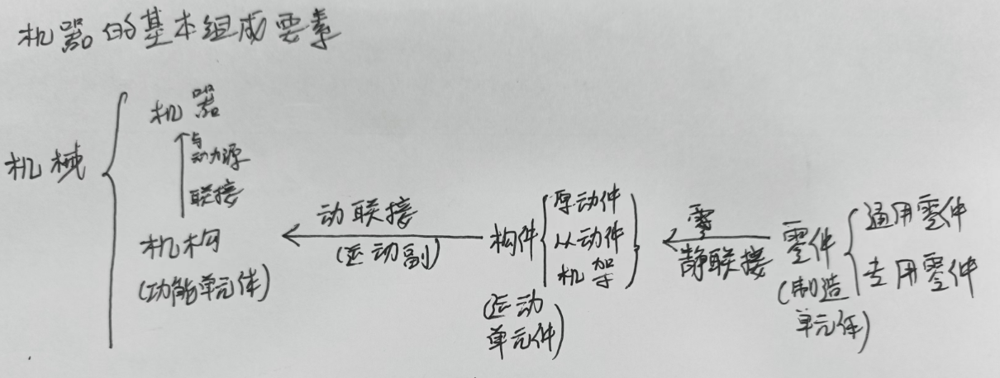

# 1 平面机构
>本章重点：
➢ 机构运动简图的测绘方法。
➢ 自由度的计算。
➢ 用瞬心法作机构的速度分析

1. 机构
机构是由许多构件组成的。机构的每个构件都以一定方式与某些构件相互连接。这种连接不是固定连接,而是能产生一定相对运动的连接。
## 1.1 运动副及其分类
1. 运动副
两构件直接接触并**能产生一定相对运动**的连接称为运动副。
(1) 一个运动副对应于两个构件;(2) 直接接触，产生约束; (3) 能产生相对运动
运动副一经形成, 组成它的两个构件间的可能的相对运动就确定。而且这种可能的相对运动, 只与运动副类型有关, 而与运动副的具体结构无关。
两构件组成运动副,其接触不外乎点、线、面。按照接触特性,通常把运动副分为低副和高副两类。
2. 平面与空间
平面运动副——组成运动副两构件之间的相对运动为平面运动。
空间运动副——组成运动副两构件之间的相对运动为空间运动。
本章只讨论平面运动副
3. 低副
两构件通过**面接触**组成的运动副称为低副。
面接触，耐磨损，承载能力高。
平面机构中的低副有**转动副**和**移动副**两种
    1. 转动副  若组成运动副的两构件只能在平面内相对转动,这种运动副称为转动副
或称铰链,如图1-2所示。
    2. 移动副  若组成运动副的两构件只能沿某一方向作相对直线移动,这种运动副称为移动副,如图1-3所示。
  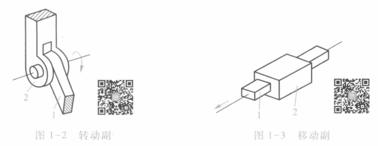

4. 高副
两构件通过**点或线接触**组成的运动副称为高副。
易磨损，承载能力低
图1-4a中的车轮1与钢轨2、图1-4b中的凸轮1与从动件2、图1-4c中的齿轮1与齿轮2分别在接触处A组成高副。组成平面高副两构件间的相对运动是沿接触处公切线-t方向的相对移动和在平面内的相对转动。
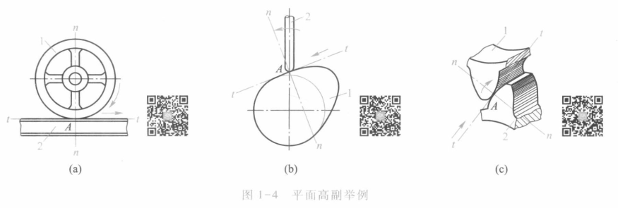

5. 运动副的分类
➢ 按约束级别分类：
• I级副：如球面高副约束数 1
• Ⅱ级副：如圆柱高副约束数 2
• Ⅲ级副：如球面低副约束数 3
• IV级副：如有平面滚滑副、圆柱副约束数 4
• V级副：如转动副、移动副、螺旋副约束数 5
➢ 按相对运动分类：
运动副的性质（即运动副引入的约束）决定了两构件的相对运动。
• 转动副：相对转动——回转副（铰链）
• 移动副：相对移动
• 螺旋副：螺旋运动
• 球面副：球面运动

## 1.2 平面机构的运动简图
1. 机构运动简图
用简单的线条和规定的符号表示构件和运动副，
按一定比例表示各运动副的相对位置。与对应的实际机构具有完全
相同的运动特性。
不按比例绘制时，称为机构示意图。
2. 构件
构件均用直线或小方块等来表示，画有斜线的表示机架。
画构件时应撇开构件的实际外形，而只考虑运动副的性质。
3. 转动副
构件组成转动副时，如下图表示。
➢图垂直于回转轴线时用图a表示；
➢图面不垂直于回转轴线时用图b表示。
➢表示转动副的圆圈，其圆心必须与回转轴线重合。
➢一个构件具有多个转动副时，则应在两条交叉处涂
黑，或在其内画上斜线。

4. 移动副
两构件组成移动副，其导路必须与相对移动方向一致。

5. 平面高副
两构件组成平面高副时，其运动简图中应画出两构件接触处的曲线轮
廓，对于凸轮、滚子，习惯划出其全部轮廓；对于齿轮，常用点划线划出
其节圆。

6. 运动链
由两个及以上的构件通过运动副连接而成的相对可动的系统
分类：闭式运动链、开式运动链 /平面运动链、空间运动链
闭链：组成运动链的各构件构成首末封闭的系统
开链：组成运动链的各构件未构成首末封闭的系统
7. 机构
将运动链中某一构件固定而成为机架，其余构件 都具有确定的相对运动，该运动链即成为机构
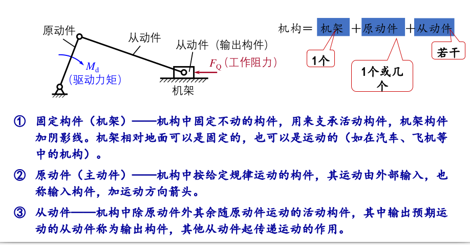
8. 绘制简图的步骤
    1. 分析机构运动的传递情况，找出固定件（机架）、原动件和从动件 。
    2. 从原动件开始，按照运动的传递顺序，分析各构件间的运动副性质，从而确定有多少构件及运动副的类型和数目。
    3. 选择视图平面。
    4. 选取合适的比例尺μL，确定各运动副之间的相对位置，用简单的线条和规定的运动副符号画出机构运动简图。比例尺为实际长度比图中长度
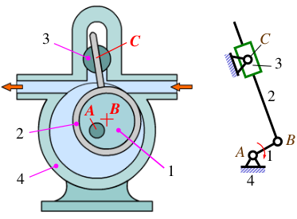
如图，低副转动副偏心轮，由1和4组成；转动副，1和2；移动副2和3；

## 1.3 平面机构的自由度
1. 自由度
构件所具独立运动的个数（确定构件位置所需独立坐标数）。
一个完全自由的平面运动构件具有三个自由度。
一个完全自由的空间运动构件具有六个自由度。
2. 平面运动副的自由度
运动副的自由度——描述组成运动副两构件之间相对运动所需独立参数的个数，F
运动副的约束数——两构件因直接接触组成运动副而失去的自由度数，S
平面运动副的约束数最多为2，最少为1。对于组成运动副的两构件作平面相对运动情况，有F＋S＝3
平面高副的自由度为2，约束数为1；平面低副的自由度为1，约束数为2
3. 机构的自由度
描述机构中各活动构件相对于机架的运动所需要的独立参数的个数
4. 平面机构自由度计算公式
    1. 机构中有k个构件
    2. 取一个为机架，那么活动构件为n = k-1个。在不受约束下，每个平面构件的自由度为3，即共有3n个自由度
    3. 每个低副（L）有两个约束，每个高副（H）有一个约束
    4. 机构自由度应为$F = 3n - 2P_L - P_H$

5. 机构的可动性与运动确定性
可动性：自由度F＞0时，机构可动；F≤0，机构的各个构建无法产生相对运动
运动确定性：自由度F > 0，且F = 原动件数
6. 复合铰链
多个构件在一处组成轴线重合的多个转动副。m个构件组成(m－1)个转动副
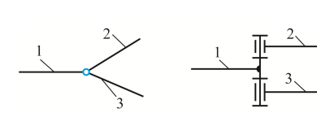
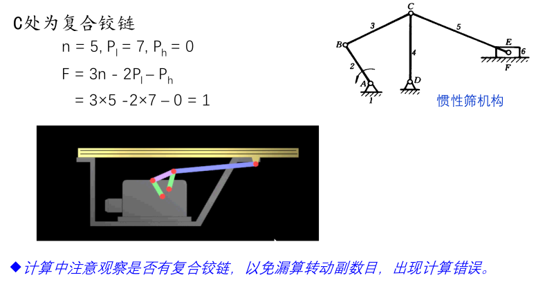
7. 局部自由度
若组成运动副的**两个构件之间的相对运动对其他构件的运动没有影响**，则该运动副对应的自由度称为局部自由度
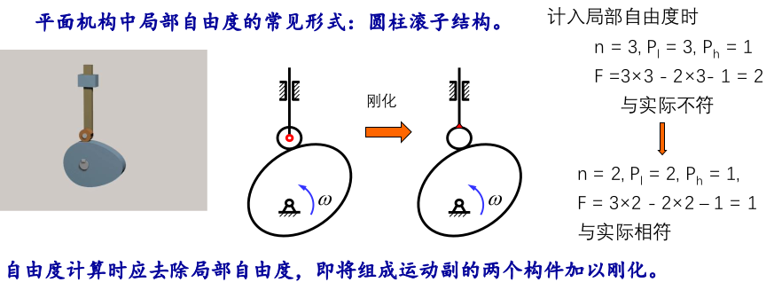
8. 虚约束
约束效果的重复约束称为虚约束。在计算自由度时应除去虚约束。
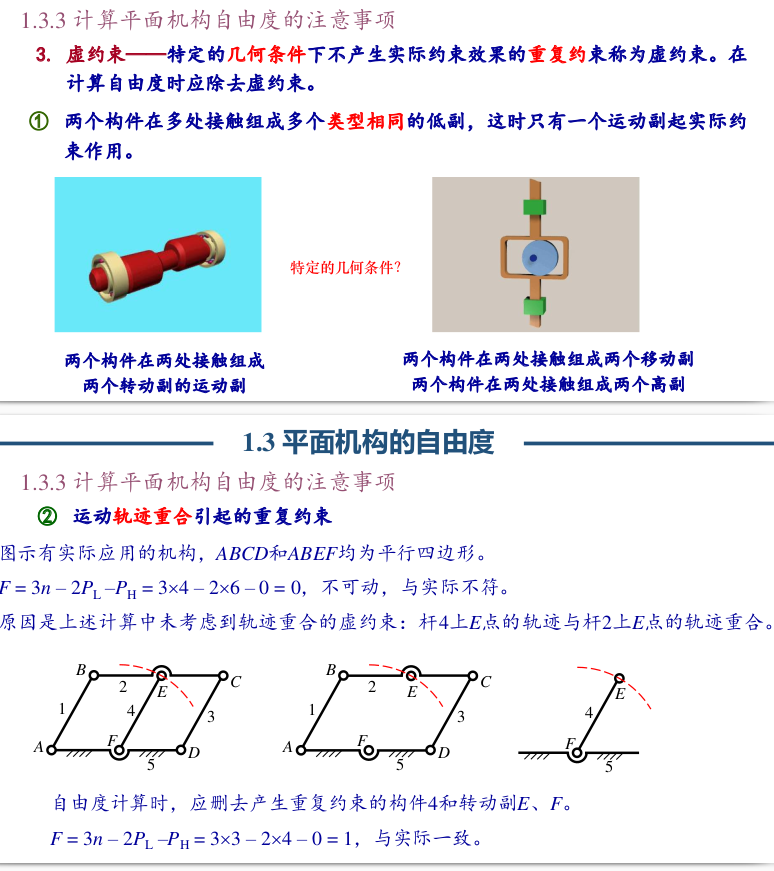
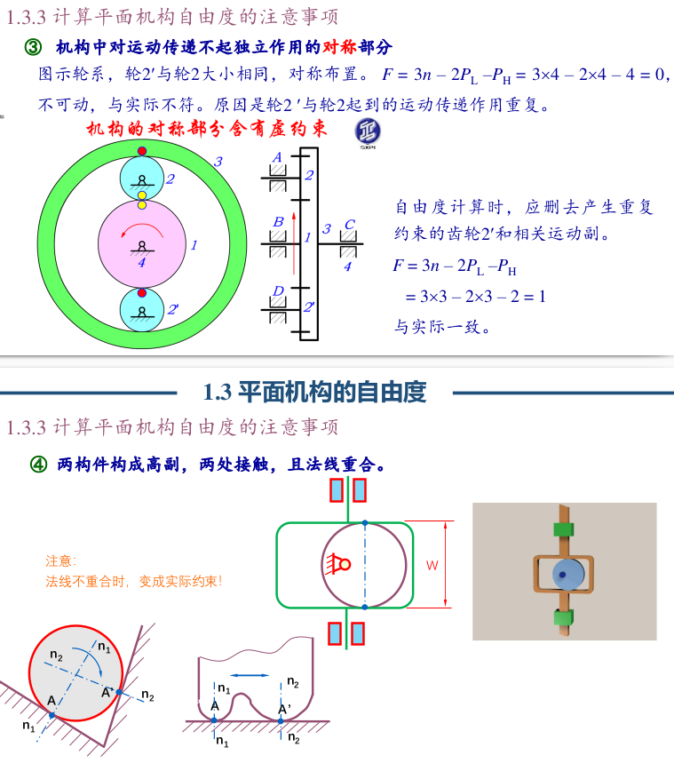
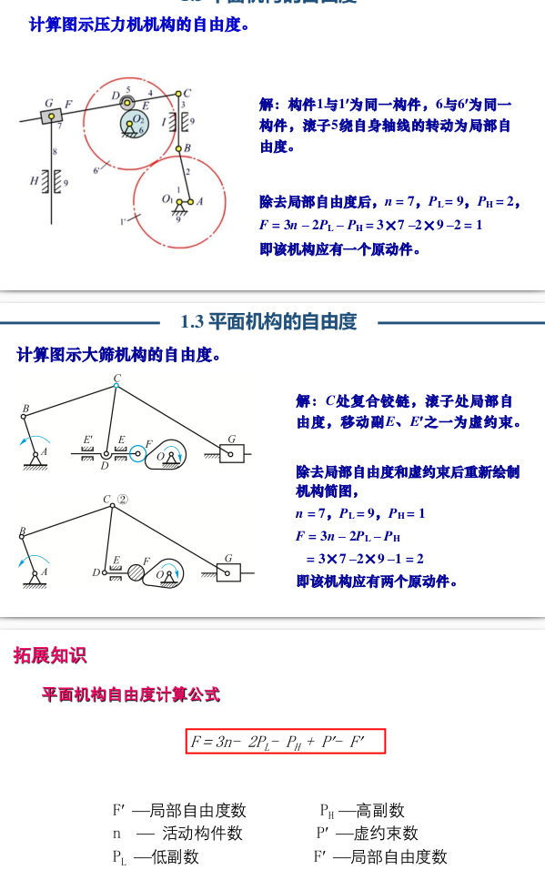

## 1.4 速度瞬心及其在机构速度分析中的应用
1. 瞬心
两个作平面运动构件，在任一瞬时，其相对运动可看作是绕某一重合点（该点不一定在刚体上）的转动，该点称瞬时速度转动中心（瞬心）。瞬心是两刚体上绝对速度相同的重合点
    1. 相对瞬心－重合点绝对速度不为零。
    2. 绝对瞬心－重合点绝对速度为零。
2. 瞬心的特点
瞬心是两个刚体上的点的重合点
在这两个刚体上的两个点，的绝对速度相同，相对速度为0
相对回转中心
3. 瞬心的个数
有k个构件，则两两构件有一个瞬心，$N=C_K^2={K(K-1)\over 2}$
4. 瞬心的位置
    1. 观察法：适用于求通过运动副直接相联的两构件瞬心位置
    转动副：位于转动中心
    移动副：位于移动导路垂线的无穷远处（移动副的轨迹是直线，可以认为是半径无穷大的转动）
    纯滚动高副：瞬心位于接触点处
    滑动兼滚动高副：瞬心位于过接触点公法线上
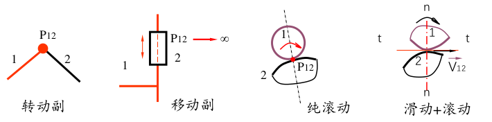
    2. 三心定律
    定义：三个彼此作平面运动的构件共有三个瞬心，且它们位于同一条直线上。此法特别适用于两构件不直接相联的场合
    内容：三个彼此作平面运动的构件共有三个瞬心，且它们位于同一条直线上
    用法：三心定律只是说三点共线，但没说第三个点在哪；因此，求两个构件的瞬心通常需要使用两次三心定律（选择不同的第三个构件），得到两条直线及其交点，才是要求的点（对于三个不直接接触的构件，也许还需要递归的思想？）
  
    应用场合：
➢ 两个构件不直接组成运动副(不直接接触)
➢ 在构件组成平面高副时，作为确定瞬心的另外一个条件。
5. 瞬心法速度分析
原理：瞬心本质是两个构建的平面上的点，当分析出瞬心在其中一个面中的速度，那么这个瞬心在另一个面中的速度也相同，这时再结合力学进行分析
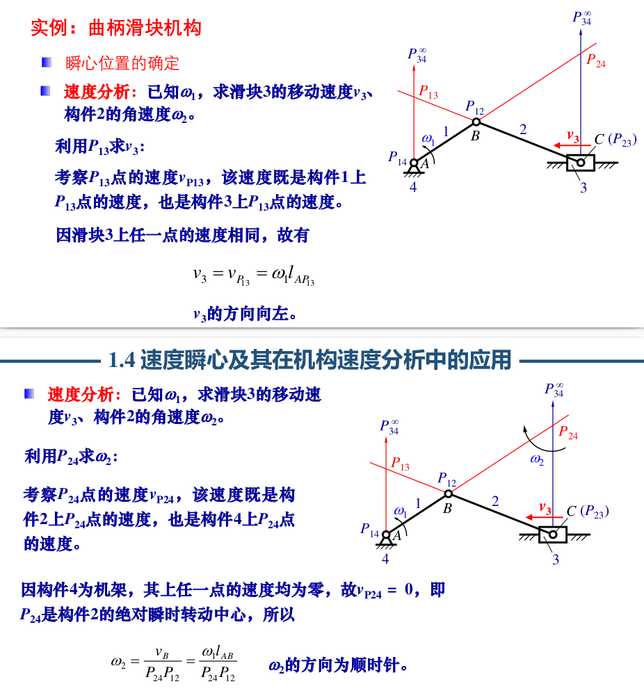

# 2 平面连杆机构
> 本章重点：
1.四杆机构的基本形式、演化及应用；
2.曲柄存在条件、传动角$\gamma$、压力角$\alpha$、死点、急回特性：极位夹角
和行程速比系数等物理含义，并熟练掌握其确定方法；
3.掌握按连杆二组位置、三组位置、连架杆三组对应位置、行程速
比系数设计四杆机构的原理与方法。

1. 连杆机构
若干个构件通过低副(Lower-pair)连接而组成的机构称为连杆机构------低副机构。连杆机构具有闭链，传动的特点
2. 平面连杆机构的特点
➢ 采用低副。面接触、承载大、便于润滑、不易磨损形状简单、制造比较简单、容易获得较高的制造精度。
➢ 改变杆的相对长度，从动件运动规律不同。
➢ 连杆曲线丰富，可满足不同要求，实现较辅助的预期运动规律。
➢ 设计——可采用计算机辅助设计。
3. 平面连杆机构的缺点
①构件和运动副多，累积误差大、运动精度低、效率低。
②产生动载荷（惯性力），不适合高速。
③设计复杂，难以实现精确的轨迹。
④惯性力不易平衡
⑤有误差累积，机械效率降低

## 2.1 平面四杆机构的基本类型及其应用
> 平面四杆机构是最简单的平面连杆机构

1. 分类
按所含移动副数目的不同，可分为全转动副的铰链四杆机构、含一个移动副的四杆机构和含两个移动副的四杆机构。
2. 铰链四杆机构
所有运动副均为转动副的平面四杆机构。它是平面四杆机构的最基本的形式
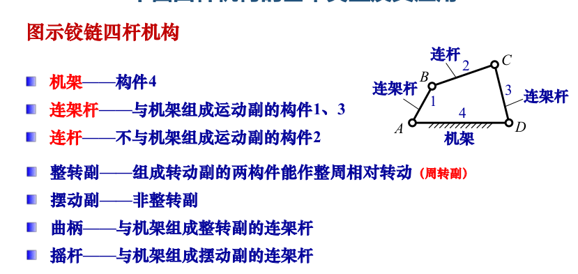
铰链四杆机构按照连架杆的运动分为：曲柄摇杆机构、双曲柄机构、双摇杆机构
    1. 曲柄摇杆机构
    一个连架杆为曲柄，另一个连架杆为摇杆
    可将曲柄的整周转动转变为摇杆的往复运动；或将往复运动转为整周转动
    缝纫机的踏板是摇杆，连接的是曲柄
  
    2. 双曲柄机构
    两连架杆都是曲柄
    通常两曲柄的转动角度不同，可以实现变速回转
    特例：平行四边形机构
    两连架杆等长且平行，连杆做平动
  
    3. 双摇杆机构
    两连架杆均为摇杆
  
3. 其它变形
    1. 曲柄滑块机构——两连架杆一为曲柄，另一为作往复移动的滑块，
    滑块为直线往复运动时，根据两机架是否在同一直线上分为分为对心和偏置（偏距e）两种
    2. 导杆机构——改变曲柄滑块机构的机架而得
  
    3. 摇块机构和定块机构——改变曲柄滑块机构的机架而得
  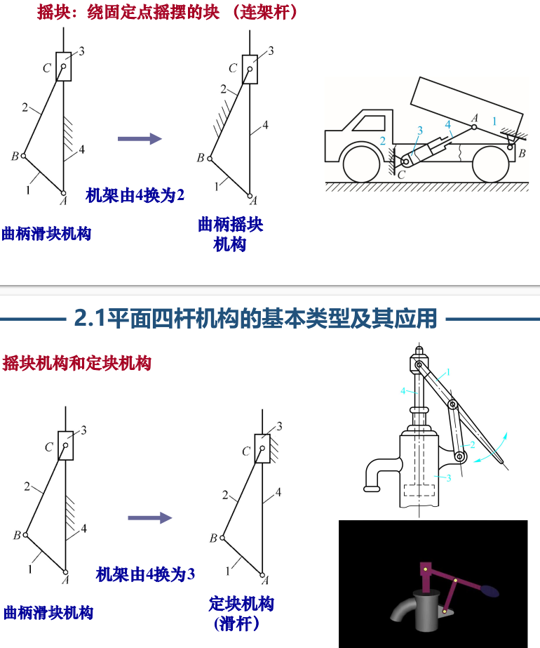

## 2.2 平面四杆机构的基本特性
1. 铰链四杆机构**曲柄存在条件**
    1. 整转副存在：最长边与最短边之和小于等于另外两边之和
  $l_{longest} + l_{shortest} \leq l_{3} + l_{4}$
  这时整转副由最短杆与其相邻杆构成，也就是能构成两个整转副
    2. 最短杆为连架杆或机架
    满足条件1时
    当最短杆为连杆，即两个连架杆都不是曲柄，那么是双摇杆；
    当最短杆为机架，即两个连架杆都形成曲柄，那么是双曲柄；
    当最短杆为连架杆，即只有该连架杆形成曲柄，那么是曲柄摇杆。
  

2. 平面四杆机构的极位
在曲柄摇杆机构中，当曲柄与连杆两次共线时，摇杆位于两个极限位置，简称极位。此两处曲柄之间的夹角$\theta$称为***极位夹角***。
摇杆同时在曲柄两次共线时到达极限位置，在这摇杆两个位置间的夹角称为***摇杆摆角***$\psi$

3. 急回特性
从动杆往复运动的平均速度不等的现象称为机构的 急回特性
从上面的图中理解，
若曲柄为主动，那么显然从一个共线位置到另一个共线位置所转过的角度是不同的，所花的时间也就不同，而摇杆摆过的角度相同，时间不同，那么其摆动的速度也会不同。反之以摇杆作为主动件也成立。

4. 行程速比系数K
用行程速比系数K来表示急回特性
$$
K=\frac{\omega_{2}}{\omega_{1}}=\frac{ \psi/t_{2}}{\psi/t_{1}}=\frac{t_{1}}{t_{2}}=\frac{\varphi_{1}}{\varphi_{2}}= \frac{180^{\circ} + \theta}{180^{\circ} - \theta}
$$
或
$$
\theta = 180^{\circ}\frac{K - 1}{K + 1}
$$

## 2.3 平面四杆机构的设计

