机械设计基础

> 掌握的就是要记的，了解的就是知道的，其它可能不会考

# 0 绪论
机械的基本组成要素

当量（Equivalent / Virtual）  

   - 在机械设计中，“当量”指将复杂或非理想情况**等效简化**为某种标准形式，以便分析计算。

# 1 平面机构
>本章重点：
➢ 机构运动简图的测绘方法。
➢ 自由度的计算。
➢ 用瞬心法作机构的速度分析

1. 机构
机构是由许多构件组成的。机构的每个构件都以一定方式与某些构件相互连接。这种连接不是固定连接,而是能产生一定相对运动的连接。
## 1.1 运动副及其分类
1. 运动副
两构件直接接触并**能产生一定相对运动**的连接称为运动副。
(1) 一个运动副对应于两个构件;(2) 直接接触，产生约束; (3) 能产生相对运动
运动副一经形成, 组成它的两个构件间的可能的相对运动就确定。而且这种可能的相对运动, 只与运动副类型有关, 而与运动副的具体结构无关。
两构件组成运动副,其接触不外乎点、线、面。按照接触特性,通常把运动副分为低副和高副两类。
2. 平面与空间
平面运动副——组成运动副两构件之间的相对运动为平面运动。
空间运动副——组成运动副两构件之间的相对运动为空间运动。
本章只讨论平面运动副
3. 低副
两构件通过**面接触**组成的运动副称为低副。
面接触，耐磨损，承载能力高。
平面机构中的低副有**转动副**和**移动副**两种
    1. 转动副  若组成运动副的两构件只能在平面内相对转动,这种运动副称为转动副
或称铰链,如图1-2所示。
    2. 移动副  若组成运动副的两构件只能沿某一方向作相对直线移动,这种运动副称为移动副,如图1-3所示。
  

4. 高副
两构件通过**点或线接触**组成的运动副称为高副。
易磨损，承载能力低
图1-4a中的车轮1与钢轨2、图1-4b中的凸轮1与从动件2、图1-4c中的齿轮1与齿轮2分别在接触处A组成高副。组成平面高副两构件间的相对运动是沿接触处公切线-t方向的相对移动和在平面内的相对转动。

5. 运动副的分类
➢ 按约束级别分类：
• I级副：如球面高副约束数 1
• Ⅱ级副：如圆柱高副约束数 2
• Ⅲ级副：如球面低副约束数 3
• IV级副：如有平面滚滑副、圆柱副约束数 4
• V级副：如转动副、移动副、螺旋副约束数 5
➢ 按相对运动分类：
运动副的性质（即运动副引入的约束）决定了两构件的相对运动。
• 转动副：相对转动——回转副（铰链）
• 移动副：相对移动
• 螺旋副：螺旋运动
• 球面副：球面运动

## 1.2 平面机构的运动简图
1. 机构运动简图
用简单的线条和规定的符号表示构件和运动副，
按一定比例表示各运动副的相对位置。与对应的实际机构具有完全
相同的运动特性。
不按比例绘制时，称为机构示意图。
2. 构件
构件均用直线或小方块等来表示，画有斜线的表示机架。
画构件时应撇开构件的实际外形，而只考虑运动副的性质。
3. 转动副
构件组成转动副时，如下图表示。
➢图垂直于回转轴线时用图a表示；
➢图面不垂直于回转轴线时用图b表示。
➢表示转动副的圆圈，其圆心必须与回转轴线重合。
➢一个构件具有多个转动副时，则应在两条交叉处涂
黑，或在其内画上斜线。
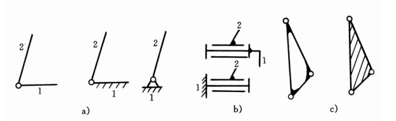
4. 移动副
两构件组成移动副，其导路必须与相对移动方向一致。
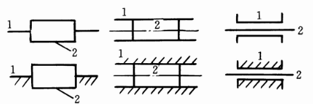
5. 平面高副
两构件组成平面高副时，其运动简图中应画出两构件接触处的曲线轮
廓，对于凸轮、滚子，习惯划出其全部轮廓；对于齿轮，常用点划线划出
其节圆。
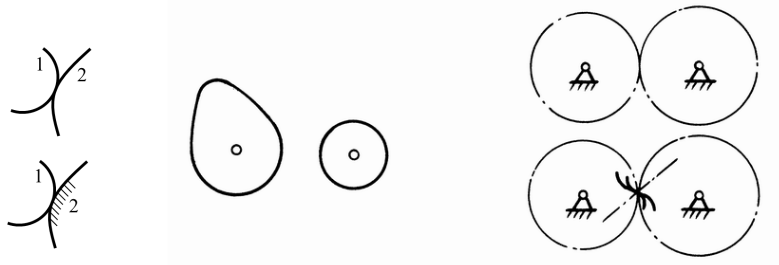
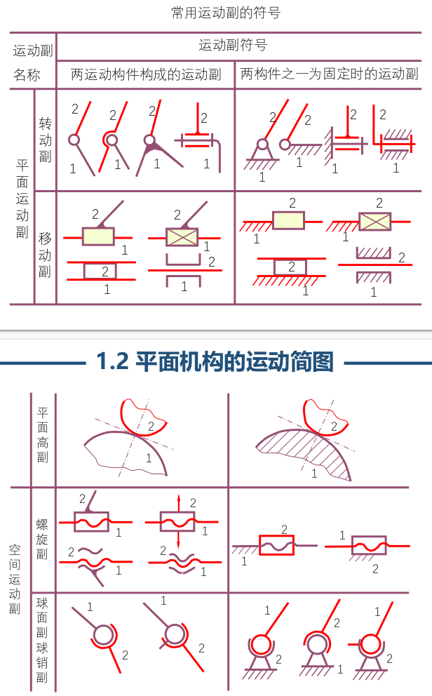
6. 运动链
由两个及以上的构件通过运动副连接而成的相对可动的系统
分类：闭式运动链、开式运动链 /平面运动链、空间运动链
闭链：组成运动链的各构件构成首末封闭的系统
开链：组成运动链的各构件未构成首末封闭的系统
7. 机构
将运动链中某一构件固定而成为机架，其余构件 都具有确定的相对运动，该运动链即成为机构

8. 绘制简图的步骤
    1. 分析机构运动的传递情况，找出固定件（机架）、原动件和从动件 。
    2. 从原动件开始，按照运动的传递顺序，分析各构件间的运动副性质，从而确定有多少构件及运动副的类型和数目。
    3. 选择视图平面。
    4. 选取合适的比例尺μL，确定各运动副之间的相对位置，用简单的线条和规定的运动副符号画出机构运动简图。比例尺为实际长度比图中长度
  
    如图，低副转动副偏心轮，由1和4组成；转动副，1和2；移动副2和3；

## 1.3 平面机构的自由度
1. 自由度
构件所具独立运动的个数（确定构件位置所需独立坐标数）。
一个完全自由的平面运动构件具有三个自由度。
一个完全自由的空间运动构件具有六个自由度。
2. 平面运动副的自由度
运动副的自由度——描述组成运动副两构件之间相对运动所需独立参数的个数，F
运动副的约束数——两构件因直接接触组成运动副而失去的自由度数，S
平面运动副的约束数最多为2，最少为1。对于组成运动副的两构件作平面相对运动情况，有F＋S＝3
平面高副的自由度为2，约束数为1；平面低副的自由度为1，约束数为2
3. 机构的自由度
描述机构中各活动构件相对于机架的运动所需要的独立参数的个数
4. 平面机构自由度计算公式
    1. 机构中有k个构件
    2. 取一个为机架，那么活动构件为n = k-1个。在不受约束下，每个平面构件的自由度为3，即共有3n个自由度
    3. 每个低副（L）有两个约束，每个高副（H）有一个约束
    4. 机构自由度应为$F = 3n - 2P_L - P_H$
  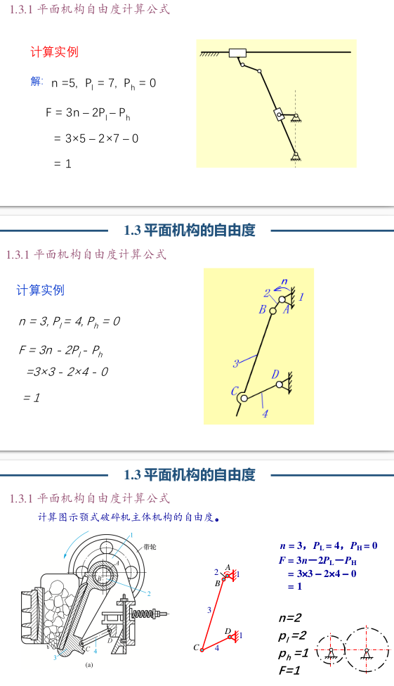
5. 机构的可动性与运动确定性
可动性：自由度F＞0时，机构可动；F≤0，机构的各个构建无法产生相对运动
运动确定性：自由度F > 0，且F = 原动件数
6. 复合铰链
多个构件在一处组成轴线重合的多个转动副。m个构件组成(m－1)个转动副

7. 局部自由度
若组成运动副的**两个构件之间的相对运动对其他构件的运动没有影响**，则该运动副对应的自由度称为局部自由度

8. 虚约束
约束效果的重复约束称为虚约束。在计算自由度时应除去虚约束。

## 1.4 速度瞬心及其在机构速度分析中的应用
1. 瞬心
   两个作平面运动构件，在任一瞬时，其相对运动可看作是绕某一重合点（该点不一定在刚体上）的转动，该点称瞬时速度转动中心（瞬心）。瞬心是两刚体上绝对速度相同的重合点
    1. 相对瞬心－重合点绝对速度不为零。
    2. 绝对瞬心－重合点绝对速度为零。
2. 瞬心的特点
瞬心是两个刚体上的点的重合点
在这两个刚体上的两个点，的绝对速度相同，相对速度为0
相对回转中心
3. 瞬心的个数
有k个构件，则两两构件有一个瞬心，$N=C_K^2={K(K-1)\over 2}$
4. 瞬心的位置
    1. 观察法：适用于求通过运动副直接相联的两构件瞬心位置
    转动副：位于转动中心
    移动副：位于移动导路垂线的无穷远处（移动副的轨迹是直线，可以认为是半径无穷大的转动）
    纯滚动高副：瞬心位于接触点处
    滑动兼滚动高副：瞬心位于过接触点公法线上
  
    2. 三心定律
    定义：三个彼此作平面运动的构件共有三个瞬心，且它们位于同一条直线上。此法特别适用于两构件不直接相联的场合
    内容：三个彼此作平面运动的构件共有三个瞬心，且它们位于同一条直线上
    用法：三心定律只是说三点共线，但没说第三个点在哪；因此，求两个构件的瞬心通常需要使用两次三心定律（选择不同的第三个构件），得到两条直线及其交点，才是要求的点（对于三个不直接接触的构件，也许还需要递归的思想？）
  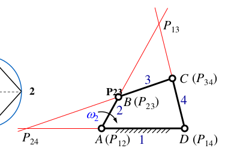
    应用场合：
    ➢ 两个构件不直接组成运动副(不直接接触)
    ➢ 在构件组成平面高副时，作为确定瞬心的另外一个条件。
5. 瞬心法速度分析
原理：瞬心本质是两个构建的平面上的点，当分析出瞬心在其中一个面中的速度，那么这个瞬心在另一个面中的速度也相同，这时再结合力学进行分析

---

# 2 平面连杆机构
> 本章重点：
1.四杆机构的基本形式、演化及应用；
2.曲柄存在条件、传动角$\gamma$、压力角$\alpha$、死点、急回特性：极位夹角
和行程速比系数等物理含义，并熟练掌握其确定方法；
3.掌握按连杆二组位置、三组位置、连架杆三组对应位置、行程速
比系数设计四杆机构的原理与方法。

1. 连杆机构
若干个构件通过低副(Lower-pair)连接而组成的机构称为连杆机构------低副机构。连杆机构具有闭链，传动的特点
2. 平面连杆机构的特点
➢ 采用低副。面接触、承载大、便于润滑、不易磨损形状简单、制造比较简单、容易获得较高的制造精度。
➢ 改变杆的相对长度，从动件运动规律不同。
➢ 连杆曲线丰富，可满足不同要求，实现较辅助的预期运动规律。
➢ 设计——可采用计算机辅助设计。
3. 平面连杆机构的缺点
①构件和运动副多，累积误差大、运动精度低、效率低。
②产生动载荷（惯性力），不适合高速。
③设计复杂，难以实现精确的轨迹。
④惯性力不易平衡
⑤有误差累积，机械效率降低

## 2.1 平面四杆机构的基本类型及其应用
> 平面四杆机构是最简单的平面连杆机构

1. 分类
按所含移动副数目的不同，可分为全转动副的铰链四杆机构、含一个移动副的四杆机构和含两个移动副的四杆机构。
2. 铰链四杆机构
    所有运动副均为转动副的平面四杆机构。它是平面四杆机构的最基本的形式
  
    铰链四杆机构按照连架杆的运动分为：曲柄摇杆机构、双曲柄机构、双摇杆机构
    1. 曲柄摇杆机构
      一个连架杆为曲柄，另一个连架杆为摇杆
      可将曲柄的整周转动转变为摇杆的往复运动；或将往复运动转为整周转动
      缝纫机的踏板是摇杆，连接的是曲柄
  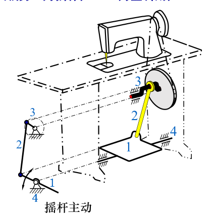
    2. 双曲柄机构
      两连架杆都是曲柄
      通常两曲柄的转动角度不同，可以实现变速回转
      特例：平行四边形机构
      两连架杆等长且平行，连杆做平动
  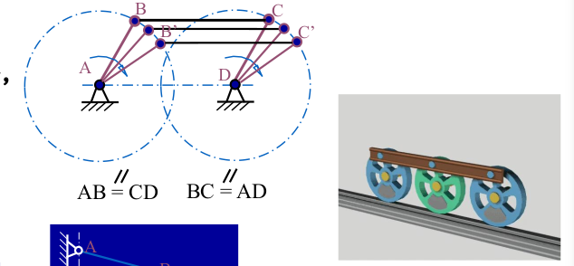
    3. 双摇杆机构
      两连架杆均为摇杆
  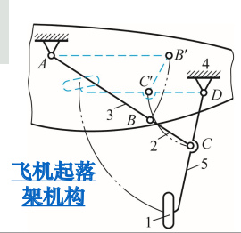
3. 其它变形
    1. 曲柄滑块机构——两连架杆一为曲柄，另一为作往复移动的滑块，
    滑块为直线往复运动时，根据两机架是否在同一直线上分为分为对心和偏置（偏距e）两种
    2. 导杆机构——改变曲柄滑块机构的机架而得
  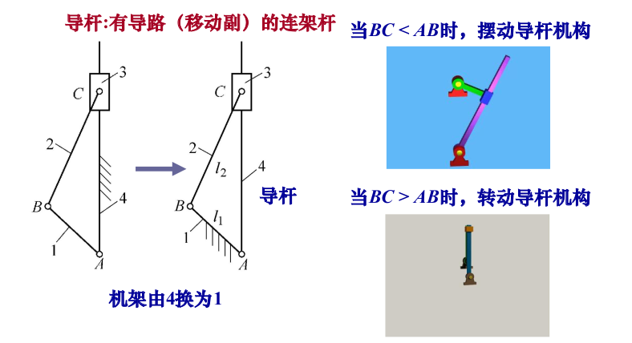
    3. 摇块机构和定块机构——改变曲柄滑块机构的机架而得
  

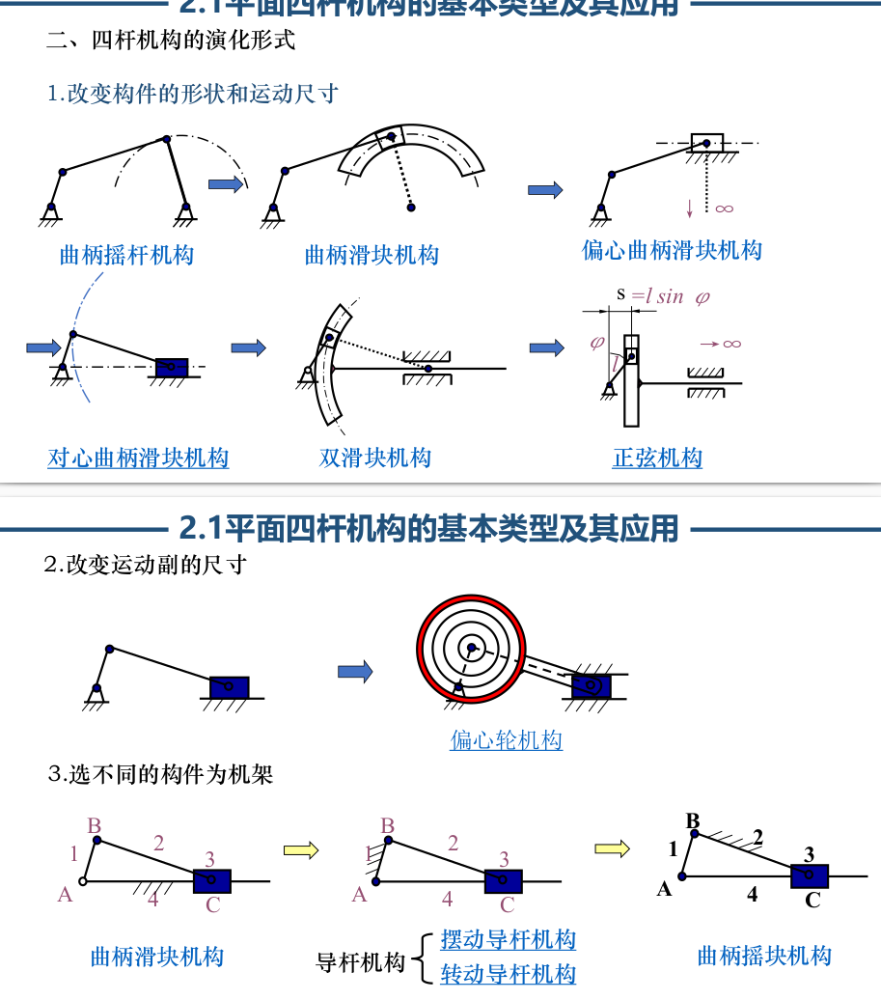

## 2.2 平面四杆机构的基本特性
1. 铰链四杆机构**曲柄存在条件**
    1. 整转副存在：最长边与最短边之和小于等于另外两边之和
  $l_{longest} + l_{shortest} \leq l_{3} + l_{4}$
        这时整转副由最短杆与其相邻杆构成，也就是能构成两个整转副
    2. 最短杆为连架杆或机架
        满足条件1时
        当最短杆为连杆，即两个连架杆都不是曲柄，那么是双摇杆；
        当最短杆为机架，即两个连架杆都形成曲柄，那么是双曲柄；
        当最短杆为连架杆，即只有该连架杆形成曲柄，那么是曲柄摇杆。
  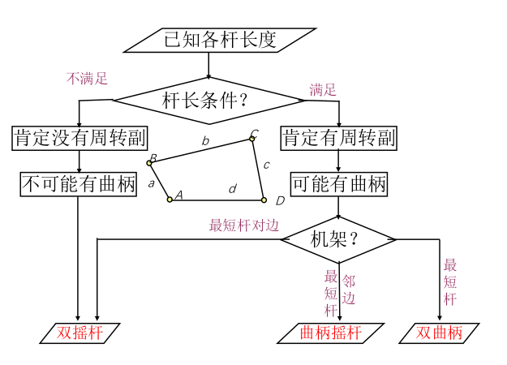

2. 平面四杆机构的极位
在曲柄摇杆机构中，当曲柄与连杆两次共线时，摇杆位于两个极限位置，简称极位。此两处曲柄之间的夹角$\theta$称为***极位夹角***。
摇杆同时在曲柄两次共线时到达极限位置，在这摇杆两个位置间的夹角称为***摇杆摆角***$\psi$
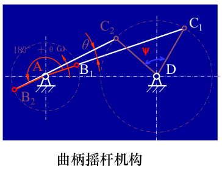

3. 急回特性
从动杆往复运动的平均速度不等的现象称为机构的 急回特性
从上面的图中理解，
若曲柄为主动，那么显然从一个共线位置到另一个共线位置所转过的角度是不同的，所花的时间也就不同，而摇杆摆过的角度相同，时间不同，那么其摆动的速度也会不同。反之以摇杆作为主动件也成立。

4. 行程速比系数K
用行程速比系数K来表示急回特性
$$
K=\frac{\omega_{2}}{\omega_{1}}=\frac{ \psi/t_{2}}{\psi/t_{1}}=\frac{t_{1}}{t_{2}}=\frac{\varphi_{1}}{\varphi_{2}}= \frac{180^{\circ} + \theta}{180^{\circ} - \theta}
$$
或
$$
\theta = 180^{\circ}\frac{K - 1}{K + 1}
$$
$\theta$的值越大，k值越大，急回特性就越明显；k=1说无急回特性
$1 \leq k \leq 3$

5. 具有急回特性的偏置曲柄滑块机构和摆动导杆机构的极位夹角
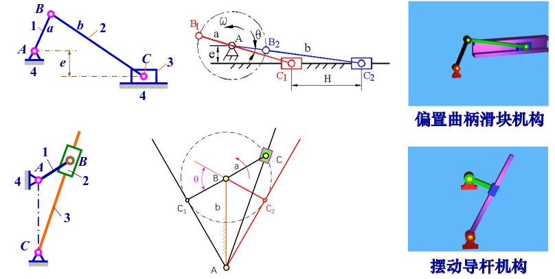

6. 压力角和传动角
    1. 压力角：从动件驱动力F与力作用点绝对速度之间所夹锐角$\alpha$。
  切向分力: F’ = Fcos$\alpha$ = Fsin$\gamma$
  法向分力: F” = Fcos$\gamma$ 
  $\gamma$越大，切向分力F’越大，对传动有利
    2. 传动角$\gamma$：大小表示机构传动力性能的好坏
  $\gamma _{min}$一定在两次共线之一出现
  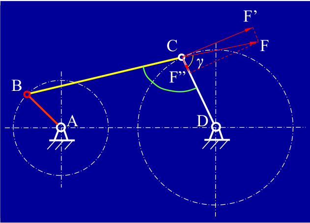

7. 止点位置
又称死点
在共线时，会出现传动角$\gamma = 0$，这时机构不能运动
可以设置两组机构错位，如火车轮，或者依靠飞轮的惯性，比如缝纫机和内燃机，来避免死点
死点也不是只有坏处，例如飞机的起落架需要死点

## 2.3 平面四杆机构的设计
1. 主要任务
根据给定的运动要求及其他要求（如传动角要求等），确定机构运动简图的尺寸参数。
两类主要运动要求：从动件的运动规律；构件上一点的运动轨迹。
基本问题：选择机构的类型、尺寸，满足结构，动力，运动条件

2. 按给定的行程速比系数K设计四杆机构
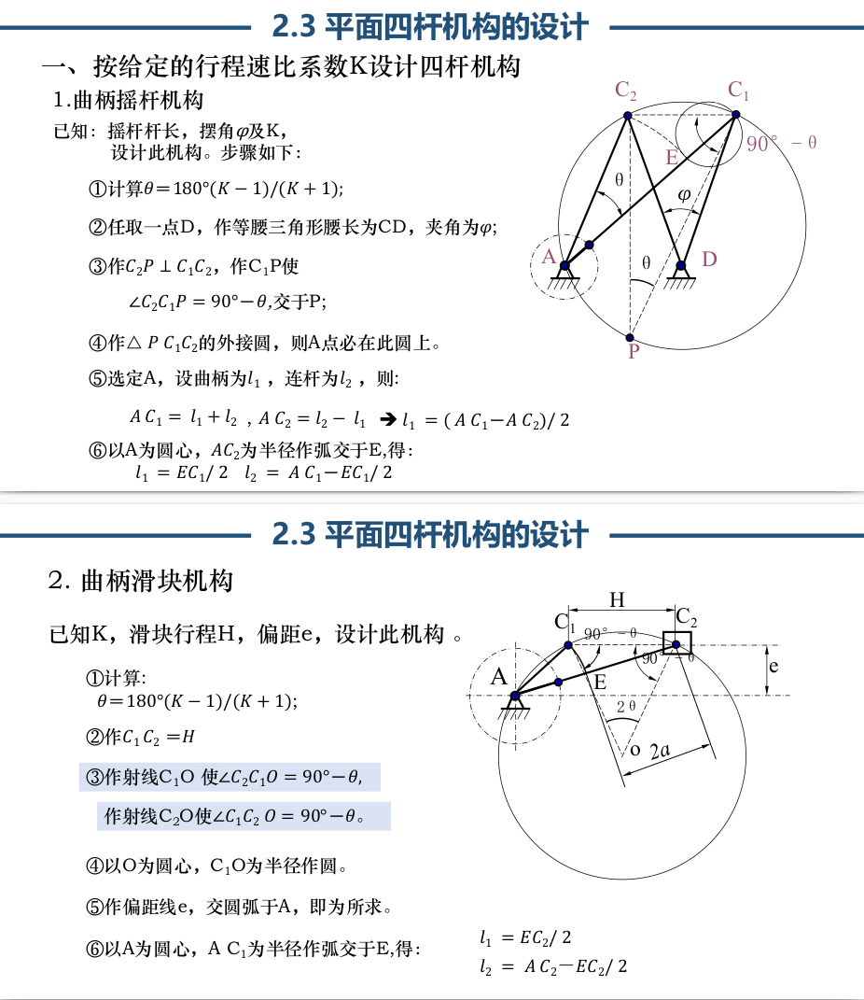
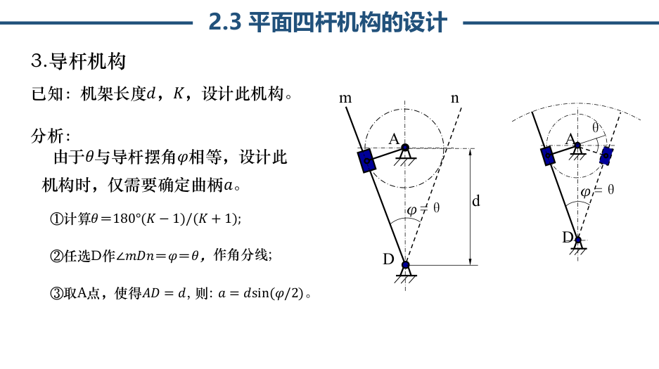

3. 给定连杆的预定位置
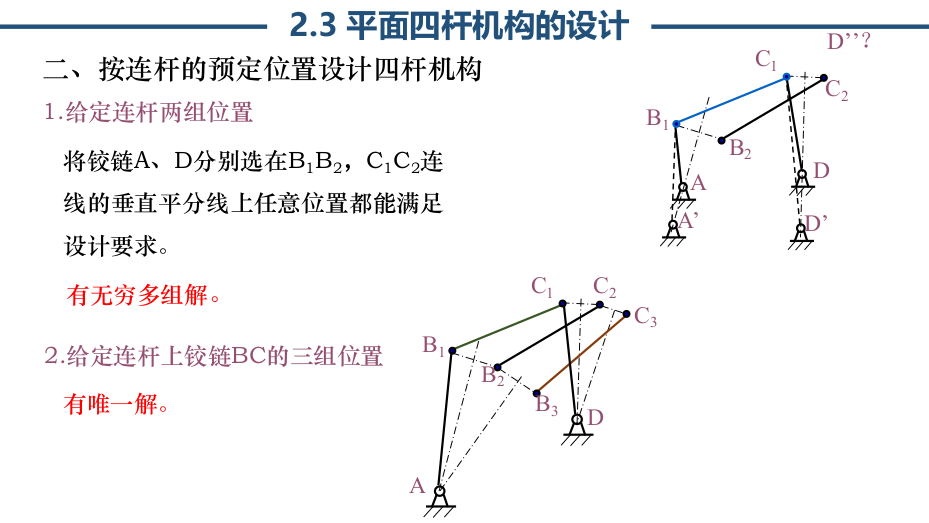

---

# 3 凸轮机构    
> 本章重点：
①常用从动件运动规律：特性及作图法；
②理论轮廓与实际轮廓的关系；
③凸轮压力角α与基圆半径rmin的关系；
④掌握用图解法设计凸轮轮廓曲线的步骤与方法；
⑤掌握解析法在凸轮轮廓设计中的应用。

## 3.1 凸轮机构的应用和类型
1. 凸轮
具有曲线轮廓或凹槽的构件，一般作主动件
与从动件以点或线接触，因此是高副机构
2. 优缺点
优点，理论上可以实现从动件任意复杂运动，而且结构简单、紧凑，设计方便
缺点，难加工，易磨损
3. 凸轮机构
凸轮，从动件，机架
4. 凸轮机构的分类
按凸轮形状分：盘形、移动、圆柱
按接触分：尖顶从动件、滚子从动件、平底从动件
按从动件运动分：直动从动件、摆动从动件
按保持接触的方式分：力锁合（外力）、形锁合（内力）

## 3.2 从动件的运动规律
1. 基本参数

| **术语**| **定义**| **符号**| **图示说明**|
|---|---|---|---|
| **基圆**| 凸轮轮廓的最小半径圆，决定从动件最低位置。|$r_0\\r_{basic}\\r_b$| 以凸轮旋转中心为圆心，与理论轮廓相切的最小圆。|
| **推程**| 从动件被凸轮推动，远离凸轮中心的运动过程（如气门开启）。|h| 从动件从基圆接触点升至最高点的位移。|
| **推程运动角**| 凸轮旋转中完成推程所转过的角度。|| 从基圆接触点至最高点对应的圆心角。|
| **远休止**| 推程结束后，从动件在最高位置静止的阶段。|| 凸轮轮廓为同心圆弧段，从动件无位移。|
| **回程**| 从动件在弹簧或外力作用下返回靠近凸轮中心的运动过程（如气门关闭）。| —| 从最高点回落至基圆的位移。|
| **回程运动角**| 凸轮旋转中完成回程所转过的角度。|| 从最高点回至基圆接触点对应的圆心角。|
| **近休止**| 回程结束后，从动件在最低位置静止的阶段。|| 凸轮轮廓回到基圆段，从动件无位移。|
| **从动件导路线** | 从动件移动方向的参考线（直线或曲线）。|| 对心从动件：通过凸轮中心；偏置从动件：与中心线平行偏移。|
| **偏距**| 偏置从动件的导路线与凸轮中心线的垂直距离。|e|表示偏置方向（通常标注正负）。|
| **偏距圆**| 以凸轮中心为圆心、偏距e为半径的圆，用于确定偏置从动件与凸轮的接触点。| —| 偏置从动件的滚子中心始终与偏距圆相切，接触点法线通过凸轮理论轮廓瞬时中心（用于压力角分析）。|

2. 从动件的位移速度加速度随时间的变化：多项式
通常主动件是匀速转动，因此使用转角$\delta = \omega t$来表示位移,是中的c为待定系数
$$
s_2 = C_0 + C_1 \delta_1 + C_2 \delta_1^2 + \cdots + C_n \delta_1^n \\
v_2 = \frac{ds_2}{dt} = C_1 \omega_1 + 2C_2 \omega_1 \delta_1 + \cdots + nC_n \omega_1 \delta_1^{n-1} \\
a_2 = \frac{dv_2}{dt} = 2C_2 \omega_1^2 + 6C_3 \omega_1^2 \delta_1 + \cdots + n(n-1)C_n \omega_1^2 \delta_1^{n-2}
$$

<table style="overflow: visible;">
  <thead>
    <tr>
      <th>运动规律</th>
      <th>运动方程</th>
      <th>推程运动线图</th>
      <th>冲击</th>
    </tr>
  </thead>
  <tbody>
    <tr>
      <td rowspan="2" style="text-align: center; vertical-align: middle;">等速运动</td>
      <td>
        <strong>推程</strong> 
  $s = \frac{h}{\Phi} \varphi$ 
  $v = v_0 = \frac{h}{\Phi} \omega$ 
  $a = 0$ 
  $(0 \leqslant \varphi \leqslant \Phi)$
      </td>
      <td rowspan="2">
        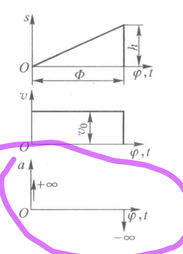
      </td>
      <td rowspan="2">刚性</td>
    </tr>
    <tr>
      <td>
        <strong>回程</strong> 
  $s = h - \frac{h}{\Phi'} (\varphi - \Phi - \Phi_s)$ 
  $v = -\frac{h}{\Phi'} \omega$ 
  $a = 0$ 
  $(\Phi + \Phi_s \leqslant \varphi \leqslant \Phi + \Phi_s + \Phi')$
      </td>
    </tr>
    <tr>
      <td rowspan="2" style="text-align: center; vertical-align: middle;">等加等减速 （二次多项式）</td>
      <td>
        <strong>推程加速段边界条件：</strong> 
  起始点：$\delta_1 = 0,\ s_2 = 0,\ v_2 = 0$ 
  中间点：$\delta_1 = \frac{\delta_t}{2},\ s_2 = \frac{h}{2}$ 
  求得：$C_0 = 0,\ C_1 = 0,\ C_2 = \frac{2h}{\delta_t^2}$  
        <strong>加速段推程运动方程为：</strong> 
  $s_2 = \frac{2h \delta_1^2}{\delta_t^2}$ 
  $v_2 = \frac{4h \omega_1 \delta_1}{\delta_t^2}$ 
  $a_2 = \frac{4h \omega_1^2}{\delta_t^2}$   
        <strong>推程减速段边界条件：</strong> 
  中间点：$\delta_1 = \frac{\delta_t}{2},\ s_2 = \frac{h}{2}$ 
  终止点：$\delta_1 = \delta_t,\ s_2 = h,\ v_2 = 0$ 
  求得：$C_0 = -h,\ C_1 = \frac{4h}{\delta_t},\ C_2 = -\frac{2h}{\delta_t^2}$  
        <strong>减速段推程运动方程为：</strong> 
  $s_2 = h - \frac{2h (\delta_t - \delta_1)^2}{\delta_t^2}$ 
  $v_2 = -\frac{4h \omega_1 (\delta_t - \delta_1)}{\delta_t^2}$ 
  $a_2 = -\frac{4h \omega_1^2}{\delta_t^2}$
      </td>
      <td rowspan="2">
        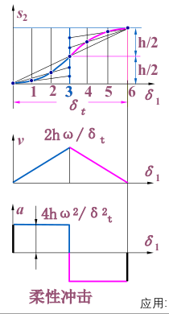
      </td>
      <td rowspan="2">柔性</td>
    </tr>
    <tr>
      <td>
        <strong>回程等加速段运动方程为：</strong> 
  $s_2 = h - \frac{2h \delta_1^2}{\delta_h^2}$ 
  $v_2 = -\frac{4h \omega_1 \delta_1}{\delta_h^2}$ 
  $a_2 = -\frac{4h \omega_1^2}{\delta_h^2}$  
        <strong>回程等减速段运动方程为：</strong> 
  $s_2 = \frac{2h (\delta_h - \delta_1)^2}{\delta_h^2}$ 
  $v_2 = -\frac{4h \omega_1 (\delta_h - \delta_1)}{\delta_h^2}$ 
  $a_2 = \frac{4h \omega_1^2}{\delta_h^2}$
      </td>
    </tr>
  </tbody>
</table>

3. 从动件的位移速度加速度随时间的变化：简谐运动
<table style="overflow: visible;">
  <thead>
    <tr>
      <th>运动规律</th>
      <th>运动方程</th>
      <th>推程运动线图</th>
      <th>冲击</th>
    </tr>
  </thead>
  <tbody>
    <!-- 余弦加速度（简谐） -->
    <tr>
      <td rowspan="2" style="text-align: center; vertical-align: middle;">余弦加速度 （简谐）</td>
      <td>
        <strong>推程：</strong> 
  $s_2 = h \left[1 - \cos(\pi \delta_1 / \delta_t)\right] / 2$ 
  $v_2 = \pi h \omega_1 \sin(\pi \delta_1 / \delta_t) \delta_t / (2 \delta_t^2)$ 
  $a_2 = \pi^2 h \omega_1^2 \cos(\pi \delta_1 / \delta_t) / (2 \delta_t^2)$
      </td>
      <td rowspan="2">
        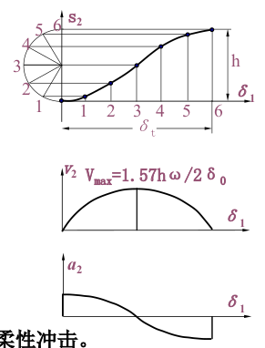
      </td>
      <td rowspan="2">在起始和终止处 理论上a2为有限值 产生柔性冲击。</td>
    </tr>
    <tr>
      <td>
        <strong>回程：</strong> 
  $s_2 = h \left[1 + \cos(\pi \delta_1 / \delta_h)\right] / 2$ 
  $v_2 = -\pi h \omega_1 \sin(\pi \delta_1 / \delta_h) \delta_h / (2 \delta_h^2)$ 
  $a_2 = -\pi^2 h \omega_1^2 \cos(\pi \delta_1 / \delta_h) / (2 \delta_h^2)$
      </td>
    </tr>
    <!-- 正弦加速度（摆线） -->
    <tr>
      <td rowspan="2" style="text-align: center; vertical-align: middle;">正弦加速度 （摆线）</td>
      <td>
        <strong>推程：</strong> 
  $s_2 = h \left[ \delta_1 / \delta_t - \sin(2\pi \delta_1 / \delta_t) / (2\pi) \right]$ 
  $v_2 = h \omega_1 \left[1 - \cos(2\pi \delta_1 / \delta_t)\right] / \delta_t$ 
  $a_2 = 2\pi h \omega_1^2 \sin(2\pi \delta_1 / \delta_t) / \delta_t^2$
      </td>
      <td rowspan="2">
        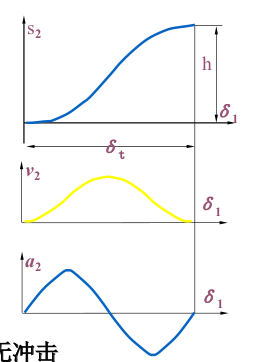
      </td>
      <td rowspan="2">无冲击</td>
    </tr>
    <tr>
      <td>
        <strong>回程：</strong> 
  $s_2 = h \left[1 - \delta_1 / \delta_h + \sin(2\pi \delta_1 / \delta_h) / (2\pi) \right]$ 
  $v_2 = h \omega_1 \left[\cos(2\pi \delta_1 / \delta_h) - 1\right] / \delta_h$ 
  $a_2 = -2\pi h \omega_1^2 \sin(2\pi \delta_1 / \delta_h) / \delta_h^2$
      </td>
    </tr>
  </tbody>
</table>

4. 不同运动规律的使用场景
一般取决于冲击，刚性冲击适合低速轻载
柔性冲击适合中低转速和轻载

## 3.3 凸轮机构的压力角
1. 压力角
正压力（作用力）与推杆上力作用点B速度方向间的夹角$\alpha$
2. 压力角与作用力的关系
不考虑摩擦时，作用力的方向是接触面的法线方向，
3. 压力角的值
当压力角大到一定程度，从动件受到的动力（沿导路方向的力）可能小于其受到的阻力，这时机构自锁，为保证正常工作，有要求$\alpha < \left[ \alpha\right]$

| 最大压力角 $[\alpha]$ | 适用场合         |
|------------------|------------------|
| $30^\circ$       | 直动从动件       |
| $35^\circ \sim 45^\circ$ | 摆动从动件     |
| $70^\circ \sim 80^\circ$ | 回程           |

4. 压力角与基圆半径的关系
$$
\tan \alpha = \frac{v_2 / \omega_1 \pm e}{S_2 + \sqrt{r_0^2 - e^2}}
$$
“+” 用于导路和瞬心位于中心两侧；“-” 用于导路和瞬心位于中心同侧；
显然，导路和瞬心位于中心同侧时，压力角将减小。
正确偏置：导路位于与凸轮旋转方向ω1相反的位置
注意：用偏置法可减小推程压力角，但同时增大了回程压力角，故偏距 e 不能太大。

压力角最大值一般出现在：
1）从动件的起点位置
2）从动件最大速度位置
3）凸轮轮廓向径变化最大部分
在上述公式中，通过增大基圆半径能减小压力角，但是基圆半径大了机构的尺寸也大，因此需要取舍
根据凸轮结构确定 $r_b$
    - **凸轮轴**：$r_b = r + r_T + 2 \sim 5\ \text{mm}$
    - **凸轮单独制造**，则：  
      $r_b = (1.5 \sim 2) r + r_T + 2 \sim 5\ \text{mm}$
    其中，$r$ 为轴的半径，$r_T$ 为滚子半径。

## 3.4 图解法设计凸轮轮廓
0. 反转原理
原本是凸轮作为主动件在旋转，而从动件不旋转
现在想象给整个凸轮机构施加一个反向的角速度，使得凸轮静止，而从动件绕凸轮旋转，这时从动件走过的轨迹就是要设计的凸轮轮廓
总之，凸轮的设计本质是按照从动件的运动需要来设计
1. 对心直动尖顶从动件盘形凸轮
对心就是圆心在导路的直线上
对心直动尖顶从动件凸轮机构中，已知凸轮的基圆半径$r_0$，角速度$\omega _1$和从动件的运动规律，设计该凸轮轮廓曲线。
设计步骤：
    1. 作基圆$r_0$
    2. 反向划分各运动角，变化快的地方分的多，变化慢的地方可以分得稀疏一点，如左图，左图为需求的运动规律图
    3. 确定从动件的尖顶在各分点的位置，注意左图中位移0是在基圆上，后面的位移也是到基圆的距离，而不是到圆心距离
    4. 确定好各点位置后光滑连接

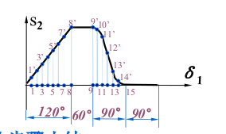 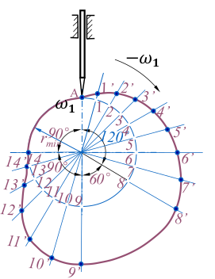
2. 偏置直动尖顶从动件盘形凸轮
已知凸轮的基圆半径 $r_0$，角速度 $\omega_1$ 和从动件的运动规律和偏心距 $e$
步骤：
    1. 根据基圆半径作出基圆；根据偏距作出偏距圆（在右图中，大圆是基圆，小圆是偏距圆）
    2. 将偏距圆等分，过这些点作偏距圆的切线，切线与基圆交于一点
    3. 沿着切线方向，从与基圆相交的点为起点，确定位移图上的距离
    4. 确定各点后光滑连接

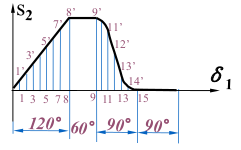 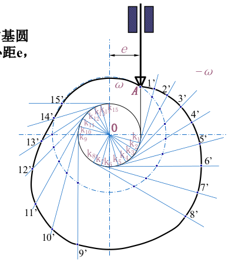
3. 对心滚子直动从动件盘形凸轮
已知凸轮的基圆半径 $r_0$，角速度 $\omega_1$ 
步骤：
    1. 由于滚子的圆心才是运动轨迹，因此作出基圆，滚子的圆心在基圆上
    2. 等分，并找到位移的各点，光滑连接，此时得到的轮廓是理论轮廓，也就是滚子圆心的轨迹
    3. 在理论轮廓上作出滚子，用光滑曲线作出滚子的内包络线，这才是凸轮的实际轮廓
    也就是说，基圆半径不是实际轮廓线的最小向径

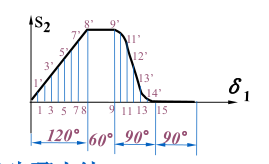 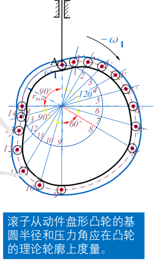

4. 滚子半径的选择
- $\rho_a$：工作轮廓的曲率半径  
- $\rho$：理论轮廓的曲率半径  
- $r_T$：滚子半径  
    1. 内凹轮廓（内凹）
    - **轮廓正常**：当 $ \rho > r_T $ 时
      - 工作轮廓曲率半径为：
  $$
  \rho_a = \rho + r_T
  $$
    - **轮廓变尖**：当 $ \rho = r_T $ 时
      - 此时：
  $$
  \rho_a = \rho - r_T = 0
  $$
      - 轮廓出现尖点，可能造成运动不连续或磨损加剧。

    2. 外凸轮廓（外凸）
    - **轮廓正常**：当 $ \rho > r_T $ 时
      - 工作轮廓曲率半径为：
  $$
  \rho_a = \rho - r_T
  $$
    - **轮廓失真**：当 $ \rho < r_T $ 时
      - 此时：
  $$
  \rho_a = \rho - r_T < 0
  $$
      - 出现负曲率半径，表示轮廓发生反转或失真，无法正常工作。
  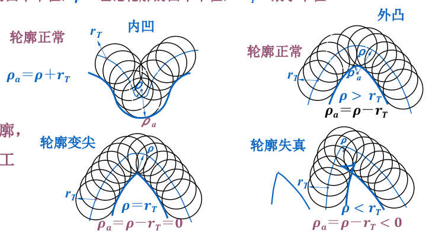

> 对于**外凸轮廓**，必须确保理论轮廓的最小曲率半径大于滚子半径，以避免轮廓失真。，应满足：
$$
\rho_{\min} > r_T
$$
即：**理论轮廓最小曲率半径必须大于滚子半径**。

| 轮廓类型 | 条件 | 工作轮廓曲率 $ \rho_a $ | 状态 |
|--------|------|-------------------------|-------|
| 内凹   | $\rho > r_T$ | $ \rho_a = \rho + r_T $ | 正常 |
| 内凹   | $ \rho = r_T $ | $ \rho_a = 0 $ | 变尖 |
| 外凸   | $ \rho > r_T $ | $ \rho_a = \rho - r_T $ | 正常 |
| 外凸   | $ \rho < r_T $ | $ \rho_a < 0 $ | 失真 |

5. 对心直动平底从动件盘形凸轮
对心直动平底从动件凸轮机构中，已知凸轮的基圆半径 $r_0$，角速度 $\omega$ 和从动件的运动规律
    1. 作出各等分点的位置
    2. 在各点的位置作垂线
    3. 作出各垂线的内包络线，就是目的轮廓线
对平底推杆凸轮机构，也有失真现象。
可通过增大 $r_0$ 解决此问题。

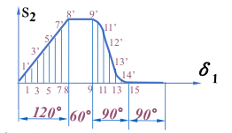 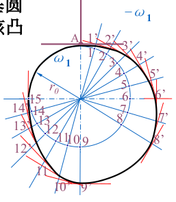

# 7 机械运转速度波动的调节
## 7.1 机械运转速度波动调节的目的和方法
1. 速度波动产生的不良后果：
①在运动副中引起附加动压力，加剧磨损，使工作可靠性降低。
②引起弹性振动，消耗能量，使机械效率降低。
③影响机械的工艺过程，使产品质量下降。
④载荷突然减小或增大时，发生飞车或停车事故

2. 速度波动调节的方法
    1. 对周期性速度波动，可在转动轴上安装一个质量较大的回转体（俗称飞轮）达到调速的目的。
    2. 对非周期性速度波动，需采用专门的调速器才能调节。

3. 机械运动的三个阶段
1 起动阶段：驱动力做的功大于阻力的功，系统的动能增加，机械的运转速度上升
2 稳定运转：机械的运转速度波动，但平均速度保持稳定，外力（包括动力和阻力）对系统的功在一个波动周期内为0
3 停车阶段：驱动力为0，系统减速直至停止
本章主要对稳定阶段的波动进行探讨

4. 周期性速度波动的原因
驱动力和阻力不可能时时相等，因此速度会变化

5. 平均角速度
平均角速度$\omega _m$指的是一个运动周期内，角速度的平均值
理论上需要对角速度积分并除以区间长度，但在符合生产实际下，为了方便，通常取极差的一半
$\omega _m = {\omega _{min} + \omega _{max} \over 2}$
6. 速度不均匀系数
衡量速度波动大小的系数，越大波动越明显
$\delta = {\omega _{max} - \omega _{min} \over \omega _m}$
由于动能与转动惯量成正比，与角速度平方成正比，又有以下推导
一个周期内最大能量变化
$$
\Delta W_{max} = \Delta E_{max} \\
= {1\over 2} J (\omega ^2 _{max} - \omega ^2 _{min}) \\
= {1\over 2} J \times 2{\omega _{max} + \omega _{min} \over 2} {\omega _{max} - \omega _{min} \over \omega_m}\omega_m \\
= J \omega ^2 _m \delta \\ \\
\\
\delta = {\Delta W _{max} \over J \omega ^2 _m}
$$

7. 周期性速度波动的调节
一般都调节方法是加上一个转动惯量较大的回转件飞轮,其转动惯量为$J_F$
于是可得
$\delta = {\Delta W _{max} \over (J + J_{F}) \omega ^2 _m}$
可以理解为飞轮存储和释放能量，让机械的速度波动幅度减小

8. 飞轮的简易设计
在上述公式中，明确不均匀系数后，即可得转动惯量，这时再确定飞轮的尺寸
9. 非周期性速度波动的调节
只能使用特殊的装置使输入功和输出功趋于平衡，这种装置称为调速器

# 第10章 连接
主要介绍可拆连接
## 10.1 螺纹参数
1. 牙型
	1. 矩形螺纹
		牙型：矩形截面，应用：多用于传动
	2. 三角形螺纹
		牙型：牙型角30°，应用：主要用于联接
	3. 梯形螺纹
		牙型：牙型角15°，应用：多用于传动
	4. 锯齿形螺纹
	牙型：工作面3°、非工作面30°，应用：多用于传动（单向受力场合）
2. 旋向
按照螺旋线的旋向，分为左旋螺纹和右旋螺纹。通常使用右旋。
3. 线数
按照螺旋线的数目，螺纹还分为单线螺纹、双线螺纹和等距排列的多线螺纹，一般不超过4线
4. 圆柱螺纹的主要几何参数
	1. 大径 d  
	   - 定义：与外螺纹牙顶（或内螺纹牙底）相重合的假想圆柱的直径  
	   - 即：螺纹的公称直径
	2. 小径 d₁  
	   - 定义：与外螺纹牙底（或内螺纹牙顶）相重合的假想圆柱的直径  
	   - 应用：常用于连接的强度计算
	3. 中径 d₂  
	   - 定义：假想圆柱的直径，其母线上牙型沟槽与凸起宽度相等  
	   - 应用：常用于连接的几何计算
	4. 线数 n  
	   - 定义：螺纹的螺旋线数目
	5. 螺距 P  
	   - 定义：螺纹相邻两个牙型上对应点间的轴向距离
	6. 导程 Pₕ  
	   - 定义：螺纹上任一点沿同一条螺旋线转一周所移动的轴向距离  
	   - 公式：Pₕ = nP,
	1. 螺纹升角 ψ  
	   - 定义：螺线与水平方向的夹角
	   - 公式：ψ = tan⁻¹(nP / πd₂)
	8. 牙型角 α  
	   - 定义：螺纹轴向截面内，螺纹牙型两侧边的夹角
	9. 牙侧角 β  
	   - 定义：牙型侧边与螺纹轴线的垂线间的夹角  
	   - 对称牙型时：β = α/2

## 10.2 螺旋副的受力分析、效率和自锁
1. 螺纹副
螺纹有内、外螺纹之分，两者旋合组成螺旋副或称螺纹副
2. 作用力
	1. 轴向力$F_a$
	2. 圆周力 $F$
	3. 法向反力 $N$
	4. 摩擦力 $f_{N}$
	5. 摩擦角$\varphi_v$
	当物体在接触面上即将滑动时，摩擦力 $F_f$ 与法向反力 $N$ 的合力与法线方向之间的夹角
3. 矩形螺纹
想象将螺纹展开成一条直线，那么问题就变成了斜面移动副的摩擦问题
自锁条件：ψ ≤ φ（即升角小于等于摩擦角
4. 非矩形螺纹（如三角形、梯形）修正 
自锁条件变为：$\psi \leq \varphi_v$
5. 所需拧紧力矩 T
$$
     T = F \cdot \frac{d_2}{2} = \frac{F_a d_2}{2} \tan(\psi + \varphi_v)
$$  
$d_2$ 为螺纹中径
6. 效率 $\eta$  
理想（无摩擦）驱动力：$F_0 = F_a \tan\psi$  
实际效率：  
     $$
     \eta = \frac{\tan\psi}{\tan(\psi + \varphi_v)}
     $$  
升角 $\psi$ 越大，效率越高；但自锁性越差

## 10.3 常用螺纹
1. 三角形螺纹  
   - 主要类型：普通螺纹、管螺纹  
   - 普通螺纹：  
     - 牙型角 α = 60°  
     - 公称直径为大径 d  
     - 同一公称直径可有多种螺距，螺距最大的为粗牙螺纹，其余为细牙螺纹  
     - 粗牙螺纹应用最广  
   - 细牙螺纹特点：  
     - 升角小、小径大  
     - 自锁性好、强度高  
     - 不耐磨、易滑扣  
   - 应用：薄壁零件、受动载荷的连接、微调机构  

2. 管螺纹  
   - 类型（共四种）：  
     - 普通细牙螺纹  
     - 55°非密封管螺纹  
     - 55°密封管螺纹  
     - 60°圆锥管螺纹  
   - 公称直径 d：表示管子的公称通径  
   - 圆柱管螺纹：用于水、煤气、润滑等管路系统  
   - 圆锥管螺纹：无需填料即可保证紧密性，旋合迅速，适用于密封要求高的场合  

3. 传动螺纹  
   - 梯形螺纹：  
     - 牙侧角 β = 15°  
     - 比矩形螺纹更易切削  
     - 可采用剖分螺母消除磨损间隙  
     - 应用广泛  
   - 锯齿形螺纹：  
     - 工作面牙侧角 β = 3°  
     - 效率高于梯形螺纹  
     - 仅适用于承受单向轴向载荷的场合

## 10.4 螺纹连接的基本类型及螺纹紧固件
1. 螺栓连接：普通螺栓连接
孔比螺栓直径大，非接触面
弹簧垫片或普通平垫片
横向载荷：依赖于被连接的两个结合面的摩擦力抵去横向载荷。因此不适合大的横向载荷
2. 螺栓连接：铰制孔用连接
螺孔直径和孔直径相同，配合面，精加工
可以不需要垫片
横向载荷：螺栓收到剪切力，因此横向承载能力远大于普通螺栓
3. 螺柱连接
适合较厚不适合通孔的下方零件
拆卸的时候无需将下方拧开，只要拧开上面的螺母就好了
4. 螺钉连接
适合不需要经常拆卸的零件
5. 紧定螺钉
依靠螺钉的端部与被连接件的接触来紧固零件
可以传递较小的扭矩
6. 六角头螺栓
公称长度不包括螺栓头的程度
7. 铰制孔用螺栓
8. 双头螺柱
旋入段和螺栓端的长度相同时，可以不分坐端和背端
公称长度不包含选入端的长度
9. 平垫圈
10. 弹簧垫圈
## 10.5 螺纹连接的预紧和防松
1. 预紧力
螺纹连接在装配时都必须拧紧，这时螺纹连接受到预紧力的作用
在方向上，就是轴向力 $F_{a}$
预紧力过大会拧断螺栓，过小时又无法正常紧固
对精密的零件，需要测力矩扳手或定力矩扳手
2. 常用粗牙螺纹钢制螺纹连接的预紧力与拧紧力矩
$$
T = 0.2 F_a d (N \cdot m)
$$
3. 螺纹连接防松的实质  
	- 防止螺纹副的相对转动，避免连接松动影响正常工作。
4. 防松方法按工作原理分类（三类）  
	   - 摩擦防松  
	   - 直接锁住（机械防松）  
	   - 不可拆卸防松（破坏螺纹副）——如铆冲、粘接、焊接
5. 常用摩擦防松方法（利用附加摩擦力）  
	   - 弹簧垫圈：  
	     - 材料：弹簧钢  
	     - 原理：装配后垫圈被压平，反弹力使螺纹间保持压紧力和摩擦力
	   - 对顶螺母：  
	     - 原理：两螺母对顶，使螺栓始终受附加拉力与摩擦力  
	     - 特点：结构简单，适用于低速重载场合  
	   - 尼龙圈锁紧螺母：  
	     - 结构：螺母内嵌尼龙圈  
	     - 原理：拧紧时尼龙圈内孔胀大，箍紧螺栓，产生摩擦阻力

## 10.6 螺栓连接的强度计算
1. 松螺栓连接与紧螺栓连接
有预紧力的称为紧螺栓连接，下面都是讨论紧螺栓
2. 受力类型
拉力（轴向载荷）与剪力（横向载荷）
除了铰制孔用螺栓外，无论外载荷的方向如何，螺栓总是受轴向拉力
3. 失效
塑性变形和疲劳断裂
4. 计算任务
确定螺栓的直径
5. 横向载荷：普通螺栓连接
受载时，只受到预紧力，而不受横向载荷力
因此，只需要考虑让两被连接零件不发生相对滑动、
即
$$
F_a \geq \frac{K_s F}{z i f}
$$
其中
	- $f$ 为被连接件接合面间的摩擦因数，对钢或铸铁的被连接件可取 $f = 0.1 \sim 0.15$；  
	- $z$ 为被连接件的接合面数目，比如说连接两个零件，结合面数就是1，连接三个零件，结合面数就是2；  
	- $i$ 为工作螺栓数目；  
	- $K_s$ 为防滑系数，通常取 $K_s = 1.1 \sim 1.3$。
	- $F$是横向载荷
可见，所需的预紧力较大，所以可以改用铰制孔用螺栓，
后采用键、销、套来承受横向载荷的减载装置
6. 强度条件
校核式
$$
\sigma = \frac{1.3 F_p}{\pi d_1^2 / 4} \leq [\sigma]
$$  
则小径，也就是最终设计式，计算后查表，使用不小于该值的螺栓小径
$$
d_1 \geq \sqrt{\frac{4 \times 1.3 F_p}{\pi [\sigma]}}
$$
7. 横向载荷：铰制孔用螺栓
依靠螺栓杆来承受横向载荷
这时要保证螺栓杆不被剪短，且被连接件的孔壁不会被压溃
剪切强度条件和挤压强度条件
8. 轴向载荷：普通螺栓连接
工作时，螺栓受到俩个力
一是拧紧后的预紧力
二是工作载荷
预紧力会让被连接件被压缩，螺栓被拉长，各自受到的力是相互作用力
当工作载荷的力与预紧力方向相同（沿轴线朝外），螺栓与零件发生形变，螺栓继续被拉伸，而零件的被压缩量减少，故此时预紧力减少，剩余的预紧力称为残余预紧力，大小与螺栓和零件的刚度有关。因此此时螺栓所受的轴向力应该是残存预紧力与轴向载荷之和
$$ F_A = F + F'_a $$
为了工作时零件不产生间隙，残余预紧力不能为0
求出单个螺栓的载荷 $F_{A}$后可以根据强度公式计算其螺栓小径
9. 受拉螺栓许用应力公式  
   $$
   [\sigma] = \frac{\sigma_s}{S}
$$
	- $\sigma_s$：螺栓材料的屈服极限  
	- $S$：安全系数，取值根据连接类型确定（查表）：  
		 - 松螺栓连接：$S = 1.2 \sim 1.7$  
		 - 紧螺栓连接（控制预紧力）：$S = 1.2 \sim 1.5$  
		 - 紧螺栓连接（不控制预紧力）：$S$
10. 螺栓组
	1. 确定被连接件的结构和连接用途，确定螺栓的数目和分布
	螺栓的分布通常是几何对称的，如圆，三角，长方形
	2. 分析受力情况，只需要分析受力最大的螺栓，根据当螺栓的受力分析确定螺栓的直径
11. 防松 
附加摩擦力防松，专门防松元件
对顶螺母，弹簧垫圈，槽形螺母和开口销，止动垫片，圆螺母和带垫片等

## 10.8 提高螺栓连接强度的措施
1. 避免产生附加弯曲应力
拧螺母的地方需要精加工
2. 减少应力集中
比如说圆角过渡

# 第14章 轴

## 14.3 轴的机构设计
1. 轴的结构应满足以下基本要求：
	1. 轴和轴上零件要有准确的工作位置；
	2. 轴上零件应便于装拆和调整；
	3. 轴应具有良好的制造工艺性。
2. 与齿轮配合
	1. 键的长度应该比轴段的长度要短一些
	2. 与齿轮配合的，轴段的宽度要比齿轮的宽度窄一些。（这样套筒就能抵在齿轮上而不是轴上）
3. 套筒
主要是实现零件的定位
套筒的外径要低于轴承内圈的厚度
4. 轴承盖
用于定位轴承的外圈
轴承盖和机架之间要有垫片
轴承盖静止，而轴旋转，为了减小摩擦，轴承盖的孔径比轴的直径要大
5. 轴肩
轴肩分为定位轴肩和非定位轴肩
定位轴肩为了减小应力集中，会设计圆角或倒角
6. 轴向定位
	1. 轴肩、套筒、圆螺母、挡圈、轴承端盖
	2. 定位轴肩: (0.007~0.1)d
	非定位轴肩：1~2mm
	其中，滚动轴承的定位轴肩高度不能超过轴承内圈端面的高度
	因为滚动轴承的拆卸时，需要将拆卸工具（拉马）作用在内圈
	3. 为了使零件能紧靠轴肩，**零件的倒角距离或圆角半径要大于轴肩的圆角半径**
	4. 套筒一般用于两个较近零件之间的定位，要注意套筒两端和零件接触而不是轴
	5. 两零件距离大时，可用圆螺母定位，应该和零件接触
	可以承受较大的轴向力，但会降低轴的疲劳强度，因此一般用于轴端
	6. 轴端挡圈也应该和零件接触
	7. 轴向力较小时，可采弹性挡圈、紧定螺钉及锁紧挡圈来实现。还有轴端挡圈、圆锥面等定位方式
7. 周向定位
键、花键、销、紧定螺钉、过盈配合等
8. 提高轴的强度的措施：合理布局
	1. 传动件应尽量靠近轴承
	2. 尽量不采用悬臂的支承形式
	3. 尽量缩短支承跨距及悬臂长度
9. 提高轴的强度的措施：改进零件结构
10. 提高轴的强度的措施：改进轴的结构
	1. 圆角过渡
	2. 避免轴上开孔、开槽、横切等
	3. 增大轴肩圆角
	4. and so on
11. 轴的结构
	1. 应该尽可能简化
	2. 为便于轴上零件的装拆，一般轴都做成从轴端逐渐向中间增大的阶梯状。
	3. 装零件的轴端应有倒角，便于装入零件
	车螺纹的轴端应有退刀槽，
	需要磨削的轴端有砂轮越程槽。这两个槽都是为了加工时能让刀具正确完成加工并退出
	4. 为了加工方便，同一轴上不同轴段的键槽应布置在轴的同一母线上。
	为减少刀具种类和提高劳动生产力：
	轴上直径相近处的圆角、倒角、键槽宽度、砂轮越程槽宽度和退刀槽宽度等应尽可能采用相同的尺寸。

## 14.4 轴的强度计算
1. 分析受力情况，判断危险截面的位置，由强度条件确定危险截面应有的尺寸
2. 扭转强度计算
	1. 只需要知道转矩大小就可以
	对传动轴进行精确计算
	或对弯矩未知的轴进行初步设计。将估算的轴径作为最小直径
	2. 转矩，圆截面轴的强度条件
	！插入公式
	当弯矩较小时，[t]可以取较大值
	此外，轴上有键槽时，轴径应该增加3%，两个键槽时应该增加7%
	对于空心轴，进行以下替换
3. 弯矩扭矩合成强度计算
	1. 仅当轴的设计已经确定适用，对转轴和心轴适用
	受力分析后分析危险截面的强度是否足够
	2. 弯曲应力
	！公式
	心轴时，取$T = 0$即可
	3. 扭切应力
	！公式
	4. 强度条件
	！公式
	由于弯曲应力和扭切应力的循环不同，折合后
	！公式
	当有键槽的时候，轴径增加5%
	5. 一般步骤
		1. 将载荷分解到水平面和垂直面。求垂直面支撑反力 $F_V$和水平面支撑反力$F_H$
		2. 2
		3. 3
		4. 4
		5. 5
		6. 6

## 14.5 轴的刚度计算
1. 保证轴的形变在许用范围内即可
形变量的描述：挠度 $\gamma$，转角，扭角
## 14.6 轴的临界转速
1. 概念
回转件的重心不可能精确在几何轴线上
因此旋转时会有偏心的

# 第15章 滑动轴承
> 要点
轴承的结构和轴承衬的结构，动压原理
## 15.1 摩擦状态
1. 轴承功用
支撑，保持旋转精度
减少摩擦与磨损
2. 轴承分类
滚动轴承：点、线接触，摩擦小
滑动摩擦：面接触，承载大，精度高，高速
3. 干摩擦
摩擦面无润滑或保护膜直接接触
4. 边界摩擦
两表面之间有润滑油，形成薄油墨（小于1微米），微观上部分地方还是会搓削
5. 液体摩擦
有充足的润滑油，形成油膜，能完全将两个表面完全分离
6. 混合摩擦
通常机械处于边界和液体之间，称为混合摩擦

## 15.2 滑动轴承的结构形式
1. 构成
轴承座
轴瓦
油孔
螺纹孔
2. 向心滑动轴承
主要承受径向载荷
	1. 整体式：简单
	2. 剖分式：拆卸方便，间隙可调
	3. 自动调心：适应轴的倾斜
3. 止推滑动轴承
主要承受轴向载荷
	1. 固定式
	2. 可倾式

## 15.3 轴瓦结构和轴承衬材料
1. 轴瓦结构
非承载区内表面有进油口和油沟，便于充分润滑
按照装配分类：
整体式
卷制式
剖分式
2. 油沟
形式多样
液体0.5~1
非液体0.8~.5
3. 轴瓦材料
摩擦小
导热
耐磨，耐蚀，抗胶合
强度和可塑性

## 15.4 润滑
1. 目的
2. 分类
液体，半固体，固体
3. 液体参数
黏度
液体内部的运动是分层的
4. 选取
载荷大，黏度大
载荷小，黏度小
5. 润滑脂
6. 固体
石墨，二硫化钼
7. 润滑装置

## 15.5 非液体摩擦的计算
1. 目的
维持边界油膜不破裂

## 15.6 动压润滑基本原理
1. 形成原理
两面平行运动时，油层间收到剪切作用，称为剪切流
两面靠近运动时，由于液体不会被压缩，油会流向两边
当两不平行的面平行运动时，为了平衡流入和 流出速度，会产生托举力
2. 条件
相对运动表面不平行
充满液体
有相对滑动速度，且让液体从大截面流入小截面
## 15.7 其它轴承

