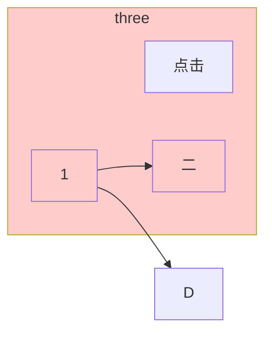
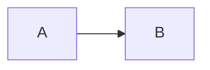
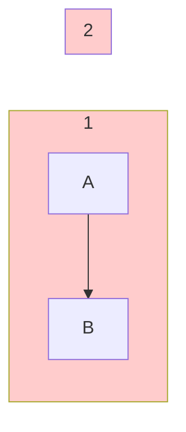

Mermaid语法
[Docu](https://mermaid.nodejs.cn/syntax/flowchart.html)

<style>
  .mermaid{
    background: #c2cfeb;
    curve: basis
  }
  
</style>

<nav style="position: fixed;right:2%;top:7%; z-index: 5">
  <ul>
    <li><a href="#目录">目录</a></li>
  </ul>
</nav>

## 目录
[节点形状](#节点形状)
[注释](#注释)
[id](#id)
[画布背景色](#设置画布背景颜色)
[子画布背景色](#设置子画布背景颜色)
[样式](#定义样式)
[样式类](#定义样式类)
[类的使用](#使用类)
[流程图](#流程图)
[连接线样式](#连接线样式)
[](#)


#### 节点形状
| 语法示例| 形状| 说明|
|----------------|----------------|--------------------------|
| `id[text]`| 矩形| 标准节点|
| `id(text)`| 圆角矩形| 常用于开始/结束节点|
| `id[[text]]`| 双圆矩形| 表示子流程或特殊步骤|
| `id[(text)]`| 圆柱形| 数据库或存储|
| `id>text]`| 不对称矩形| 右侧开口（较少用）|
| `id{text}`| 菱形| 条件判断（if-else）|
| `id((text))`| 圆形| 常用于起点/终点|


#### 注释
使用`%%`,且需要另起一行
~~~mermaid
graph LR
  %%这是注释
  注释
~~~

#### id
id有显式和隐式
```
A[]//普通节点，其中A是id，显示
内容//普通节点，其中“内容”是id，隐式
```
1. 用于指定样式
2. 连接节点
3. 引用
4. 交互


#### 设置画布背景颜色
用`<div>`来设置
<div style="background-color: #ffcccc;">
   

</div>

#### 设置子画布背景颜色
notable渲染器有限制
定义一个类
给子画布设置id
为id指定类


#### 定义样式
**语法**
```
style <id> <attribute>: <value>, <attribute>: <value>, ...
//只能指定一个id
```

#### 定义样式类
**语法**
```
classDef <class_name> <attribute>: <value>, <attribute>: <value>, ... ;
```
**常用属性**
| 属性名| 作用| 示例值|
|----------------------|-------------------------------|---------------------------------|
| `fill`| 节点背景色| `fill:#fff`（白色）、`fill:#f0f0f0`（浅灰） |
| `stroke`| 节点边框色| `stroke:#333`（黑色）、`stroke:#ff0000`（红色） |
| `stroke-width`| 边框粗细（单位：px）| `stroke-width:2px`|
| `rx`/`ry`| 圆角矩形的圆角半径（仅对矩形） | `rx:20, ry:20`（椭圆效果）|
| `color`| 文本颜色| `color:#ff0000`（红色文本）|
| `font-size`| 文本字号| `font-size:14px`|
| `stroke-dasharray`| 边框虚线样式（如 `5 5` 表示“5px实线+5px空白”） | `stroke-dasharray:5 5`（虚线边框） |

#### 使用类
```
1.
<node>:::<class_name>

2.
class <id>, <id>,... <class_name>
```

#### 流程图
使用`graph`关键字，接一个布局参数
语法
```
graph TD
```
| 布局参数| 含义| 示例代码| 效果示意图|
|----------------|-----------------------|------------------------------|--------------------------------------------------------------------------|
| `TB`（默认）| Top-Bottom（同 TD）| `graph TB; A-->B;`| 与 `TD` 完全一致（A 在 B 上方）|
| `LR`| Left-Right（从左到右）| `graph LR; A-->B;`| A 在 B 的左侧，水平排列：<br>```mermaid graph LR A-->B ```|
| `RL`| Right-Left（从右到左）| `graph RL; A-->B;`| A 在 B 的右侧，水平反向排列：<br>```mermaid graph RL A-->B ```|

#### 连接线样式
**内置样式**
|写法|样式|
|---|---|
|`A---B`|无箭头实线|
|`A--text---B`|无箭头文本实线|
|`A-->B`|带箭头实线|
|`A-->|text|B`|箭头文本实线|
|`A--text-->B`|箭头文本实线|
|`A-.-B`|无箭头虚线,文本相同，不赘述|
|`A-.->B`|带箭头虚线|
|`A===B`|粗线|
|`A==>B`|粗线箭头|

**自定义样式**
**语法**
```
linkStyle <index>,<index> <attribute>: <value>, <attribute>: <value>,...
//将覆盖原有样式
//索引从0开始，允许指定多个

linkStyle default <attribute>: <value>, <attribute>: <value>,...
//默认样式,或者说全局样式
//借助于默认样式---，-->,等减号样式为默认样式，对default设置
```
| 属性名| 作用| 示例值|
|----------------------|-------------------------------|---------------------------------|
| `stroke`| 线条颜色| `stroke:#ff0000`（红色线条）|
| `stroke-width`| 线条粗细| `stroke-width:2px`|
| `stroke-dasharray`| 线条虚线样式| `stroke-dasharray:5 5`可有多个值|


