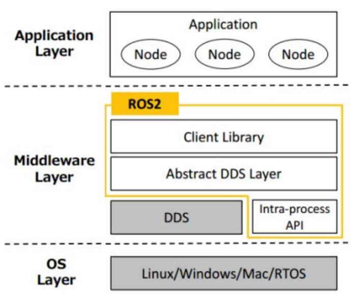

# 1概述与环境搭建
[返回根目录](./ROS2目录.md)
<p id = "directory">目录</p>

* [1.1简介](#11简介)
* [1.2安装](#12安装)
* [1.3体验](#13体验)
* [1.4环境搭建](#14环境搭建)
* [1.5体系架构](#15体系架构)

<nav style="position: fixed;right:2%;top:7%; z-index: 5">
  <ul>
    <li><a href="#directory">目录</a></li>
  </ul>
</nav>

# 1.1简介
[返回目录](#directory)
humble将维护到27年

ros是用于构建机器人应用开发的软件开发工具，在软件层面集成各模块，使各模块相互配合

本质上，ros是sdk，software development kit，软件开发包

模块化的概念是指本身具备一定的功能，但是可以搭配各种适配的工具，这些工具只要是标准化设计，就可以自由地结合

ros生态由通信(Plumbing)、工具(Tools)、功能(Capabilities)与社区(Community)四大部分组成

## 通信
通信是整个ROS系统的核心实现，是ROS内置的一个消息传递系统，通常称之为middleware(中间件)或Plumbing(管道)。

在构建新的应用程序或使用与硬件交互的软件时，如何实现通信是首当其冲的问题，为此ROS提供了专门的消息传递系统，它可以管理不同节点之间的通信细节，提高开发者的工作效率。这套消息传递系统使用了“**面向接口**”的编程思想，可以通过清晰规范的接口，将不同模块分离，从而也将故障隔离。使得ROS系统更易于维护、扩展性更强且保证了程序的高复用性。

接口规范**可以由开发者自行定义**。同时为了方便使用，在ROS中也**提供了许多标准的接口**，这些标准接口有着广泛应用，比如:将雷达或摄像头数据传输到可视化的用户界面或是传输到定位算法模块，都会使用到标准接口。

## 工具
构建机器人应用程序极具挑战性。开发者除了会遇到一些传统的软件开发问题之外，还需要通过传感器或执行器与物理世界进行异步交互/显而易见的，良好的开发工具可以提高应用程序的开发效率，在ROS中就内置了launch、调试、可视化、绘图、录制回放等一系列工具。这些工具不光可以提高开发效率，还可以在发布产品时直接包含在产品之中。

## 功能
ROS生态系统是机器人软件的聚宝盆/无论开发者需要用于GPS的设备驱动程序、用于四足仿生机器人的步行和平衡控制器，还是用于移动机器人的地图系统，RO都能满足你的需求。从驱动程序到算法，再到用户界面，ROS都提供了相关实现，开发者只需专注于自身应用程序即可。

ROS的目标是提供一站式的技术支持，降低构建机器人应用程序的门槛。ROS希望任何开发者都可以将自己的“创意”变为现实，而无需了解底层软件和硬件的所有内容。

## 社区
ROS社区规模庞大、多样目全球化，从学生和业余爱好者到跨国公司和政府机构，各行各业的人和组织都在推动着ROS项目的发展。

该项目的社区中心和中立管家是Open Robotics，它托管共享在线服务(例如[ROS官网](https:/www.ros.org))，创建和管理分发版本(包括您安装的二进制包)，并开发和维护大部分ROS核心软件。Open Robotics还提供与 ROS 相关的工程服务。

## 优势
1. 去中心化
避免使用master节点
2. DDS通信
3. 支持多机、实时
4. Zeroconf,ZeroMQ,Redis,WebSockets

# 1.2安装
[返回目录](#directory)
## 一键安装
```
source <(wget -qO- http://fishros.com/install)
```

## 测试
终端1中输入指令：`ros2 run turtlesim turtlesim_node`，执行完毕，会启动一个绘有小乌龟的窗口；

终端2中输入指令：`ros2 run turtlesim turtle_teleop_key`，执行完毕，可以在此终端中通过键盘控制乌龟运动。

## 安装colcon构建工具
一键安装中可能已经安装

colcon是一个命令行工具，用于改进编译，测试和使用多个软件包的工作流程。它实现过程自动化，处理需求并设置环境以便于使用软件包。ROS2中便是使用colcon作为包构建工具的，但是ROS2中没有默认安装colcon，需要自行安装，安装命令如下：
```
sudo apt install python3-colcon-common-extensions
```

# 1.3体验
[返回目录](#directory)
## 准备
无论是使用C++还是Python编写ROS2程序，都需要依赖于工作空间，在此，我们先实现工作空间的创建与编译，打开终端，输入如下指令：
```
mkdir -p ws00_helloworld/src #创建工作空间以及子级目录 src，工作空间名称可以自定义
cd ws00_helloworld #进入工作空间
colcon build #编译,colcon弹窗绿色为正常，黄色非致命警告，红色失败
```
上述指令执行完毕，将创建ws00_helloworld目录，且该目录下包含build、install、log、src共四个子级目录。

## 流程(4步)
### 创建功能包
```
cd src
ros2 pkg create hello_cpp --build-type ament_cmake --dependencies rclcpp --node-name helloworld
```
~~~ros2
ros2 pkg create <pkgname> --build-type <构建类型，不写默认cmake> --denpendencies <添加依赖，依赖名> --node-name <生成一个可执行程序，自动生成同名源代码>
~~~

### 编辑源文件
在上面的步骤中，应该生成了`hello_cpp`文件夹，里面有`src`文件夹，内部放置源代码文件
源文件基本结构
~~~c++
#include "rclcpp/rclcpp.hpp"

int main(int argc, char ** argv)
{
  // 初始化 ROS2
  rclcpp::init(argc,argv);
  // 创建节点
  auto node = rclcpp::Node::make_shared("helloworld_node");
  // 输出文本
  RCLCPP_INFO(node->get_logger(),"hello world!");
  // 释放资源
  rclcpp::shutdown();
  return 0;
}
~~~

### 编辑配置文件
在`hello_cpp`文件夹中，`CmakeList.txt`和`package.xml`是配置文件

`CmakeList.txt`中
|语句|含义|
|---|---|
|`find_package(<package_name> REQUIRED)`|引入外部依赖包|

`package.xml`中
|语句|含义|
|---|---|
|`<depend>rclcpp</depend>`|指明所需依赖|

### 编译
在工作空间根目录下
```bash
colcon build
```

### 执行
在工作空间根目录下
```
. install/setup.bash
ros2 run hello_cpp helloworld#功能包+可执行程序的名字，这行可以不在工作空间中执行
```

### 优化
在新终端下，需要执行类似`. install/setup.bash`的命令激活环境，现在希望在任意打开终端中都能省略这一步。

```
echo "source 绝对路径/setup.bash" >> ~/.bashrc
```


# 1.4环境搭建
[返回目录](#directory)
# 1.5体系架构
[返回目录](#directory)
## 文件系统

* 操作系统层（OS Layer）
ROS必须依赖于传统意义的操作系统

* 中间层（Middleware Layer）
主要由数据分发服务DDS与ROS2封装的关于机器人开发的中间件组成。DDS是一种去中心化的数据通讯方式，ROS2还引入了服务质量管理 （Quality of Service）机制，借助该机制可以保证在某些较差网络环境下也可以具备良好的通讯效果。ROS2中间件则主要由客户端库、DDS抽象层与进程内通讯API构成。

* 应用层（Application Layer）
是指开发者构建的应用程序，在应用程序中是以功能包为核心的，在功能包中可以包含源码、数据定义、接口等内容。

### 空间结构
功能包是ROS2应用程序的核心，但是功能包不能直接构建，必须依赖于工作空间，一个ROS2工作空间的目录结构如下：

    WorkSpace --- 自定义的工作空间。
        |--- build：存储中间文件的目录，该目录下会为每一个功能包创建一个单独子目录。
        |--- install：安装目录，该目录下会为每一个功能包创建一个单独子目录。
        |--- log：日志目录，用于存储日志文件。
        |--- src：用于存储功能包源码的目录。
            |-- C++功能包
                |-- package.xml：包信息，比如:包名、版本、作者、依赖项。
                |-- CMakeLists.txt：配置编译规则，比如源文件、依赖项、目标文件。
                |-- src：C++源文件目录。
                |-- include：头文件目录。
                |-- msg：消息接口文件目录。
                |-- srv：服务接口文件目录。
                |-- action：动作接口文件目录。
            |-- Python功能包
                |-- package.xml：包信息，比如:包名、版本、作者、依赖项。
                |-- setup.py：与C++功能包的CMakeLists.txt类似。
                |-- setup.cfg：功能包基本配置文件。
                |-- resource：资源目录。
                |-- test：存储测试相关文件。
                |-- 功能包同名目录：Python源文件目录。
            |-- C++或Python功能包,都可以自定义一些配置文件相关的目录。下面这些目录也可以定义为其他名称，或者根据需要创建其他一些目录。
                |-- launch：存储launch文件。
                |-- rviz：存储rviz2配置相关文件。
                |-- urdf：存储机器人建模文件。
                |-- params：存储参数文件。
                |-- world：存储仿真环境相关文件。
                |-- map：存储导航所需地图文件。
                |-- ......

### 源文件结构
C++继承Node实现示例如下：
~~~c++
#include "rclcpp/rclcpp.hpp"

class MyNode: public rclcpp::Node{
public:
  MyNode():Node("node_name"){ //构造函数，创建实例时输出日志
    RCLCPP_INFO(this->get_logger(),"hello world!");
  }

};

int main(int argc, char *argv[])
{
  rclcpp::init(argc,argv);//初始化
  auto node = std::make_shared<MyNode>();
  rclcpp::shutdown();//释放资源
  return 0;
}
~~~

之所以***继承***比直接实例化Node更被推荐，是因为继承方式可以在一个进程内组织多个节点，这对于提高节点间的通信效率是很有帮助的，但是直接实例化则与该功能不兼容。

### 配置文件
C++功能包的构建信息主要包含在package.xml与CMakeLists.txt中

**package.xml**
不管是何种类型的功能包，package.xml的格式都是类似的，在该文件中包含了包名、版本、作者、依赖项的信息，package.xml可以为colcon构建工具确定功能包的编译顺序。一个简单的package.xml示例如下：
~~~xml
<?xml version="1.0"?>
<?xml-model href="http://download.ros.org/schema/package_format3.xsd" schematypens="http://www.w3.org/2001/XMLSchema"?>
<package format="3">
  <name>pkg01_helloworld_cpp</name>
  <version>0.0.0</version>
  <description>TODO: Package description</description>
  <maintainer email="ros2@todo.todo">ros2</maintainer>
  <license>TODO: License declaration</license>

  <buildtool_depend>ament_cmake</buildtool_depend>
  <depend>rclcpp</depend>

  <test_depend>ament_lint_auto</test_depend>
  <test_depend>ament_lint_common</test_depend>

  <export>
    <build_type>ament_cmake</build_type>
  </export>
</package>
~~~
| 标签类别       | 标签名称                  | 描述                                                                 |
|----------------|---------------------------|----------------------------------------------------------------------|
| 根标签         | `<package>`               | 整个xml文件的根标签，`format`属性声明文件格式版本                     |
| 元信息标签     | `<name>`                  | 包名                                                                 |
|                | `<version>`               | 包的版本号                                                           |
|                | `<description>`           | 包的描述信息                                                         |
|                | `<maintainer>`            | 维护者信息                                                           |
|                | `<license>`               | 软件协议                                                             |
|                | `<url>`                   | 包的介绍网址                                                         |
|                | `<author>`                | 包的作者信息                                                         |
| 依赖项         | `<buildtool_depend>`      | 声明编译工具依赖                                                     |
|                | `<build_depend>`          | 声明编译依赖                                                         |
|                | `<build_export_depend>`   | 声明根据此包构建库所需依赖                                           |
|                | `<exec_depend>`           | 声明执行时依赖                                                       |
|                | `<depend>`                | 相当于`<build_depend>`+`<build_export_depend>`+`<exec_depend>`的集成 |
|                | `<test_depend>`           | 声明测试依赖                                                         |
|                | `<doc_depend>`            | 声明构建文档依赖                                                     |

**CmakeList.txt**
~~~C++
# 声明cmake的最低版本
cmake_minimum_required(VERSION 3.8)
# 包名，需要与package.xml中的包名一致
project(pkg01_helloworld_cpp)

if(CMAKE_COMPILER_IS_GNUCXX OR CMAKE_CXX_COMPILER_ID MATCHES "Clang")
  add_compile_options(-Wall -Wextra -Wpedantic)
endif()

# find dependencies
find_package(ament_cmake REQUIRED)
# 引入外部依赖包
find_package(rclcpp REQUIRED)

# 映射源文件与可执行文件
add_executable(helloworld src/helloworld.cpp)
# 设置目标依赖库
ament_target_dependencies(
  helloworld
  "rclcpp"
)
# 定义安装规则
install(TARGETS helloworld
  DESTINATION lib/${PROJECT_NAME})

if(BUILD_TESTING)
  find_package(ament_lint_auto REQUIRED)
  # the following line skips the linter which checks for copyrights
  # comment the line when a copyright and license is added to all source files
  set(ament_cmake_copyright_FOUND TRUE)
  # the following line skips cpplint (only works in a git repo)
  # comment the line when this package is in a git repo and when
  # a copyright and license is added to all source files
  set(ament_cmake_cpplint_FOUND TRUE)
  ament_lint_auto_find_test_dependencies()
endif()

ament_package()
~~~

## 核心模块

### 通信模块
有数据交换就离不开通信模块

### 功能包应用
1. 二进制安装
ROS官方或社区提供的功能包可以很方便的通过二进制方式安装，安装命令如下：
~~~bash 
sudo apt install ros-ROS2版本代号-功能包名称
~~~
> 可以调用apt search ros-ROS2版本代号-* | grep -i 关键字格式的命令，根据关键字查找所需的功能包。

2. 源码安装
即使用git clone源码
3. 自实现

### 终端命令与rqt
### launch文件
通过launch文件，可以批量的启动ROS2节点，这是在构建大型项目时启动多节点的常用方式。
### TF坐标变换
TF坐标变换可以实现机器人不同部件或不同机器人之间的相对位置关系的转换。
### 可视化
ROS2内置了三维可视化工具rviz2，它可以图形化的方式显示机器人模型或显示机器人系统中的一些抽象数据。

## 技术支持
ROS社区提供了多种技术支持机制，主要包括：包文档、问答、论坛、包索引以及问题跟踪，每种机制都有自己的用途，合适的选择技术支持机制可以避免问题的重复提问、减少问题解决时间
[包文档](https://docs.ros.org/)
[问答](https://answers.ros.org/questions/)
[论坛,闲聊用的](https://discourse.openrobotics.org/)
[包索引](https://index.ros.org/)
[问题跟踪器,提交bug或请求新功能](https://github.com/ros2/ros2/issues)
## 应用方向
1. NAV2
2. opencv
3. movelt
4. the autoware foundation
5. ……

