# 2通信机制核心
[返回根目录](./ROS2目录.md)

<style>
  .mermaid {
    background: #c2cfeb;
  }

  /*子图标题*/
  .clusters *{
    padding: 10px;
  }

/*矩形节点*/
  .node rect{
  }
   

</style>

<p id = "directory">目录</p>

<nav style="position: fixed;right:2%;top:7%; z-index: 5">
  <ul>
    <li><a href="#directory">目录</a></li>
  </ul>
</nav>

[2.1通信机制简介](#21通信机制简介)

[2.2话题通信](#22话题通信)
* [2.2.1案例分析](#221案例分析)
* [2.2.2原生消息](#222原生消息)
* [2.2.4自定义消息](#224自定义消息)

[2.3服务通信](#23服务通信)
* [2.3.1案例分析](#231案例分析)
* [2.3.2接口消息](#232接口消息)
* [2.3.3服务通信](#233服务通信)

[2.4动作通信](#24动作通信)
* [2.4.1案例分析](#242接口消息)
* [2.4.2接口消息](#243动作通信)
* [2.4.3动作通信](#241案例分析)

[2.5参数通信](#25参数通信)
* [2.5.1案例分析](#251案例分析)
* [2.5.2数据类型](#252数据类型)
* [2.5.3参数服务](#253参数服务)


# 2.1通信机制简介
[返回目录](#directory)
在ROS2中通信方式虽然有多种，但是不同通信方式的组成要素都是类似的，比如：通信是双方或多方行为、通信时都需要将不同的通信对象关联、都有各自的模型、交互数据时也必然涉及到数据载体等等。本节将会介绍通信中涉及到的一些术语。
### 节点
在通信时，不论采用何种方式，通信对象的构建都依赖于节点(***Node***)，在ROS2中，一般情况下每个节点都对应某一单一的功能模块(例如：雷达驱动节点可能负责发布雷达消息，摄像头驱动节点可能负责发布图像消息)。一个完整的机器人系统可能由许多协同工作的节点组成，ROS2中的单个可执行文件(C++程序或Python程序)可以包含一个或多个节点。

### 话题
话题(***Topic***)是一个纽带，具有相同话题的节点可以关联在一起，而这正是通信的前提。并且ROS2是跨语言的，有的节点可能是使用C++实现，有的节点可能是使用Python实现的，但是**只要二者使用了相同的话题，就可以实现数据的交互**。

### 通信模型
1. 话题通信：是一种单向通信模型，在通信双方中，发布方发布数据，订阅方订阅数据，数据流单向的由发布方传输到订阅方。

2. 服务通信：是一种基于请求响应的通信模型，在通信双方中，客户端发送请求数据到服务端，服务端响应结果给客户端。

3. 动作通信：是一种带有连续反馈的通信模型，在通信双方中，客户端发送请求数据到服务端，服务端响应结果给客户端，但是在服务端接收到请求到产生最终响应的过程中，会发送**连续的反馈**信息到客户端。

4. 参数服务：是一种基于共享的通信模型，在通信双方中，服务端可以设置数据，而客户端可以连接服务端并操作服务端数据。

```mermaid
graph TD
  subgraph 参数服务
    server4[参数服务]
    top4[话题]:::topic
    client4[参数客户]
    note4[特点: <br>数据共享]:::note
    data[(数据池)]


    client4-->top4
    top4-->client4
    top4-->server4
    server4-->top4
    client4-.-note4
    data-->server4-->data

  end  
  
  subgraph 动作通信
    server3[动作服务端]
    top3[话题]:::topic
    client3[动作客户端]
    note3[特点: <br>连续反馈]:::note

    client3-->top3
    top3-->client3
    top3-->server3
    server3-->top3
    client3-.-note3
    server3-->top3-->client3

  end


  subgraph 服务通信
    server[服务端]
    top2[话题]:::topic
    client[客户端]
    note2[特点: <br>请求式响应]:::note

    client-->top2
    top2-->client
    top2-->server
    server-->top2
    client-.-note2

  end

  subgraph 话题通信
    pub[发布方]
    top1[话题]:::topic
    sub[订阅方]
    note1[特点: <br>单向数据流]:::note

    pub-->top1-->sub-.-note1

  end


  classDef topic fill:white;
  classDef note fill: #FFFFDE, stroke-width: 0px, height: 67px;
```



### 接口
通信过程中，需要传输数据，就必然涉及到数据载体，也即要以特定格式传输数据。在ROS2中，数据载体称之为接口(interfaces)。
接口文件有三种：msg文件、srv文件与action文件。

#### msg文件
msg文件是用于定义**话题通信**中数据载体的接口文件，一个典型的.msg文件示例如下。
```msg
int64 num1
int64 num2
```
在文件中声明了一些被传输的类似于C++变量的数据。话题通信单向，因此结构也简单

#### srv文件
srv文件是用于定义**服务通信**中数据载体的接口文件，一个典型的.srv文件示例如下。
```srv
int64 num1
int64 num2
---
int64 sum
```
文件中声明的数据被---分割为两部分，上半部分用于声明请求数据，下半部分用于声明响应数据。

#### action文件
action文件使用用于定义**动作通信**中数据载体的接口文件，一个典型的.action文件示例如下。
```
int64 num
---
int64 sum
---
float64 progress
```
文件中声明的数据被---分割为三部分，上半部分用于声明请求数据，中间部分用于声明响应数据，下半部分用于声明连续反馈数据。

#### 变量类型
文件中每行声明的数据都由字段类型和字段名称组成，可以使用的字段类型有：
* int8, int16, int32, int64 (或者无符号类型: uint*)
* float32, float64
* string
* time, duration
* 其他msg文件
* 变长数组和定长数组

ROS中还有一种特殊类型：Header，标头包含时间戳和ROS2中常用的坐标帧信息。许多接口文件的第一行包含Header标头。

> 参数通信的数据无需定义接口文件，参数通信时数据会被封装为参数对象，参数客户端和服务端操作的都是参数对象。

实际应用中一般建议创建专门的接口功能包定义接口文件，终端下进入工作空间的src目录，执行如下命令：
```bash
ros2 pkg create --build-type ament_cmake base_interfaces_demo
```
该功能包将用于保存本章教程中自定义的接口文件。

# 2.2话题通信
[返回目录](#directory)
话题通信是ROS中使用频率最高的一种通信模式，话题通信是基于发布订阅模式的，也即：一个节点发布消息，另一个节点订阅该消息。话题通信的应用场景也极其广泛

一些传感器数据的采集，也都是使用了话题通信，话题通信适用于不断更新的数据传输，少逻辑处理相关的应用场景。

**概念**
话题通信是一种以发布订阅的方式实现不同节点之间数据传输的通信模型。数据发布对象称为发布方，数据订阅对象称之为订阅方，发布方和订阅方通过话题相关联，发布方将消息发布在话题上，订阅方则从该话题订阅消息，消息的流向是单向的。

话题通信的发布方与订阅方是一种**多对多**的关系，也即，同一话题下可以存在多个发布方，也可以存在多个订阅方，这意味着数据会出现交叉传输的情况，当然如果没有订阅方，数据传输也会出现丢失的情况。

**消息接口**

* 在ROS2中通过std_msgs包封装了一些原生的数据类型,比如：String、Int8、Int16、Int32、Int64、Float32、Float64、Char、Bool、Empty.... 这些原生数据类型也可以作为话题通信的载体，不过这些数据一般只包含一个 data 字段，而std_msgs包中其他的接口文件也比较简单，结构的单一意味着功能上的局限性，当传输一些结构复杂的数据时，就显得力不从心了；

* 在ROS2中还预定义了许多标准话题消息接口，这在实际工作中有着广泛的应用，比如：sensor_msgs包中定义了许多关于传感器消息的接口（雷达、摄像头、点云......），geometry_msgs包中则定义了许多几何消息相关的接口（坐标点、坐标系、速度指令......）；

* 如果上述接口文件都不能满足我们的需求，那么就可以自定义接口消息；


## 2.2.1案例分析
要关注的要素有三个：
1. 发布方
2. 订阅方
3. 消息载体

流程：
1. 编写发布方实现
2. 编写订阅方实现
3. 编辑配置文件
4. 编译执行

## 2.2.2原生消息
创建功能包
```bash
ros2 pkg create cpp01_topic --build-type ament_cmake --dependencies rclcpp std_msgs base_interfaces_demo --node-name publisher
```
[发布源码](./dds/topic/src/topic/src/publisher.cpp)
[订阅源码](./dds/topic/src/topic/src/suber.cpp)
要修改cmake配置文件


## 2.2.4自定义消息
与编写可执行程序流程类似：
1. 创建并编写`.msg`文件
3. 编辑配置文件
4. 编译执行

以包含姓名，年龄，身高等字段为例

功能包 下
### 1
新建 `msg` 文件夹，`msg`文件夹下新建`Student.msg`文件（**首字母要大写**），文件中输入如下内容：
```msg
string   name
int32    age
float64  height
```
### 2
在`package.xml`中需要添加一些依赖包，具体内容如下：
```xml
<!--编译依赖 -->
<build_depend>rosidl_default_generators</build_depend>
<!--执行依赖-->
<exec_depend>rosidl_default_runtime</exec_depend>
<!--声明当前包所属的功能包组-->
<member_of_group>rosidl_interface_packages</member_of_group>
```
### 3
为了将`.msg`文件转换成对应的C++和Python代码，还需要在`CMakeLists.txt`中添加如下配置：
```python
find_package(rosidl_default_generators REQUIRED)
# 为接口生成源码
rosidl_generate_interfaces(${PROJECT_NAME}
  "msg/Student.msg"
)
```
### 编译
生成的文件在根目录的`install`文件夹下，`include` `local`分别是c++和python的内容
### 测试
```bash
ros2 interface show <package_name>/msg/Student
```
将输出文件一致的内容


自定义接口的使用只是包含头文件和改变`msg`类型


# 2.3服务通信
[返回目录](#directory)
服务通信是以请求响应的方式实现不同节点之间数据传输的通信模式。发送请求数据的对象称为客户端，接收请求并发送响应的对象称之为服务端，同话题通信一样，客户端和服务端也通过话题相关联，不同的是服务通信的数据传输是双向交互式的。

服务通信中，**服务端与客户端是一对多**的关系，也即，同一服务话题下，存在多个客户端，每个客户端都可以向服务端发送请求。

用于偶然的、对实时性有要求、有一定逻辑处理需求的数据传输场景。
## 2.3.1案例分析
* 客户端；
* 服务端；
* 消息载体。

## 2.3.2接口消息
定义服务接口消息与定义话题接口消息流程类似，主要步骤如下：
1. 创建并编辑 .srv文件；
1. 编辑配置文件；
1. 编译；
1. 测试。

功能包下新建srv文件
格式为
```srv
type varient
type varient

---

type varient
```
cmake和xml的配置与话题通信相同

配置完成后编译功能包即可，测试方法与话题通信相同

## 2.3.3服务通信
客户端最好发送请求前验证是否正常链接服务端


# 2.4动作通信
[返回目录](#directory)
动作通信适用于长时间运行的任务。就结构而言动作通信由目标、反馈和结果三部分组成；就功能而言动作通信类似于服务通信，动作客户端可以发送请求到动作服务端，并接收动作服务端响应的最终结果，不过动作通信可以在*请求响应过程中获取连续反馈，并且也可以向动作服务端发送任务取消请求*；就底层实现而言动作通信是建立在话题通信和服务通信之上的，目标发送实现是对服务通信的封装，结果的获取也是对服务通信的封装，而连续反馈则是对话题通信的封装。

如图，有五次通信
第一次客户端向服务端发送请求
第二次，服务端评估请求后并响应是否接受请求
第三次，客户端向服务端请求处理
第四次，服务费向客户端连续反馈
第五步，服务端响应最终结果

后两步ros2已经封装好了，无需自己实现

一般适用于耗时的请求响应场景，用以获取连续的状态反馈。

## 2.4.1案例分析
动作通信的c++实现需要额外依赖包`rclcpp_action`
## 2.4.2接口消息
接口文件首字母大写，以`.action`为后缀

`package.xml`配置
```xml
<buildtool_depend>rosidl_default_generators</buildtool_depend>
<depend>action_msgs</depend>
<member_of_group>rosidl_interface_packages</member_of_group>
```

`cmake`配置与前面相同

检验方法相同

## 2.4.3动作通信


# 2.5参数通信
[返回目录](#directory)

## 2.5.2数据类型
## 2.5.1案例分析
## 2.5.3参数服务

<p id = "now"></p>


# 小结
[返回目录](#directory)
无论何种通信机制，他们的实现框架都是类似的。比如：通信必然涉及到双方，双方需要通过“话题”关联，通信还都必然涉及到数据，一般可以通过接口文件来定义数据格式（参数服务是通过参数类封装数据）。

不同的通信机制其实现模型也存在明显差异。话题通信是基于广播的单向数据交互模式；服务通信是基于请求响应的问答式交数据互模式；动作通信则是在请求响应的过程中又包含连续反馈的数据交互模式；参数服务是基于服务通信的，可以在不同节点间实现数据共享。实现模型的差异也决定着他们有着不同的应用场景，大家可以根据自己的实际需求灵活选择。 

