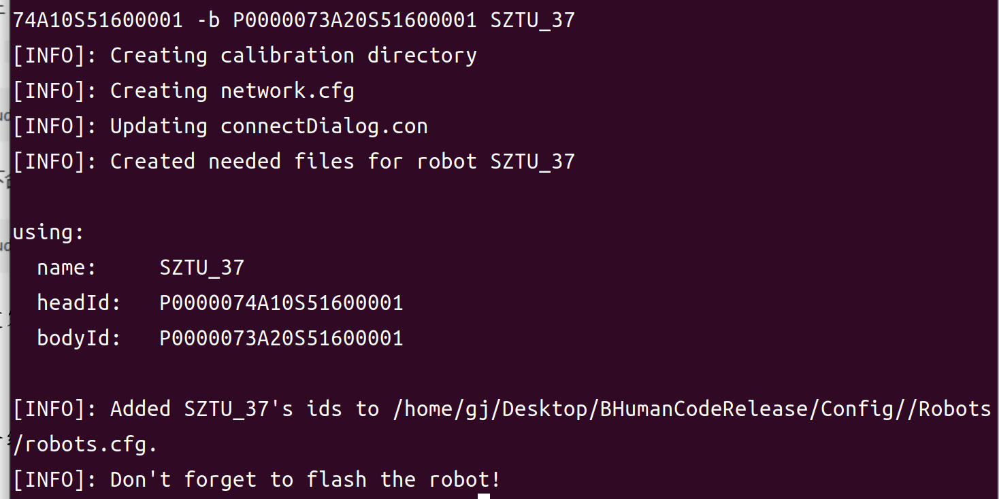

# 足球机器人的上手使用
<style>

  .preview{
    background: #F5F5DC
  }
  img{display:block;width:50%;height:auto;min-height:1px}

</style>

<nav style="position: fixed;right:2%;top:7%; z-index: 5">
  <ul>
    <li><a href="#directory">目录</a></li>
  </ul>
</nav>

[Official Document](https://docs.b-human.de/master/getting-started/running-the-code/#deploying-the-software)
笔者基于双系统写下这篇教程。

<p id = "directory">目录</p>

[0 足球机器人的使用](#0-足球机器人的使用)
[1 安装虚拟机|装双系统](#1-安装虚拟机装双系统)
[2 初步配置环境](#2-初步配置环境)
[3 克隆代码](#3-克隆代码)
[4 生成缓存与编译代码](#4-生成缓存与编译代码)
[5 创建机器人文件并生成第二次刷机文件](#5-创建机器人文件并生成第二次刷机文件)
[6 第一次刷机](#6-第一次刷机)
[7 第二次刷机](#7-第二次刷机)
[8 部署代码](#8-部署代码)
[9 使用控制器](#9-使用控制器)


知识要求：

1. 掌握Linux基本命令、Linux终端基本命令的使用，可以在安装Linux系统后学习使用
2. 会科技上网，即梯子、翻墙
3. 会使用搜索引擎，会问问题
4. 有一定的英语水平是加分项

***

## 0 足球机器人的使用
机器人胸口有一个按钮，头上有三个按钮，后脑勺有U盘插口和网口

*图0-1 头上的三个按钮*
#### 刷好机的状态下
1. 关机下，短按胸口开机
2. 开机后，待到胸口闪蓝光，再次短按启动，这时机器人站立
3. 站立后再次短按，机器人行走
4. 机器人直立或行走时，同时长按头上三个按钮，机器人将蹲下
#### 刷机操作
1. 机器人置于关机状态，插入U盘，长按胸口直至闪蓝光，开始刷机

***

## 1 安装虚拟机|装双系统

> 机器人操作系统（robot operating system, ros）与ubuntu有着密切的关联，因此ubuntu是最佳选择，趁早学习不会吃亏。由于推荐使用双系统，在这里并不会介绍如何安装虚拟机

<details>
  <summary>点击展开</summary>
     <!-- <summary style="background-color: #c2cfeb; width: max-content; position: absolute; right: 50%; ">点击展开</summary> -->

### 1镜像包
[下载，记得选桌面版](https://cn.ubuntu.com/download/alternative-downloads)，或找人拷贝
### 2制作启动盘
找人拷贝制作启动盘的软件

***下面选择语言时建议选英文***
***下面选择语言时建议选英文***
***下面选择语言时建议选英文***

第6步选择默认的方式就行，之后正常点就行

***

</details>

## 2 初步配置环境
> 这些基本的包是往下进行的基础  
#### 安装基础包
[文档对应**Linux**](https://docs.b-human.de/coderelease2021/getting-started/#linux)
在任意终端运行以下命令  
```bash
sudo apt update
sudo apt install -y build-essential tar
sudo apt install clang cmake git graphviz libasound-dev libglew-dev libqt5opengl5-dev libqt5svg5-dev lld llvm net-tools ninja-build pigz qtbase5-dev rsync wish xterm xxd
```
没有出现无法定位，无法找到等，大概就是成功


***

## 3 克隆代码
挑选一处文件夹，在当前文件夹打开终端，在终端执行以下命令以克隆代码，执行完后应该会在当前文件夹下生成文件夹`BHumanCodeRelease`下面用`/path/to/your/`指代文件夹`BHumanCodeRelease`所在路径
```bash
git clone --recurse-submodules https://github.com/bhuman/BHumanCodeRelease.git
```
其中`--recurse-submodules`是非常重要的参数，千万不能漏！
成功如图3-1

*3-1*

github需要vpn，网络问题可以先找人要克隆好的文件

***

## 4 生成缓存与编译代码
[文档对应](https://docs.b-human.de/coderelease2021/getting-started/#project-generation)
在上面的终端中，执行以下命令
```bash
cd BHumanCodeRelease #进入文件夹
NO_CLION=true Make/Linux/generate #生成缓存
Make/Linux/compile #编译
```
分开运行时，第二行正常结果如图4-1，且无红色字符

*图4-1*

第三行正常结果如图4-2，且无红色字符

*图4-2*

***

## 5 创建机器人文件并生成第二次刷机文件
> 接下来正式要使用到机器人了，搬一台过来！

#### 创建机器人
[文档对应**Creating a Robot Configuration**](https://docs.b-human.de/coderelease2021/getting-started/#creating-a-robot-configuration)
这里我们不使用ip创建机器人，而是使用序列号
如图5-1，双手摸机器人头下方，找到蓝色部分并按下即可将头部拆下，红色部分为头部序列号，记下序列号,注意，***序列号是P开头的20位字符***。装回时只需对准卡好即可

*图5-1*

如图5-2，机器人身体序列号在左腿后侧，记下序列号

*图5-2*

在`/path/to/your/BHumanCodeRelease`文件夹下打开终端，运行以下命令,在这一步，一次只能创建一个机器人，当创建多个机器人时，多次执行命令即可
```bash
Install/createRobot -d -t <team> -r <robot> -s <head> -b <body> <name>
```
[各参数意义参考](https://docs.b-human.de/master/getting-started/running-the-code/#deploying-the-software)
其中进行以下替换,其中，两个序列号是机器人的唯一不变标识

|被替换内容|替换内容|
|---|---|
|\<team\>|上一步中的`number`，将作为机器人ip的第三位，刷机后仍可更改|
|\<robot\>|可以自定义，将作为机器人ip的第四位，刷机后仍可更改，不能重复|
|\<head\>|头部序列号|
|\<body\>|身体序列号|
|\<name\>|机器人名字，不能有空格，不能重复,建议命名为`SZTU_37`,`SZTU_17`等|
***注意***，是将`<team>`替换成`1`，而不是替换成`<1>`

成功示例如图5-3

*图5-3*

#### 制作第二次刷机文件
[文档对应**Creating a Root Image**](https://docs.b-human.de/coderelease2021/getting-started/#creating-a-root-image)
**第一步**，
找人拷贝或在群里找到文件<strong><big>nao-2.8.5.11_ROBOCUP_ONLY_with_root.opn</big></strong>，将复制到ubuntu中，记下文件路径

**第二步**，生成镜像文件
在`/path/to/your/BHumanCodeRelease`文件夹下打开终端，运行以下命令
```bash
sudo apt install debootstrap patchelf
```
```bash
sudo Install/createRootImage <path to original SoftBank OPN>
```
其中，`<path to original SoftBank OPN>`替换为上述文件路径，例如
```bash
sudo Install/createRootImage /home/gj/Desktop/足球机器人资料/nao-2.8.5.11_ROBOCUP_ONLY_with_root.opn
```
成功如图5-4，这时记住所创建的文件路径

*图5-4*

**第三步**，设置网络

我们进入文件夹`~BHumanCodeRelease/Install/Profiles`
对任一文件进行修改，或创建新文件，修改后文件名为***naosoccer***,
内容如图5-5

*图5-5*

**第四步**，生成刷机文件

再在第二步终端中执行
```bash
Make/Common/deploy -i -v 30 -w naosoccer
```
这时可能有类似报错
`[FATAL]: /home/gj/Desktop/BHumanCodeRelease/Install/root-coderelease2024.ext3[.gz] does not exist. Did you run the script to create the root image?
`
找到第二步生成的文件，将其重命名为与报错中相同名字，如`root-2025-07-16.ext3`改为`root-coderelease2024.ext3`

<p id ="ProductBhuman"></p>

再在终端中执行上述命令，成功如图5-6

*图5-6*

在文件夹`/BHumanCodeRelease/Build/Image/Develop`中查看是否有***bhuman.opn***文件，文件大小在260MB左右，若有则成功

***

## 6 第一次刷机
> 机器人内原本有设置好 的内容，这里是要将其重置。你需要一个至少8G的U盘。

首先,**格式化U盘**，不要快速格式化，或者用以下方法
1. 进入windows系统中，将U盘插入电脑中
2. 按windows+R键来打开运行，然后输入Diskpart，回车打开程序，之后依次输入下列命令：
```bash
#列出所有U盘
list volume
#(number为刚刚插入的U盘对应的编号，例如5)
SELECT VOLUME <U盘对应的编号>
#(删除U盘的文件和配置信息)
CLEAN
```
找人要或群内找到压缩包***flasher-2.1.0.19-win64-vs2010zip***，在Windows中解压，并打开路径`/flasher-2.1.0.19-win64-vs2010/flasher-2.1.0.19-win64-vs2010/bin/`
以管理员身份运行文件**flasher**

*图6-1*
重新插入U盘，点击`Refresh`获取U盘
点击`Browse`，选择刷机文件，`Write`开始写入

第一次刷机文件为<strong><big>nao-2.8.5.11_ROBOCUP_ONLY_with_root.opn</big></strong>，在上面的步骤中已经使用过

烧录完成后，将U盘插入机器人，长按胸口直至出现蓝光。刷机结束的标志有，机器人站起，说话等

***

## 7 第二次刷机
第二次刷机文件为<strong><big>bhuman.opn</big></strong>，在[上面的步骤](#ProductBhuman)中**生成**，其它步骤与第一次刷机相同，不多赘述
刷机完成后机器自动关机
短按胸口冒白光
待胸口出现蓝关时，再次短按，机器人能站起，大概成功

---

## 8 部署代码
> 回到ubuntu，这里双系统和虚拟机的操作略有不同……

#### 设置[部署参数](https://docs.b-human.de/coderelease2021/bush/#configuration)
进入文件夹`/path/to/your/BHumanCodeRelease/Config`

第一个文件（必须修改）
打开文件`teamList.cfg`
这里添加你的队伍名称和它对应的编号，注意模仿格式，编号和[创建机器人](#创建机器人)中设置的编号一致
影响的是[图8-3的Team中的选项，点击前往](#img8-3)
也可以打开界面一边修改着感受这些改了都有什么影响。每次修改完保存，并重新打开界面，看看什么变化，下面的文件修改同理。

第二个文件（非必须修改）
打开文件`teams.cfg`
该文件设置的是[图8-3的界面和默认参数，点击前往](#img8-3)
可以不改这些默认值，到时候在部署界面选择，设置即可
|参数|作用|
|--|--|
|name|没有太大作用，参考[图8-3](#img8-3)|
|number|队伍的编号|
|fieldPlayerColor|球员颜色|
|goalkeeperColor|守门员颜色|
|scenario|场景，比赛模式|
|location|主场或客场|
|wlanConfig|网络名称，NONE为关闭|
|volume|音量|
|magicNumber|机器人会忽略来自magicNumber不同的机器人的信息，建议设置|
|player|机器人名字，可以不设置，要设置就用创建机器人时的名字，甚至建议不设置|
图8-1中给出两个示例

*图8-1*

修改后保存

确保机器人正常启动了

### 双系统
连接实验室的网络**naosoccer**,密码与WiFi同名。
进行以下设置，如图8-2

*图8-2*
在`/path/to/your/BHumanCodeRelease`文件夹下打开终端，运行
```bash
./Build/Linux/DeployDialog/Develop/DeployDialog 
```
<p id="img8-3"></p>

打开部署界面，如图8-3

*8-3*

能看见表格中右边各列有值，说明这台机器人成功连上了！
如果前面没有设置`player`,那现在连上的机器人左边应该没有编号，按住鼠标左键将对应的机器人名字拖上去即可。
点击`Deploy`，这时终端会输出一串参数，[参数参考](https://docs.b-human.de/master/getting-started/running-the-code/#deploying-the-software)

接下来运行命令
```bash
./Make/Common/deploy <上面输出的参数，相信你已经知道这里该怎么替换了>
```
成功示例如图8-4

*图8-4*

至此，机器人队伍的部署就完成了

### 虚拟机
关闭主机（Windows）的网络，用网线连接机器人和电脑，并对虚拟机进行如下设置


这里是插上网线后，对ubuntu的网络设置，[第四位不要和任何机器人重复](#创建机器人)

在`/path/to/your/BHumanCodeRelease`文件夹下打开终端，运行
```bash
./Build/Linux/DeployDialog/Develop/DeployDialog 
```
打开部署界面

*图8-1*
可能不会出现各值，直接点击`Deploy`，这时终端会输出一串参数，[参数参考](https://docs.b-human.de/master/getting-started/running-the-code/#deploying-the-software)
这时再在终端中运行
```bash
./Make/Common/deploy <上面输出的参数，相信你已经知道这里该怎么替换了>
```
成功示例如图8-4。
由于是依赖网线连接，所以每次只能为一台机器人部署代码，有可能报错其它机器人不能reach

*图8-4*

---

## 9 使用控制器
从别人或群里或实验室电脑拷一份***game_controller***过来。

#### 配置
进入其中的文件夹`config`,对两个文件进行修改，
`teams.yaml`和`champions_cup/teams.yaml`
在文件中添加自己的队伍信息，***注意格式***，注意颜色至少两种
如图9-1


#### 使用
在有***game_controller***文件的文件夹下打开终端，运行
```bash
./game_controller
```
打开控制器，如图9-2

*图9-2*
相信这些英文难不倒你，在上面两个可选中选择队伍，队伍必须不同
同样，下面四个颜色也必须四个直接互不相同
点击`start`进入
当你能看见你的队伍那边，有绿色的点，说明连上了，如图9-3

*图9-3*

若没有，也可以点击`Substitute`，再点击下面的球员，看看有没有绿点，注意，这里球员的编号与[图8-1](#图8-1)中最左边的编号对应


##### 非教程部分
通过deploydialog可以查看机器人的状态

