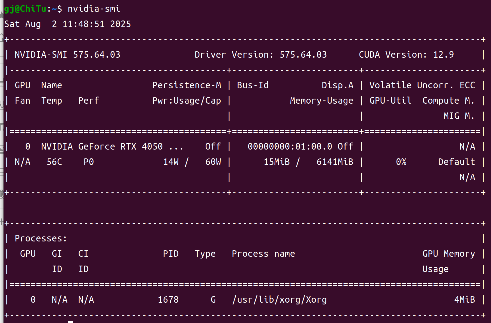

CUDA

<style>
  img{
    display:block;
    width:75%;
    height:auto;
    min-height:1px
  }
</style>

[一文讲清楚CUDA、CUDA toolkit、CUDNN、NVCC关系](https://blog.csdn.net/qq_41094058/article/details/116207333)
[安装cuda和cudnn](https://zhuanlan.zhihu.com/p/691711768)

# 0简介
## 什么是cuda
通俗地说，CUDA是一种协助“CPU任务分发+GPU并行处理”的编程模型/平台，用于加速GPU和CPU之间的计算。

也就是说CUDA通过CPU任务分发和GPU并行处理的方式，把计算任务通过CPU分发给GPU进行并行计算加速。而GPU并行计算的能力需要CUDA借助其自带的编程接口和工具，比如C/C++语言来编写并行计算程序，并通过CUDA编译器将程序转化为可以在英NVIDIA GPU上执行的机器码快速运行。

所以，通过使用CUDA平台，开发者可以充分利用GPU的并行计算能力加速各种应用程序的运行速度，同时还能与CPU进行协同计算。而人工智能运算往往需要进行大规模亿级的计算，这也就是CUDA在人工智能领域大行其道的原因之一。

## 其它组件
* cudnn：为深度学习计算设计的软件库。
* CUDA Toolkit (nvidia)： CUDA完整的工具安装包，其中提供了 Nvidia 驱动程序、开发 CUDA 程序相关的开发工具包等可供安装的选项。包括 CUDA 程序的编译器、IDE、调试器等，CUDA 程序所对应的各式库文件以及它们的头文件。
* CUDA Toolkit (Pytorch)： CUDA不完整的工具安装包，其主要包含在使用 CUDA 相关的功能时所依赖的动态链接库。不会安装驱动程序。
* （NVCC 是CUDA的编译器，只是 CUDA Toolkit 中的一部分）

# 1安装
## 驱动

## cuda
命令行查看驱动
```bash
nvidia-smi
```
如图，右上角为最高支持的cuda版本


[最新版下载链接](https://developer.nvidia.com/cuda-toolkit)
[旧版](https://developer.nvidia.com/cuda-toolkit-archive)
找到合适的版本，下载deb(local),完成后安装

**检验安装**
命令行查看cuda
```bash
nvcc -V
```
能看到版本说明安装成功了

**配置环境变量**
命令行
```bash
gedit ~/.bashrc
```
在最后添加
```
export PATH=/usr/local/cuda-<version>/bin${PATH:+:${PATH}}
export LD_LIBRARY_PATH=/usr/local/cuda-<version>/lib64${LD_LIBRARY_PATH:+:${LD_LIBRARY_PATH}}
```
保存后退出
重新加载配置环境文件
```bash
source ~/.bashrc
```

## cudnn


