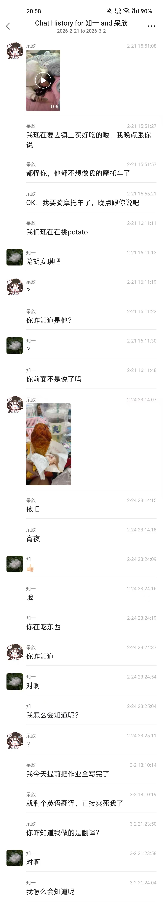

memo

给你展现一下我写小作文的能力

我觉得写小作文真的很爽，甚至可以说是我在中学的一种放松，缓解压力的方式。像是遇到什么特别sb的事，的人，或者自己做了什么sb的事，又不能找到一个绝对信得过的人吐槽，或者没法立刻吐槽，缠绕在心头，惹人烦，没法专注到别的事上，这时就可以掏出本子把心里想骂的写下来，会轻松些。嗯对。
当然，最好专门拿个本子写，然后一定要保管好***别让别人看到***。

---

作为同样上过12年学的人，我很理解开学前一两天的害怕、低落、焦虑、压抑甚至愤懑，我小学开学的时候想到自己没写暑假作业都想直接跳楼了（嗯对就是这么没骨气）。
但是我不能接受你要在大顺风的局发“求针对”。（是的就是那一把游戏，又说我翻旧账了。）很简单，你在大逆风的时候被对面的瑶嘲讽会好受吗？既然对面前期没有恶意嘲讽，我们在占优势的时候也不该嘲讽。像什么“国服瑶求针对”真是看得我尬死了，简直是小学生打架。

---

我说的不是我们聊天时开玩笑说的高冷。
你说你想要变得“高冷”，我想知道你对高冷的定义如何？在我看来，一个人表现出所谓的高冷，一种是他的***认知水平足以让他以冷静的态度当前发生的事***，一种则是性格或精神有问题，像什么故意不理人，从不主动社交，自认为高人一等的。
至于什么，扮成“高冷”的样子，那就有点嘉豪行为了。行为举止是由内而外的，不是能扮出来的。

---

接着就从学习说起吧。
其实我生来就是天才，根本没有学习方法（笑）。
我只能说的是，站在现在的角度去回顾过去的经历，提取当中的行为并总结为经验和方法，嗯对。

我至今任然记得那种感觉：我小学和初中听课非常认真和专注，上课老师讲了***一个知识点，其中某一两句话是关键信息***，我记住了，也许记在脑子里，也许记在纸上，当天或者隔天，在作业，在习题，在老师的提问中再次出现那个知识点时，我就能立刻回忆起老师讲了这个知识点，这种感觉是非常畅快的，极大地加深了我对这个知识点的记忆。
这看起来平平无奇，对吗？我不这么认为。高中我在教同班同学的时候发现一个很严重的现象，刚刚上课的时候老师明明讲过这个知识点，为什么ta不知道，为什么ta没有听进去，没有做笔记，没有留下任何印象和痕迹？
我认为这是非常严重的。明明某个知识点在第一遍出现的时候就能基本掌握，为什么要在之后三番五次强调才能勉强记住？
其实我也很难共情这个现象的发生，猜测两类原因：
**无法提取关键信息**
这个其实很难说，因为正常人聊天就是一个从语言中提取信息并吸收理解的过程，比如“*唉，那家怎么在放炮啊，哦好像是他们家去年那个媳妇死了，今年又马上找了个新的娶回来了*”，就会被提取为“*那家人去年死了媳妇，今年又娶了*”。‘‘*There is a book and two pens on the desk.这个there be 的be取决于哪个离他近，你看这个一本书离他近，所以他就是is，如果把two pens放在前面，那又是are，这就是there be的就近原则*’’，你就会提取为“*there be 是就近原则*”，然后如果有空位有时间就把把这个例句抄在后面，辅助理解。
一般来说，正常人这个能力都是具备的，因为大家说的是同一个语言，也不会有太大的困难，也没有太大的差距。（当然这在理解英语文本和语音的时候这种差距就会比较大，这是另一回事。）
**无法专注**
最直接的就是上课走神，压根没听到。
好一点就是听了，但是也没在意，也没记得。
最基本的，将上面说的，你能提取到的信息记下来，也就是记笔记，这是让自己的思维跟着老师走的最简单的方法。
往上，回答问题，well，也不必强求大声回答问题，即使是在心里默念，动动嘴皮子不发声，也能让自己更集中在老师讲的内容，当然，能大声回答也好，如果答错了，还能触发惊喜开关——犯错的尴尬会让你对你犯错的知识点印象更深。
再往上，这个比较难，但也不是不能做，就是让自己对老师讲的东西感兴趣。很抽象地说，就是爱上学习？对老师讲的知识点充满期待，对自己能学到知识点充满期待，对自己又变得更强了充满期待，自然，对上课能学到东西，也会多一点积极性，而不是非常不情愿地，很为难地在听讲，那样效率会很低的。
无论是讨厌的老师还是喜欢的老师，都要专注听，哪怕老师在吹水，你也当放松，也跟着听，觉得老师吹水是在放屁，你就呵呵笑一笑和同学心领神会，老师讲他的故事你觉得有意思，也可以跟着听。一节课40min，能专注听老师讲话30min并记下东西，其实已经很可以了，毕竟初中的知识容量不大，老师也不会整整40min塞满东西。
好吧，如果这一点能做好，至少物理化学英语语法，就能对大部分知识点有四五十的印象了。

我从初一开始，就经常做不完作业，做不完就交不上，以至于后来大家都说我不写作业。幸运的是，我们也不是每个老师每一次作业都痛批学生。为什么做不完作业？我觉得我是在思考，只是思考得慢，我得承认我不如其他成绩好的同学那么聪明，能很快地想出答案。
**接下来说的仅理科适用**。听起来不聪明的办法，就是死磕。当你新学一个知识点，由于你对这个知识点不熟悉，那么对应的中等难度的题甚至简单题也可能需要让你慢慢思考才能准确正确地做出来，不要急，就慢慢一步一步地做出来，你才能慢慢掌握这个知识点。等到你熟悉这些知识点了，再做难题，也死磕，沉浸在死磕这道题当中，你会把你所学过的知识点都往上套，最后如果做出来了，因为你好不容易做出来，你会印象深刻，及时没能做出来，也会潜意识地复习了一遍知识点。
当然我不想你步我的后尘，所以如果是当晚要交作业的而且其他作业还差得多，就小题不磕过5min，大题不超过15分钟（时间我瞎说的，你自己把握吧）
我初三的老师说的一句话，我深有共鸣，至今记得，“数学？拿回家死磕那道题一个小时，两个小时，一天，一个周末，终于做出来了，然后就会了。”
也不必太担心，随着越来越熟悉知识点和越来越自信，速度会慢慢上去的。
**文科大概不适用，请不要死磕，我文科也不好，不要模仿**
此外，我理科考试经常写不完试卷，但是我能拿高分。很简单，我前面写的能几乎全对。这没什么好说的，慢下来，细心的艺术，对知识点掌握的艺术。平时的作业也应该养成只要做，就尽量保证全对的习惯，上了考场也才能做了全对。“***做的题都对***”，这也极大地增强了我的***信心***。只能说，如果是寒假作业那种粗心程度，那真是完蛋了。

掌握这两段的精髓和常翻书，不说起飞考全校第一，至少在班里保持一个理科强和英语不错的人设应该不难。
政治历史，我也不知道怎么说，背多分吧，加一点兴趣，加一点理解，加一点技巧，加一点常识常理，不会低分。
~~遗憾的是，我的方法并不是最好的，甚至比较差，唯一优势是我之前能保持专注。我只是个臭一本的，大概率用我的方法是不能教出和我相同水平的人的，这段话比较悲观，你就别听进去了。~~

---

健康与审美？
爱美之心人皆有之。这一部分的话，可能就包含**过多的我的主观的审美标准**了，看个乐子就行了。
先说减肥。我中学的时候每餐都吃的很多，中午和晚餐要吃到有点撑的那种，在长身体的几个学期更是能吃同龄人的两三倍，但是我几乎不吃零食，在家也是。我一直没有“胖”。得承认，每个人的吸收营养的能力不同，也许你会觉得你的吸收太强了，我也不能反驳。但只要是人类，减肥就一定遵守***消耗的能量＞吸收的能量***这一原则，听说你在学校都是汤泡饭，不错，这是减少了你吸收的能量，这是最简单的方法，但这种方法在你现在的体重来说还是有些极端了，又不是说吃不起饭什么的。因为你现在是真的长身体的年纪，这个时期如果没有足够的营养，可能会影响某些方面的发育，也许身高，也许脑子……总之，人体是非常复杂的一个系统，什么菜都吃，才能保证身体健康。此外，同样的，因为人体是非常复杂的系统，***只有营养正常摄入，才能保证你能正常地思考，才能正常地专注***
减肥减到什么程度？你说要马甲线，我查了一下，其实也可以，嗯对，你再瘦些是可以的。我主观认为，当手臂已经抓不起来赘肉的时候（注意皮肤是有弹性的，肌肉在放松的时候是软的，别弄混了），减肥得就差不多了。此外，***减肥不等于减重***，你不能盯着体重秤看，因为你现在要准备体育中考，随着锻炼，你的肌肉会变多，而肌肉的密度是比脂肪大的，所以你减肥下来了，看起来也更瘦了一点，但是体重可能没有明显下降，这是正常的，你应该观察自己都皮肤紧致程度和运动表现。至于想减得多些，体现出肌肉线条美，还是减少一些，保留女性的‘‘丰腴‘‘曲线美，都取决于你，但不要光饿自己，让自己瘦得像竹节虫，*我觉得*不好看。
如何减肥？谨记***消耗的能量＞吸收的能量***这一原则。前面已经说了，汤泡饭这种极端方法不太可取，饿多了会让身体主动降低代谢水平，也就是身体每日必须的基础消耗会减少，也不利于保持活力和给大脑充分供能。在饮食方面，别挑食，决定不了食堂做什么菜，那就接受它，什么菜都吃一点，那种太油的菜的汤里面的油尽量不吃迟到，然后米饭打少一点，最后一节课前不饿得慌，不会老想着吃零食，我觉得就可以了。中学阶段没有必要花太多的时间在思考和弄吃的上面，有啥吃啥，吃饱吃好才有力气思考和学习。再说增加消耗，其实人体的运动是很节能的，除非你运动或劳动强度很大，不然就你那跑个早操都要偷懒，不太可能靠运动瘦下来。但***脑子是非常消耗能量的***，如果能保持高度专注和思考，脑子能帮你消耗掉非常多的能量，自然也能让你不胖。
btw，如果有条件，早餐也是要吃的，如果能每次都拿一两个鸡蛋，那将非常好。我主观认为，中国人的饮食，尤其食堂饭菜里，是不能提供足够的蛋白质（吃肉）的，跟你说额外补充的话，可能是一种负担，每天吃一个鸡蛋的话，应该会比较简单（不准说起不来）。

耳钉。这将非常主观非常个人审美，仅供参考。中学生，尚未进入社会，带着些稚气，纯洁又有生机。你说你想变得青春有活力，想象高中时扎个高马尾漂亮极了。不错，我很欣赏。我想象的，是一个平淡素雅的，干净纯洁的，也许有些不成熟但尚可原谅的，具有生命力的中学生。美甲，耳钉，专门烫染的头发，尽管不是成年人的专属，合理的搭配确实能提升一个人的魅力，但对于中学生来说，却多了些社会的俗气，破坏了中学生独有的可爱，变得“假成熟”。也许你觉得与你同龄的人相比，你是是“成熟”的，有魅力的，可在比你年长多的人眼中，再怎么打扮终究不是真的成熟，却又丢失了中学生该有的可爱纯洁与活力。
冒犯地说，如果你这些是在快手上看的学的，我希望你能别再使用快手。

---

学校生活？
早起也挺好的，朝霞和晚霞是学生时代最美的景色了吧。早睡早起本身也是一个不错的习惯呢。很多成绩比我好的也是很晚起床，所以你不习惯比别人早起，也无所谓。我中学阶段，大部分时候保持比学校铃声早起的习惯，甚至宿舍门都没开，要等宿管开门。倒不是我多勤快，单纯觉得比别人早起很爽，别人都在睡觉，而我可以一个静静享受早餐也不用排长队，享受日出，享受厕所，享受教室，对就这么简单，就是觉得这样很爽，所以比学校铃声早起。
学校的饭菜其实我也挺无奈的，因为我们是一个月一个月地交餐费，不是充钱，吃一次扣一次。~~为了能吃回本，我每次都吃得巨多。~~ 不好吃，单调，每天都差不多的味道，这是没法回避的问题，不如去试着接受，用一种平淡的心态，把吃饭当作一种补充营养而不是享受。不只是吃饭，生活大部分时候就是平淡的。

---

其他的规律？
有两条我就得有一点道理的规律，你看看呢？
**成绩靠前的同学越容易维持靠前的成绩。** 因为名列前茅的同学，会自然地受到排在后面的同学的竞争压力，也就会自然地驱动自己，主动地学习，确保自己不被超越。成绩好的同学，往往也**对学习更加自信，更容易取得更好的成绩**。所以，你也不要再说什么“反正我也考不上你的大学”，而是抱着“这道题我肯定能做出来”的信心。当然这种信心也不是凭空产生的，需要你像我之前说的，打好基础，才能有实力，才会有底气。才初二，不要说“反正我也考不上你的大学”。

**学习就像骑单车，开始难，维持的时候简单**这句话比较好理解，就是万事开头难嘛，还有坚持什么的。这句话我的体会比较浅，就不多bb了。

---

学习有什么用
这个问题，我也不知道怎么回答才是正确的，因为我到现在也不是所谓的成功人士，在这里言之凿凿说什么学习有大用也不太合适。
非要我回答，我觉得有具体的和抽象的。
**具体的**，
语文告诉你人类有丰富的文学瑰宝
数学告诉你世界最基本的运转规律
英语是一门语言，是工具除非你永远不接触新事物，当个厂妹，不然总是会用到英语的
物理化学生物地理告诉你自然科学，你身边的一切是什么，怎么来的
历史告诉你人类，中国人这一路的发展
政治告诉你一些基本道德伦理，也告诉你，你所在的国家社会是一个怎么样的意识形态，社会发生的大事件背后的规律是什么
**抽象的**，
当你一遍又一遍阅读文学，当中人物的精神会感动你，感染你，影响你，培养你的人文情怀
~~当你一遍又一遍朗读政治，符合中国社会的价值观，方法论会默默刻进你心，让你做一个有道德的人~~（这点我保留意见）
当记忆历史，会理解先人这一路走来的不容易，意识到自己所在的是一个还不错的时代
当你做数学题，写下一个个因为、所以时，你正在养成一种严谨，细致的逻辑思维。之后做事情变得有理有据，能够抓住前因后果。
**再往上剥离一层**，你接触一个新的知识点（新事物，新方法），学习它，熟悉它，解剖它，联系它（与你的其它知识关联），运用它，这个过程本身就是一个非常难能可贵的技能。
**学习，本身就是一个技能**，虽然在应试教育下，会出现一些偏离学习的方法，导致做题高手不一定就是学习高手。高考结束后，要接触的新事物更难，更复杂，这种情况下，学习力强的人才能更好地掌握一门新技能。

---

做一个会思考的人
这可能又在学习之上。
这是很抽象的一句话。我用一两个例子来说明，不知道恰不恰当。

如图，想象这是一个路口，红色的点代表行人红绿灯，黑白相间的就是人行道斑马线，绿色的是绿化带，浅灰色的水泥路，深灰色的是非机动车道（自行车，电动车）。
请问，当很多学生同时下课，并且需要走这个路口等红绿灯时，应该怎么站是最好的？
我认为下面这种站法会比较好，不会挡住自行车和电动车的路。

可事实往往是下面这样的。然后每次自行车和电动车就会被挡在这里。

不知道你怎么想的？这似乎是一个很显而易见的问题。可是这么多的大学生，好像不往上挤是会死般，总是能占住道。他们难道不聪明吗？他们很聪明。但是他们都不觉得这么做有问题。

第二个例子。假设一个电梯厢，请问要怎么样才能尽可能挤进去多的带着书包的大学生？你看，如果每个人都把书包背在肩膀上，那么上半部分就会挤满了书包，而下半身就会很空。我认为，部分人把书包提在手上就好了，这样才能有效利用电梯的运载能力。

可能你也觉得，哎呀，这样太小题大做了，这种小事根本无所谓，大家都等一等不就好了吗？
的确，这也无伤大雅，这条路，这几部电梯，不会因为这一点小举动而变得好得多。
问题在于，这根本就不合理，明明有更好的做法，为什么不呢？

well，我们不再讨论这两个例子的合理性，而是说，为什么这些大学生不能注意到这些点并做出行动？在我看来，他们是“不会思考的人”，他们可以是成绩优异，学习能力强的人，但他们对于周身发生的事，对，缺乏敏锐的察觉和思考。

我在初中开始就发现很多人没有常识，对，没有常识。最开始是做物理题，你知道，现在物理都讲究联系生活实际，有的题是能够凭借平日生活中的观察就能选出正确答案的，可惜有的人即没知识，也没常识。在生活相处的过程中，也能发现有的人简直生活一团糟，没常识，没思考的人，他们只是生活能自理，会做几道题的……

这个过于抽象，我也不知道该说怎么养成。
也许，我小学的时候打扫卫生，因为弄得干净，被夸了一句“做得比女生还细心”，从此之后，无论做什么事，都会一直思考如何做好，比如擦玻璃，就会一直想如何擦干净。***总是一直想着，如何做好这件事***，大抵是这样。甚至到一个新环境，也可以左右观察，看看天花板，看看逃生指示牌，思考一下这里的布局如何，用的东西如何？
这是人对物保持思考。

***人对人，包括自己，的思考更加重要***。
对自己的思考，其实就是自省。自己做了什么说了什么，是否足够得体，是否够好。
我很好奇为什么你总是忘记自己说的话，没有察觉到自己说的话已经透露了非常多的信息。也许你根本就是忘记了自己刚刚说了什么？

对他人的思考就比较复杂，
一种就是我之前说过的，思考周围的人做的是否合理，作为镜子，好的就要学，不好的就要反省自己有没有犯相同的问题。***见贤思齐焉，见不贤而内自省也。***
一种就是***将心比心***。设身处地地想像，自己和他经历相同的事，会怎么做，会有什么样的情绪，这是一种共情能力。

当然，常保持这些思考，也能让脑子更加灵光。

你大姑，没读过什么书，不指望她会思考我们这些读书的东西。早些年，也帮忙算账出货，平日买菜算钱什么的，还算用脑了。现在，一整年，每天去厂里打工，也不用思考，买菜也少了，也没有那种一年四季都聊天的朋友，也不爱打牌，当然也没时间打牌，一整年几乎不做什么思考。
根据我的观察，她已经有一些认知下降了，从她的语言中观察出来的。此外，她过年的时候还说她不会打斗地主，我可以告诉你，我的斗地主就是她教的，她上一次打也许是很多年前了，但是，如果是一个保持思考的脑子，我不认为会忘记这么简单的规则。

---

我开学的感受，这就是纯闲聊个人感受了，我前面说了，我爱写小作文，可以掐掉。
唉，时间不等人呐，时间不等人呐，惹得人焦虑……
其实对于开学本身我已经习惯了，毕竟怎么说我也是大学生了，对日复一日的生活早就看开了。像去年暑假我没回家，下半年开学我的心情是很轻松的。
我最害怕的是回家后返校，尤其回汕头。
有人照顾，有人关心，有活动参与，可以将学习抛之脑后……多么惬意轻松，连并不吸引我的零食也能变得有滋味。
回到学校，必须独自面对生活，自己找吃的，自己洗衣服，没有人关心，没有人可以依靠，没有人可以诉说，人潮熙熙攘攘，我却孤身一人。（首先大部分人只是一个同事关系，第二没有人有义务做别人的情绪排气管）。又立刻投入到紧张的学习任务重，神经难以放松，带来的零食完全没有食欲，更回想到，那些关心我的人，还能等我多久呢？现在的就业形式又那么严峻。我必须尽快成长，这样的想法又是一种巨大的压力，让人焦虑得无法冷静。
唉，谁都不容易，你我，所有普通人都是。

不过你放心啊，只要你有问题，有情绪，我都会悉数回答，倾听的。

---

有些内容，
包含主观的意见比较多，不顺的话就当耳边风吧
而且由于我一直成绩不错，在大学前有很好的专注力，其实也不能感同身受成绩稍差的同学的感受。
以及我后面输出的，其实已经是我的价值观，世界观，方法论了，我未必就是对的，别人大概也不是错的，你不需要将其奉为真理，而是批判，思辨。
而且，我一直在广州较好的环境中长大，也许你遇到一个真的非常糟糕的垃圾老师，我也不知道怎么办才好。好的老师循循善诱，能把知识点讲得通透，令人唾弃的老师只会上课摆烂，压力学生……教育公平还有很长的路要走

说这么多，我也不知道你能理解多少，以一个初二学生的阅历能理解多少，我也不知道你们这代人的想的如何，毕竟时代太快了，虽然也就五六年，但隔阂也许不小
当然，有的东西你完全不能理解也无所谓，我是从初二才开始慢慢思考这个世界的，有的人早，有的人晚，也有的人一辈子都被保护得很好，所以不会思考这些。当经历的越来越多，也许某天就能理解我说的……

So，在减肥和学习这两件事上，从一个小而简单的开始做吧，一步步变强才是符合规律的，没有人能突然开智然后变成上课百分百集中的天才。
比如，上课右手时刻握着笔准备记笔记，并且一直翻找老师讲的内容在书上的哪里，试题册的哪里，
让自己高度集中在老师讲的内容上，随着老师一起思考如何解题而不是等老师把答案列出来
比如，每次遇到不确定或者忘记了的知识点，就去勤翻书巩固……

