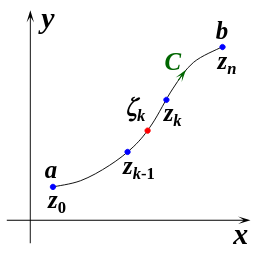
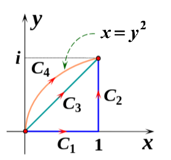
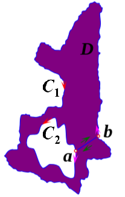
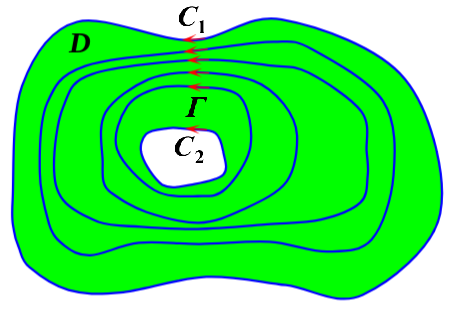
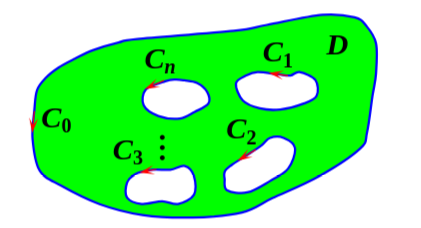
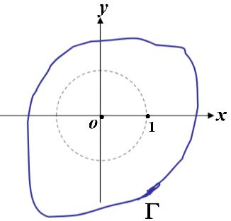
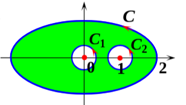
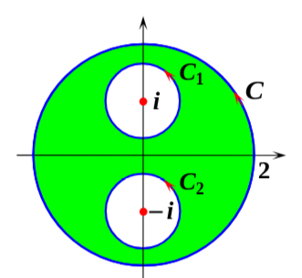

复变函数与积分变换

# 1复数与复变函数
## 1.1复数基础
1. $z = x + iy$
有实部$Re(z) = x$,虚部$Im(z) = y$
2. 复数的四则运算
### 复数的表示
1. 复数在复平面中以向量表示
2. 模$|z|=|\overline z| = r = \sqrt {x^2 +y^2}$
3. 辐角$Arg z$
辐角$Arg z = \theta$表示复数在复平面中与x轴正方向的夹角
任意的z都有无数个辐角
将$-\pi < \theta _0 < \pi$的$\theta _0$称为主值
记作$arg z = \theta _0$, $\tan {\theta _0} = {y\over x}$
4. 复数的象限和辐角主值的关系
$$
\theta _0 = 
\begin{cases}
\arctan {y\over x}, 一四象限\\
\pi + \arctan {y\over x}, 第二象限\\
-\pi + \arctan {y\over x}, 第三象限
\end{cases}
$$
5. 模的运算性质
    1. $z \cdot \overline z = |z|^2 = |\overline z|^2$
    2. $|z_1z_2| = |z_1| |z_2|$
    3. $|{z_1 \over z_2}| = {|z_1| \over |z_2|}(z_2 \not = 0)$
    4. ${z_1 \over z_2} = {{z_1 \cdot \overline z_2} \over {|z_2|^2}}$
    5. $|z_1 \pm z_2|^2 = |z_1|^2 + |z_2|^2 \pm 2Re(z_1z_2)$
    6. $|z_1 + z_2 | \leq |z_1| + |z_2|$

6. 二级结论
    1. $\dfrac{z_2}{z_1} = \dfrac{r_2}{r_1} e^{i(\theta_2 - \theta_1)}$
7. 

## 1.2 三角表示（极坐标）
$z = r(\cos \theta +i \sin \theta)$
1. 利用欧拉公式$e^{i\theta} = \cos \theta + i\sin \theta$
得复数的指数表示$z = re^{i\theta}$
2. 为什么使用三角和指数形式
三角和指数形式容易计算
三角形式还能体现几何性质
3. 运算性质
    1. $Arg z_1 z_2 = Arg z_1 + Arg z_2$（多值相等，非主值计算）
    2. 乘法$z_1 z_2  = r_1r_2e^{i(\theta _1 + \theta_2)}$
    3. 乘方$z^n = r^n (\cos n\theta +i \sin n\theta) = r^n e^{i(n\theta)}$
    4. 开方$\sqrt[n]z = \sqrt[n]{|z|}$
4. 复数乘法与除法的几何意义
   - **定理1（乘积的模与幅角）**  
     两个复数乘积的模等于它们模的乘积，乘积的幅角等于它们幅角的和：  
  $$
  |z_1 z_2| = |z_1| \cdot |z_2|, \quad \arg(z_1 z_2) = \arg z_1 + \arg z_2.
  $$
   - **定理2（商的模与幅角）**  
     两个复数商的模等于它们模的商，商的幅角等于被除数与除数幅角之差：  
  $$
  \left| \frac{z_2}{z_1} \right| = \frac{|z_2|}{|z_1|}, \quad \arg\left( \frac{z_2}{z_1} \right) = \arg z_2 - \arg z_1.
  $$

   - **几何解释（乘法）**  
  复数乘法 $z_1 z_2$ 在几何上相当于：  
  将向量 $z_2$ 的模扩大 $|z_1|$ 倍，并绕原点逆时针旋转 $\arg z_1$ 的角度。

5. 复数的乘方

   - **乘积指数形式**  
  设 $z_1 = r_1 e^{i\theta_1}$，$z_2 = r_2 e^{i\theta_2}$，则  
  $$
  z_1 z_2 = r_1 e^{i\theta_1} \cdot r_2 e^{i\theta_2} = r_1 r_2 e^{i(\theta_1 + \theta_2)}.
  $$

   - **n 个复数相乘**  
  $$
  z_1 z_2 \cdots z_n = r_1 e^{i\theta_1} \cdot r_2 e^{i\theta_2} \cdots r_n e^{i\theta_n} = r_1 r_2 \cdots r_n \cdot e^{i(\theta_1 + \theta_2 + \cdots + \theta_n)}.
  $$

   - **n 次幂（相同复数相乘）**  
  设 $z = r(\cos\theta + i\sin\theta)$，则  
  $$
  z^n = \underbrace{z \cdot z \cdots z}_{n\text{次}} = r^n (\cos n\theta + i \sin n\theta).
  $$

   - **De Moivre 公式**  
  $$
  (\cos\theta + i\sin\theta)^n = \cos n\theta + i\sin n\theta.
  $$  
     此公式是欧拉公式的直接推论，用于快速计算复数单位圆上点的幂。

## 1.3 平面点集的一般概念
1. 邻域与去心邻域  
   以 $z_0$ 为中心、$\delta > 0$ 为半径的开圆盘 $|z - z_0| < \delta$ 称为 $z_0$ 的**邻域**；去掉中心点后 $0 < |z - z_0| < \delta$ 称为**去心邻域**；无穷远点的邻域是 $|z| > M$（含或不含 $\infty$）。

2. 平面曲线分类  
   曲线按参数方程 $z(t) = x(t) + iy(t)$ 表示；若 $t_1 \ne t_2 \Rightarrow z(t_1) \ne z(t_2)$ 则为**简单曲线**；若 $z(\alpha) = z(\beta)$ 则为**闭曲线**；若导数连续且不全为零则为**光滑曲线**。

3. 简单闭曲线与区域划分  
   任意**简单闭曲线** $C$ 将复平面唯一分为三部分：曲线本身、有界**内部**、无界**外部**，这是 Jordan 曲线定理的核心几何直观。

4. 内点、外点、边界点  
   设 $G$ 为点集：  
   - 若存在 $z_0$ 的邻域全含于 $G$，则 $z_0$ 是**内点**（$\exists B(z_0,\delta) \subset G$）；  
   - 若存在邻域与 $G$ 无交，则为**外点**（$B(z,\delta) \cap G = \varnothing$）；  
   - 否则为**边界点**（任一邻域既含内点也含外点），全体边界点记作 $\partial G$。

5. 开集、闭集、余集  
   - 所有点均为内点 → **开集**；  
   - 开集的补集 → **闭集**；  
   - 例：$|z - i| < 1$ 是开集，$\operatorname{Im}(z) \leq 4$ 是闭集，空集和全平面既是开集也是闭集。

6. 连通与区域  
   - $G$ 中任意两点可用全在 $G$ 内的曲线连接 → **连通集**；  
   - 非空连通开集 → **区域**；  
   - 区域与其边界合称**闭区域**（记作 $\overline{G}$）；  
   - 若存在 $M > 0$ 使 $\forall z \in G, |z| \leq M$ → **有界区域**，否则为**无界区域**。

7. 单连通与多连通  
   区域 $B$ 中任意简单闭曲线的内部仍属 $B$ → **单连通域**；若存在曲线内部“挖洞”不属于 $B$ → **多连通域**。

8. 复球面与无穷远点  
   用球面投影将复平面映射到球面：除北极 $N$ 外，球面上每点对应复平面上一点；北极 $N$ 代表**无穷远点** $\infty$，此球称为**复球面**（Riemann 球面）。

## 1.4 复变函数
1. 复变函数的极限
复变函数应该看做二元函数，极限存在需要从各个方向逼近
2. 复变函数的连续性性质
	  - **连续函数的四则运算仍连续**  
	  若 $f(z)$、$g(z)$ 在区域 $D$ 上连续，则 $f \pm g$、$f \cdot g$、$\frac{f}{g}$（当 $g(z) \neq 0$ 时）在 $D$ 上也连续。
	  - **连续函数的复合函数仍连续**  
	  若 $w = f(\zeta)$ 在 $\zeta_0$ 连续，$\zeta = \varphi(z)$ 在 $z_0$ 连续，且 $\varphi(z_0) = \zeta_0$，则复合函数 $w = f[\varphi(z)]$ 在 $z_0$ 连续。
	  - **连续函数的模也连续**  
	  若 $f(z)$ 在 $z_0$ 连续，则 $|f(z)|$ 在 $z_0$ 也连续。  
	  （因 $||f(z)| - |f(z_0)|| \leq |f(z) - f(z_0)| \to 0$）
	  - **有界闭区域上的连续函数必有界，且模取到最大值与最小值**  
	  设 $f(z)$ 在有界闭区域 $D$ 上连续，则：  
	  (i) 存在 $M > 0$，使 $|f(z)| \leq M,\ \forall z \in D$；  
	  (ii) 存在 $z_1, z_2 \in D$，使得 $|f(z_1)| = \max_{z\in D}|f(z)|$，$|f(z_2)| = \min_{z\in D}|f(z)|$。
	  - **有界闭区域上的连续函数必一致连续**  
	  对任意 $\varepsilon > 0$，存在 $\delta > 0$，使得对所有满足 $|z' - z''| < \delta$ 的 $z', z'' \in D$，均有 $|f(z') - f(z'')| < \varepsilon$。

# 第二章 解析函数 
## 2.1 解析函数
1. 复变函数导数
定义和实函数相同
2. 可导与可微
可导$\Leftrightarrow$可微，可导$\rightarrow$连续
3. 解析函数的定义

    - **在一点解析**：设 $f(z)$ 在区域 $D$ 有定义，$z_0 \in D$。若存在 $z_0$ 的一个邻域，使得 $f(z)$ 在该邻域内（含 $z_0$）处处可导，则称 $f(z)$ 在 $z_0$ 处**解析**，也称 $z_0$ 是 $f(z)$ 的**解析点**。

    - **在区域内解析**：若 $f(z)$ 在区域 $D$ 内每一点都解析，则称 $f(z)$ 在 $D$ 内**解析**，或称 $f(z)$ 是 $D$ 内的**解析函数**。

4. 解析与可导的关系

    - **在一点**：  
  函数在一点解析 $\Rightarrow$ 在该点可导，但**反之不成立**。  
  （例：$f(z) = |z|^2$ 仅在原点可导，但在任何邻域内不处处可导 → 不解析）

    - **在区域内**：  
  函数在区域 $D$ 内解析 $\Leftrightarrow$ 在 $D$ 内每一点可导。

5. 解析函数的判别方法（Cauchy-Riemann 条件）
    - 设 $f(z) = u(x,y) + i v(x,y)$，则 $f(z)$ 在点 $z = x + iy$ 可导（即解析）的**充要条件**是：  
  (i) $u(x,y)$、$v(x,y)$ 在 $(x,y)$ 处可微；  
  (ii) 满足 **Cauchy-Riemann 方程（C-R 方程）**：  
  $$
  \frac{\partial u}{\partial x} = \frac{\partial v}{\partial y}, \quad \frac{\partial u}{\partial y} = -\frac{\partial v}{\partial x}.
  $$

6. 解析函数的性质
	(1) 两个解析函数的和、差、积、商（分母不为零）仍为解析函数。  
	(2) 两个解析函数的复合函数仍为解析函数。  
	(3) 一个解析函数不可能仅在一个点或一条曲线上解析；所有解析点的集合必为开集。

7. 典型示例
    - $f(z) = z^2$：在整个复平面上解析（处处可导且满足 C-R）。  
    - $f(z) = |z|^2$：仅在 $z=0$ 可导 → 不解析。  
    - $f(z) = x + 2yi$：不满足 C-R 方程 → 整个复平面不解析。  
    - $f(z) = \frac{1}{z}$：除 $z=0$ 外处处解析，$z=0$ 是奇点。

## 2.3 初等函数
1. 指数函数

	- **定义**：对于复数 $z = x + iy$，称  
$$
w = e^x (\cos y + i \sin y)
$$  
为**指数函数**，记作 $w = \exp z$ 或 $w = e^z$。

	- **注**：  
	  - (1) 指数函数是初等函数中最重要的函数，其余初等函数都通过指数函数来定义。  
	  - (2) 借助欧拉公式，可记忆为：  
$$
w = e^z = e^{x+iy} = e^x \cdot e^{iy} = e^x (\cos y + i \sin y).
$$

	- **性质**：

	  - (1) $e^z$ 是**单值函数**。事实上，对给定 $z = x + iy$，定义中的 $e^x, \cos y, \sin y$ 均为单值函数。  

	  - (2) $e^z$ 除**无穷远点**外，处处有定义。  
	    - 无穷远的极限不存在：  
	      - 当 $y=0, x \to +\infty$ 时，$e^z \to +\infty$；  
	      - 当 $y=0, x \to -\infty$ 时，$e^z \to 0$。  

	  - (3) $e^z \neq 0$。因为 $e^x > 0$，且 $\cos y + i \sin y \neq 0$。  

	  - (4) $e^z$ 在复平面上处处解析，且 $(e^z)' = e^z$。  

	  - (5) $\forall z_1 = x_1 + iy_1,\, z_2 = x_2 + iy_2$，有  
$$
e^{z_1} \cdot e^{z_2} = e^{z_1 + z_2}.
$$  
	    - 事实上：  
$$
	      \begin{aligned}
	      e^{z_1} \cdot e^{z_2} &= e^{x_1}(\cos y_1 + i\sin y_1) \cdot e^{x_2}(\cos y_2 + i\sin y_2) \\
	      &= e^{x_1+x_2} [(\cos y_1 \cos y_2 - \sin y_1 \sin y_2) + i(\sin y_1 \cos y_2 + \cos y_1 \sin y_2)] \\
	      &= e^{x_1+x_2} [\cos(y_1+y_2) + i\sin(y_1+y_2)] = e^{z_1+z_2}.
	      \end{aligned}
	      $$

	  - (6) $e^z$ 是以 $2k\pi i$ 为周期的**周期函数**。  
	    - 事实上，由 $e^{2k\pi i} = \cos 2k\pi + i\sin 2k\pi = 1$，得  
$$
	      e^{z + 2k\pi i} = e^z \cdot e^{2k\pi i} = e^z.
	      $$

2. 对数函数

	- **定义**：满足方程 $e^w = z$ 的函数 $w = f(z)$ 称为**对数函数**（$z \neq 0$），记作 $w = \mathrm{Ln}\, z$。  
	  - 即：  
$$
	    w = \mathrm{Ln}\, z = \ln |z| + i\,\mathrm{Arg}\, z.
	    $$

	- **推导**：令 $z = |z| e^{i\,\mathrm{Arg}\, z} = r e^{i\theta}$，$w = u + iv$。  
	  - 由 $e^w = z$，有 $e^u \cdot e^{iv} = r \cdot e^{i\theta}$，故  
$$
	    \begin{cases}
	    u = \ln r = \ln |z|, & \text{——由 } z \text{ 的模得到 } w \text{ 的实部}；\\
	    v = \theta = \mathrm{Arg}\, z. & \text{——由 } z \text{ 的辐角得到 } w \text{ 的虚部}。
	    \end{cases}
	    $$  
	  - 即  
$$
	    w = \mathrm{Ln}\, z = \ln |z| + i\,\mathrm{Arg}\, z = \ln |z| + i\arg z + 2k\pi i,\quad (k=0,\pm1,\pm2,\cdots).
	    $$

	- **主值与分支**：  
	  - **主值**：称 $w = \ln |z| + i\arg z$ 为 $\mathrm{Ln}\, z$ 的**主值**，记作 $\ln z$。  
	  - **分支**：对于任意固定的 $k$，称 $\ln z + 2k\pi i$ 为 $\mathrm{Ln}\, z$ 的一个**分支**。  
	  - 显然，对数函数为**多值函数**。

	- **性质**：

	  - (1) $\mathrm{Ln}\, z$ 的各分支在除去原点及负实轴的复平面内解析；  
	    - 特别地，$\ln z$ 在除去原点及负实轴的平面内解析。  
	    - 由反函数求导法则可得：  
$$
	      \frac{\mathrm{d}\ln z}{\mathrm{d}z} = \frac{1}{(e^w)'_w} = \frac{1}{e^w} = \frac{1}{z}.
	      $$  
	    - 进一步有：  
$$
	      \frac{\mathrm{d}\,\mathrm{Ln}\, z}{\mathrm{d}z} = \frac{\mathrm{d}(\ln z + 2k\pi i)}{\mathrm{d}z} = \frac{\mathrm{d}\ln z}{\mathrm{d}z} = \frac{1}{z}.
	      $$

	  - (2)  
$$
	    \mathrm{Ln}(z_1 z_2) = \mathrm{Ln}\, z_1 + \mathrm{Ln}\, z_2；\quad \mathrm{Ln}\frac{z_1}{z_2} = \mathrm{Ln}\, z_1 - \mathrm{Ln}\, z_2.
	    $$

3. 幂函数

	- **定义**：函数 $w = z^\alpha$ 定义为  
$$
	  z^\alpha = e^{\alpha \,\mathrm{Ln}\, z} \quad (\alpha \text{ 为复常数},\, z \neq 0)
	  $$  
称为复变量 $z$ 的**幂函数**。  

	- **还规定**：当 $\alpha$ 为正实数，且 $z = 0$ 时，$z^\alpha = 0$。

	- **分类讨论**：

	  - (1) **当 $\alpha$ 为正整数时**，$z^n = e^{n\,\mathrm{Ln}\, z} = e^{n\ln z}$。（单值）  
	    - 此时，$z^\alpha$ 处处解析，且 $(z^\alpha)' = \alpha z^{\alpha-1}$。

	  - (2) **当 $\alpha$ 为负整数时**，$z^{-n} = \dfrac{1}{z^n}$。（单值）  
	    - 此时，$z^\alpha$ 除原点外处处解析，且 $(z^\alpha)' = \alpha z^{\alpha-1}$。

	  - (3) **当 $\alpha = 0$ 时**，$z^0 = 1$。

4. 三角函数

	- **启示**：由欧拉公式 $e^{i\theta} = \cos\theta + i\sin\theta$，有 $e^{-i\theta} = \cos\theta - i\sin\theta$，  
	  - 得：  
$$
	    \cos\theta = \frac{1}{2}(e^{i\theta} + e^{-i\theta}),\quad \sin\theta = \frac{1}{2i}(e^{i\theta} - e^{-i\theta}).
	    $$

	- **定义**：

	  - **余弦函数**：$\cos z = \dfrac{1}{2}(e^{iz} + e^{-iz})$；  
	  - **正弦函数**：$\sin z = \dfrac{1}{2i}(e^{iz} - e^{-iz})$。

# 第三章 复变函数的积分
> 本章重点
1.Cauchy积分定理 
2.复合闭路定理
3.Cauchy积分公式与高阶导数公式
4.复变函数积分的计算方法

## 3.1 复变函数的积分
1. 复积分的定义：设 $C$ 为简单光滑的有向曲线，其方向是从点 $a$ 到点 $b$，函数 $f(z)$ 在 $C$ 上有定义。
   - 将曲线 $C$ 任意划分：  
  $$
  z_0 = a,\, z_1,\, z_2,\, \dots,\, z_n = b,
  $$  
  令 $\Delta z_k = z_k - z_{k-1}$，$\lambda = \max\limits_{1 \leq k \leq n} |\Delta z_k|$。
   - 在每个弧段 $\widehat{z_{k-1}z_k}$ 上任取一点 $\zeta_k \in \widehat{z_{k-1}z_k}$。  
  若极限  
  $$
  \lim_{\lambda \to 0} \sum_{k=1}^{n} f(\zeta_k) \Delta z_k
  $$  
  存在（且不依赖于 $C$ 的划分和 $\zeta_k$ 的选取），则称该极限为 $f(z)$ 沿曲线 $C$ 的**积分**，记作  
  $$
  \int_C f(z)\,\mathrm{d}z.
  $$

2. 积分方向约定：
   - $\displaystyle \int_{C^-} f(z)\,\mathrm{d}z$ 表示沿曲线 $C$ 的**负方向**积分；
   - $\displaystyle \oint_\Gamma f(z)\,\mathrm{d}z$ 表示沿**闭曲线 $\Gamma$** 的**逆时针方向**积分。

3. 复积分的计算方法一：化为第二类曲线积分  
   设 $f(z) = u + iv$，$dz = dx + i\,dy$，则  
   $$
   \begin{aligned}
   \int_C f(z)\,\mathrm{d}z &= \int_C (u + iv)(dx + i\,dy) \\
   &= \int_C u\,dx - v\,dy + i \int_C v\,dx + u\,dy.
   \end{aligned}
   $$

4. 复积分的计算方法二：直接化为定积分  
   设曲线 $C: z = z(t) = x(t) + i\,y(t),\quad t: a \to b$，则  
   $$
   \boxed{
   \int_C f(z)\,\mathrm{d}z = \int_a^b f[z(t)]\,z'(t)\,\mathrm{d}t,
   }
   $$  
   其中，$z'(t) = x'(t) + i\,y'(t)$。

5. 例题1：计算 $I = \displaystyle \int_C z\,\mathrm{d}z$，其中 $C$ 为如下三种路径（如图）：
	- (1) $C = C_1 + C_2$；
	- (2) $C = C_3$；
	- (3) $C = C_4$。  
	- 
	**解**（以路径 $C = C_1 + C_2$ 为例）：
	- 曲线 $C_1$：$z = x$，$x: 0 \to 1$；
	- 曲线 $C_2$：$z = 1 + iy$，$y: 0 \to 1$。
	则  
	$$
	\begin{aligned}
	I &= \int_{C_1} z\,\mathrm{d}z + \int_{C_2} z\,\mathrm{d}z \\
	&= \int_0^1 x\,\mathrm{d}x + \int_0^1 (1 + iy)\,\mathrm{d}(1 + iy) \\
	&= \int_0^1 x\,\mathrm{d}x + \int_0^1 i(1 + iy)\,\mathrm{d}y \\
	&= \left.\frac{1}{2}x^2\right|_0^1 + \left.(iy - \frac{1}{2}y^2)\right|_0^1 = i.
	\end{aligned}
	$$
	> 📌 注：右侧图示中，$C_1$ 为从 $(0,0)$ 到 $(1,0)$ 的水平线段，$C_2$ 为从 $(1,0)$ 到 $(1,1)$ 的竖直线段，$C_3$ 为从 $(0,0)$ 到 $(1,1)$ 的斜线段，$C_4$ 为抛物线 $x = y^2$ 从 $(0,0)$ 到 $(1,1)$ 的弧段。  
	> 右侧红色标注：“利用原函数计算” —— 即可直接用 $F(z) = \frac{1}{2}z^2$ 计算，结果一致。
6. 积分公式结论：  
   $$
   \oint_{|z - z_0| = r} \frac{1}{(z - z_0)^{n+1}} \,\mathrm{d}z =
   \begin{cases}
   2\pi i, & n = 0, \\
   0, & n \neq 0.
   \end{cases}
   $$

   > **积分值与圆周的中心、半径无关。**

## 3.2 柯西基本定理
1. 柯西基本定理（单连域）：
   - 定理：设函数 $f(z)$ 在单连通域 $D$ 内解析，$\Gamma$ 为 $D$ 内的任意一条简单闭曲线，则  
  $$
  \oint_{\Gamma} f(z)\,\mathrm{d}z = 0.
  $$

   - 推广定理：设单连域 $D$ 的边界为 $C$，函数 $f(z)$ 在 $D$ 内解析，在 $\overline{D} = D + C$ 上连续，则  
   $$
   \oint_C f(z)\,\mathrm{d}z = 0.
   $$

2. 闭路变形原理（二连域推广）：

   - 定理：设二连域 $D$ 的边界为 $C = C_1 + C_2^-$（如图），函数 $f(z)$ 在 $D$ 内解析，在 $D + C$ 上连续，则  
  $$
  \oint_C f(z)\,\mathrm{d}z = 0 \quad \text{或} \quad \oint_{C_1} f(z)\,\mathrm{d}z = \oint_{C_2} f(z)\,\mathrm{d}z.
  $$
   - 证明思路：作线段 $\overline{ab}$，将二连域变为单连域，利用柯西基本定理推导得证。
   - 闭路变形原理（几何解释）：若 $f(z)$ 在区域 $D$ 内解析，在边界 $C = C_1 + C_2^-$ 上连续，$\Gamma$ 为 $D$ 内任意一条“闭曲线”，则  
  $$
  \oint_{C_1} f(z)\,\mathrm{d}z = \oint_{C_2} f(z)\,\mathrm{d}z = \oint_{\Gamma} f(z)\,\mathrm{d}z.
  $$
  > 解析函数沿区域内闭曲线的积分值，不因闭曲线在区域内作连续变形而改变 —— 称此为**闭路变形原理**。

3. 复合闭路定理（多连域推广）：

   - 定理：设多连域 $D$ 的边界为 $C = C_0 + C_1^- + C_2^- + \cdots + C_n^-$（如图），函数 $f(z)$ 在 $D$ 内解析，在 $D + C$ 上连续，则  
  $$
  \oint_C f(z)\,\mathrm{d}z = 0,
  $$
     或等价地：
  $$
  \oint_{C_0} f(z)\,\mathrm{d}z = \oint_{C_1} f(z)\,\mathrm{d}z + \oint_{C_2} f(z)\,\mathrm{d}z + \cdots + \oint_{C_n} f(z)\,\mathrm{d}z.
  $$

4. 路径无关性（单连域内）：
   - 定理：设函数 $f(z)$ 在单连通域 $D$ 内解析，$C_1, C_2$ 为 $D$ 内任意两条从 $z_0$ 到 $z_1$ 的简单曲线，则  
  $$
  \int_{C_1} f(z)\,\mathrm{d}z = \int_{C_2} f(z)\,\mathrm{d}z.
  $$
   - 证明：由 柯西基本定理$\displaystyle \int_{C_1} f(z)\,\mathrm{d}z + \int_{C_2^-} f(z)\,\mathrm{d}z = 0$

5. 例题4：计算积分 $\displaystyle \oint_{\Gamma} \frac{2z - 1}{z^2 - z}\,\mathrm{d}z$，其中 $\Gamma$ 为包含圆周 $|z| = 1$ 在内的任意分段光滑正向简单闭曲线。

   - 解：函数 $f(z) = \dfrac{2z - 1}{z^2 - z} = \dfrac{2z - 1}{z(z - 1)}$ 在复平面有两个奇点：$z = 0$ 和 $z = 1$，且 $\Gamma$ 包含这两个奇点。
   - “打洞”技巧：在 $\Gamma$ 内作两个互不包含、互不相交的圆周 $C_1$ 和 $C_2$，使 $C_1$ 只包含奇点 $z = 0$，$C_2$ 只包含奇点 $z = 1$，则 $C + C_1^- + C_2^-$ 构成复围线。
   - 根据复合闭路定理，原积分可拆分为沿 $C_1$ 和 $C_2$ 的积分之和

## 3.3 柯西积分公式
1. 柯西积分公式（Cauchy Integral Formula）

   - **定理**：设函数 $f(z)$ 在区域 $D$ 内解析，在边界 $C$ 上连续，且 $z_0 \in D$，则  
  $$
  \boxed{f(z_0) = \frac{1}{2\pi i} \oint_C \frac{f(z)}{z - z_0}\,\mathrm{d}z}.
  $$

   - **意义**：
     - 将 $z_0$ 换成 $z$，积分变量 $z$ 换成 $\xi$，则公式变为：  
  $$
  \boxed{f(z) = \frac{1}{2\pi i} \oint_C \frac{f(\xi)}{\xi - z}\,\mathrm{d}\xi, \quad (z \in D)}.
  $$
     - **核心结论**：解析函数在其解析区域内的值完全由其在边界上的值确定。
     - 换句话说，解析函数可用其解析区域边界上的值以一种特定的积分形式表达出来。

   - **注意**：
     - 区域 $D$ 可以为多连域。例如，对于二连域 $D$，其边界为 $C = C_1 + C_2^-$，则  
  $$
  f(z_0) = \frac{1}{2\pi i} \oint_C \frac{f(z)}{z - z_0}\,\mathrm{d}z = \frac{1}{2\pi i} \oint_{C_1} \frac{f(z)}{z - z_0}\,\mathrm{d}z - \frac{1}{2\pi i} \oint_{C_2} \frac{f(z)}{z - z_0}\,\mathrm{d}z, \quad (z_0 \in D).
  $$

   - **区别**
   积分公式解决不解析点在区域内时的积分
   积分定理解决单连域区域内都解析时的闭曲线积分都为0
   - **应用**：
     - 反过来可用于计算积分：,此式是柯西积分公式的直接推论，常用于快速求解含奇点的闭路积分。 

$$
  \oint_C \frac{f(z)}{z - z_0}\,\mathrm{d}z = 2\pi i \cdot f(z_0).
$$
  

2. 例题：计算积分 $I = \displaystyle \oint_C \frac{2z - 1}{z^2 - z}\,\mathrm{d}z$，其中 $C$ 为包含 $z=0$ 和 $z=1$ 的正向简单闭曲线（如图）。

   - **解**：
  令 $f(z) = \dfrac{2z - 1}{z^2 - z} = \dfrac{2z - 1}{z(z - 1)}$，有两个一阶极点 $z=0$ 和 $z=1$。
     - 作两个小圆周：$C_1: |z| = \dfrac{1}{3}$（包围 $z=0$），$C_2: |z - 1| = \dfrac{1}{3}$（包围 $z=1$）。
     - 根据**复合闭路定理**，有  
  $$
  I = \oint_{C_1} f(z)\,\mathrm{d}z + \oint_{C_2} f(z)\,\mathrm{d}z.
  $$
     - 对每个小圆周分别应用**柯西积分公式**：
  $$
  \begin{aligned}
  I &= \oint_{C_1} \frac{\left( \dfrac{2z - 1}{z - 1} \right)}{z}\,\mathrm{d}z + \oint_{C_2} \frac{\left( \dfrac{2z - 1}{z} \right)}{z - 1}\,\mathrm{d}z \\
  &= 2\pi i \cdot \left. \frac{2z - 1}{z - 1} \right|_{z=0} + 2\pi i \cdot \left. \frac{2z - 1}{z} \right|_{z=1} \\
  &= 2\pi i \cdot (-1) + 2\pi i \cdot (1) = 4\pi i.
 \end{aligned}
  $$

3. 平均值公式（Mean Value Formula）（没讲？）

   - **定理**：若函数 $f(z)$ 在圆 $|z - z_0| < R$ 内解析，在闭圆盘 $|z - z_0| \leq R$ 上连续，则  
   $$
   \boxed{f(z_0) = \frac{1}{2\pi} \int_0^{2\pi} f(z_0 + R e^{i\theta})\,\mathrm{d}\theta}.
    $$
   - **几何意义**：
     - 解析函数在圆心处的值等于它在圆周上各点值的“算术平均”。
     - 是调和函数平均值性质在复变函数中的体现。

## 3.4 解析函数的高阶导数
1. 高阶导数定理

   - **定理**：如果函数 $f(z)$ 在区域 $D$ 内解析，在 $\overline{D} = D + C$ 上连续，则 $f(z)$ 的各阶导数均在 $D$ 上解析，且  
  $$
  f^{(n)}(z) = \frac{n!}{2\pi i} \oint_C \frac{f(\zeta)}{(\zeta - z)^{n+1}}\,\mathrm{d}\zeta, \quad (z \in D).
  $$

   - **意义**：  
  **解析函数的导数仍解析。**

   - **应用**：
     - 反过来可用于计算积分：  解决分母是${(z - z_0)^{n+1}}$形式的积分

  $$
  \oint_C \frac{f(z)}{(z - z_0)^{n+1}}\,\mathrm{d}z = \frac{2\pi i}{n!} f^{(n)}(z_0).
  $$

2. 例题：计算积分 $I = \oint_{|z|=2} \frac{e^z}{(z^2 + 1)^2}\,\mathrm{d}z$

   - **分析**：
  被积函数 $f(z) = \frac{e^z}{(z^2 + 1)^2} = \frac{e^z}{(z - i)^2 (z + i)^2}$ 在复平面上有两个二阶极点：$z = i$ 和 $z = -i$，均位于圆周 $|z| = 2$ 内部。
     - 可将积分路径 $C: |z| = 2$ 拆分为两个小圆周 $C_1$（包围 $z=i$）和 $C_2$（包围 $z=-i$），即  
  $$
  I = I_1 + I_2 = \oint_{C_1} f(z)\,\mathrm{d}z + \oint_{C_2} f(z)\,\mathrm{d}z.
  $$

   - **计算 $I_1$（围绕 $z = i$）**：
     将被积函数改写为：
  $$
  I_1 = \oint_{C_1} \frac{\left( \frac{e^z}{(z + i)^2} \right)}{(z - i)^2}\,\mathrm{d}z.
  $$
  根据**高阶导数公式**（n=1）：
  $$
  \oint_C \frac{f(z)}{(z - z_0)^{n+1}}\,\mathrm{d}z = \frac{2\pi i}{n!} f^{(n)}(z_0),
  $$
  此处令 $f(z) = \frac{e^z}{(z + i)^2}$，$z_0 = i$，$n=1$，则：
  $$
  I_1 = \frac{2\pi i}{1!} \cdot \left. \frac{\mathrm{d}}{\mathrm{d}z} \left( \frac{e^z}{(z + i)^2} \right) \right|_{z=i}.
  $$
     计算导数：
  $$
    \left. \frac{\mathrm{d}}{\mathrm{d}z} \left( \frac{e^z}{(z + i)^2} \right) \right|_{z=i}
   = \left. \frac{e^z (z + i)^2 - e^z \cdot 2(z + i)}{(z + i)^4} \right|_{z=i}
   = \left. \frac{e^z (z + i - 2)}{(z + i)^3} \right|_{z=i}
  = \frac{e^i (i + i - 2)}{(i + i)^3}
   = \frac{e^i (2i - 2)}{(2i)^3}
   = \frac{e^i \cdot 2(i - 1)}{-8i}
    = \frac{e^i (i - 1)}{-4i}.
  $$
     代入得：
  $$
  I_1 = 2\pi i \cdot \frac{e^i (i - 1)}{-4i} = \frac{\pi}{2} (1 - i) e^i.
  $$

   - **计算 $I_2$（围绕 $z = -i$）**：
  同理，令 $f(z) = \frac{e^z}{(z - i)^2}$，$z_0 = -i$，应用高阶导数公式：
  $$
  I_2 = \frac{2\pi i}{1!} \cdot \left. \frac{\mathrm{d}}{\mathrm{d}z} \left( \frac{e^z}{(z - i)^2} \right) \right|_{z=-i}.
  $$
     类似计算可得：
  $$
  I_2 = -\frac{\pi}{2} (1 + i) e^{-i}.
  $$

   - **最终结果**：
  $$
  I = I_1 + I_2 = \frac{\pi}{2} \left[ (1 - i)e^i - (1 + i)e^{-i} \right].
  $$
  利用欧拉公式 $e^{i\theta} = \cos\theta + i\sin\theta$ 化简：
  $$
  \begin{aligned}
  (1 - i)e^i &= (1 - i)(\cos 1 + i \sin 1) = \cos 1 + \sin 1 + i(\sin 1 - \cos 1), \\
  (1 + i)e^{-i} &= (1 + i)(\cos 1 - i \sin 1) = \cos 1 + \sin 1 + i(\cos 1 - \sin 1).
  \end{aligned}
  $$
     相减后虚部保留：
  $$
  (1 - i)e^i - (1 + i)e^{-i} = 2i (\sin 1 - \cos 1) = 2\sqrt{2} i \sin\left(1 - \frac{\pi}{4}\right).
  $$
     因此：
  $$
 I = \frac{\pi}{2} \cdot 2\sqrt{2} i \sin\left(1 - \frac{\pi}{4}\right) = \boxed{\sqrt{2}\, \pi i \sin\left(1 - \frac{\pi}{4}\right)}.
  $$

3. 柯西不等式，刘维尔定理（没讲？）

---

# 第四章 解析函数的级数表示
## 4.1 复数项级数
1. 复数列的定义与极限  
   设 $\{\alpha_n\}\ (n=1,2,\cdots)$ 为一复数列，其中 $\alpha_n = a_n + i b_n$。又设 $\alpha = a + i b$ 为一确定的复数。  
   如果对于任意给定 $\varepsilon > 0$，总存在正整数 $N(\varepsilon)$，当 $n > N$ 时，有  
   $$
   |\alpha_n - \alpha| < \varepsilon,
   $$  
   那么称 $\alpha$ 为复数列 $\{\alpha_n\}$ 当 $n \to \infty$ 时的极限，记作  
   $$
   \lim_{n \to \infty} \alpha_n = \alpha.
   $$  
   此时也称复数列 $\{\alpha_n\}$ 收敛于 $\alpha$。

2. 定理4.1（复数列收敛的充要条件）  
   设复数列 $\{\alpha_n = a_n + i b_n\}$，$\alpha = a + i b$，则  
   $$
   \lim_{n \to \infty} \alpha_n = \alpha
   $$  
   的充分必要条件是  
   $$
   \lim_{n \to \infty} a_n = a, \quad \lim_{n \to \infty} b_n = b.
   $$  

3. 复数项级数的定义  
   设 $\{\alpha_n\}$ 是一复数列，则  
   $$
   \sum_{n=1}^{\infty} \alpha_n = \alpha_1 + \alpha_2 + \cdots + \alpha_n + \cdots \tag{4.1}
   $$  
   称为复数项级数。  
   令部分和 $S_n = \alpha_1 + \alpha_2 + \cdots + \alpha_n$。  
   若 $\{S_n\}\ (n=1,2,\dots)$ 以有限复数 $s$ 为极限，即  
   $$
   \lim_{n \to \infty} S_n = s \ (\neq \infty),
   $$  
   则称复数项无穷级数 (4.1) 收敛于 $s$，且称 $s$ 为 (4.1) 的和，写成  
   $$
   s = \sum_{n=1}^{\infty} \alpha_n.
   $$  
   否则称级数 (4.1) 为发散。

4. 定理4.2（复级数收敛的充要条件）  
   复级数 (4.1) 收敛于 $s = a + i b$（$a,b$ 为实数）的充要条件为：  
   $$
   \sum_{n=1}^{\infty} a_n = a, \quad \sum_{n=1}^{\infty} b_n = b.
   $$

5. 定理4.3（级数收敛的必要条件）  
   级数 $\sum_{n=1}^{\infty} z_n$ 收敛的必要条件是  
   $$
   \lim_{n \to \infty} z_n = 0.
   $$  
   **证明**：因为级数 $\sum_{n=1}^{\infty} z_n$ 收敛的充分必要条件是 $\sum x_n$ 与 $\sum y_n$ 都收敛，再由实级数收敛的必要条件是 $\lim_{n \to \infty} x_n = 0$，$\lim_{n \to \infty} y_n = 0$ 得证。

6. 定理4.4（绝对收敛与收敛的关系）  
   若级数 $\sum_{n=1}^{\infty} |z_n|$ 收敛，则级数 $\sum_{n=1}^{\infty} z_n$ 也收敛。  
   - 若 $\sum |z_n|$ 收敛，则称 $\sum z_n$ **绝对收敛**。  
   - 若 $\sum z_n$ 收敛而 $\sum |z_n|$ 发散，则称 $\sum z_n$ 为**条件收敛**。

7. 例题  
    
   - **先备知识**：
$\sum \frac{1}{n}$ 发散，$\sum \frac{1}{n^2}$ 收敛。   

   - **例2**：判断下列级数收敛性  
  (1) $\sum_{n=1}^{\infty} \frac{1}{n} \left(1 + \frac{i}{n}\right)$  
  解：令 $z_n = \frac{1}{n} + i \frac{1}{n^2}$，则 $\sum a_n = \sum \frac{1}{n}$ 发散，$\sum b_n = \sum \frac{1}{n^2}$ 收敛 → 原级数发散。  
  (2) $\sum_{n=1}^{\infty} \frac{1}{n^2} \left(1 + \frac{i}{n}\right)$  
  解：$\sum a_n = \sum \frac{1}{n^2}$ 收敛，$\sum b_n = \sum \frac{1}{n^3}$ 收敛 → 原级数收敛。  

8. 几何级数 $\sum_{n=0}^{\infty} z^n$ 的收敛性结论  
等于1时，发散
   $$
   \sum_{n = 0}^{\infty} z^n =
   \begin{cases}
   \dfrac{1 - z^n}{1 - z}，发散, |z| \neq 1 \\ \\
   \dfrac{1}{1 - z}, 收敛, |z| < 1
   \end{cases}
   $$

## 4.2 复变函数项级数
1. 复变函数项级数的定义  
   设复变函数项级数  
   $$
   f_1(z) + f_2(z) + f_3(z) + \cdots + f_n(z) + \cdots \tag{4.2}
   $$  
   的各项均在区域 $D$ 内有定义。若在 $D$ 内存在一个函数 $f(z)$，使得对 $D$ 内每一点 $z$，级数 (4.2) 均收敛于 $f(z)$，则称 $f(z)$ 为级数 (4.2) 的和函数，记作  
   $$
   f(z) = \sum_{n=1}^{\infty} f_n(z).
   $$

2. 幂级数的定义与标准形式  
   形如  
   $$
   \sum_{n=0}^{\infty} c_n (z - a)^n = c_0 + c_1(z - a) + c_2(z - a)^2 + \cdots \tag{4.3}
   $$  
   的复函数项级数称为**幂级数**，其中 $a, c_0, c_1, c_2, \dots$ 均为复常数。  
   特别地，当 $a = 0$ 时，可写为  
   $$
   \sum_{n=0}^{\infty} c_n z^n = c_0 + c_1 z + c_2 z^2 + \cdots.
   $$

3. 定理4.5（阿贝尔定理）  
   如果幂级数 (4.3) 在某点 $z_1 (\neq a)$ 收敛，则它必在圆  
   $$
   K: |z - a| < |z_1 - a|
   $$  
   （即以 $a$ 为圆心、过 $z_1$ 的开圆盘，不包括圆周上，圆周上需要具体讨论）内**绝对收敛**。
   推论（发散区域）  
   若幂级数 (4.3) 在某点 $z_2 (\neq a)$ 发散，则所有满足 $|z - a| > |z_2 - a|$ 的点 $z$ 都是该幂级数的**发散点**。
   

4. 收敛半径的求法  
   设幂级数 $\sum_{n=0}^{\infty} c_n (z - a)^n$，令  
   $$
   l = \lim_{n \to \infty} \left| \frac{c_{n+1}}{c_n} \right| \quad \text{(达朗贝尔 D'Alembert)},
   $$  

   则其收敛半径 $R$ 为：  
   $$
   R =
   \begin{cases}
   \dfrac{1}{l}, & (l \neq 0, l \neq +\infty), \\
   0, & (l = +\infty), \\
   +\infty, & (l = 0).
   \end{cases}
   \tag{4.4}
   $$

5. 课堂练习例题  
   **例1** 求下列幂级数的收敛半径，并讨论圆周情形：

   (1) $\displaystyle \sum_{n=1}^{\infty} \frac{z^n}{n^3}$  
       解：因  
  $$
  \lim_{n \to \infty} \left| \frac{c_{n+1}}{c_n} \right| = \lim_{n \to \infty} \left( \frac{n}{n+1} \right)^3 = 1,
  $$  
  故收敛半径 $R = 1$。  
  → 级数在 $|z| < 1$ 内收敛，在 $|z| > 1$ 发散。  
  → 在圆周 $|z| = 1$ 上，$\displaystyle \sum_{n=1}^{\infty} \left| \frac{z^n}{n^3} \right| = \sum_{n=1}^{\infty} \frac{1}{n^3}$ 收敛 ⇒ 整个圆周上绝对收敛。

   (2) $\displaystyle \sum_{n=1}^{\infty} \frac{(z - 1)^n}{n}$  
       解：  
  $$
  \lim_{n \to \infty} \left| \frac{c_{n+1}}{c_n} \right| = \lim_{n \to \infty} \frac{n}{n+1} = 1 \Rightarrow R = 1.
  $$  
  → 收敛域为 $|z - 1| < 1$，即 $0 < z < 2$（开区间）。  
  → 当 $z = 0$ 时，级数为 $\displaystyle \sum_{n=1}^{\infty} (-1)^n \frac{1}{n}$，条件收敛；  
  当 $z = 2$ 时，级数为 $\displaystyle \sum_{n=1}^{\infty} \frac{1}{n}$，发散。

## 4.3 泰勒级数
## 4.4 洛朗级数

傅立叶变换
## 单位冲激函数
## 傅立叶变换概念
1. $c_n$的模和辐角分别对应该信号的振幅和相位
|$c_n$|称为离散振幅谱，$arg c_n$称为离散相位谱
$c_n$称为离散频谱
2. 非周期函数的傅立叶变换
	1. 可以看作一个周期无穷大的周期函数
	2. 频率特性
	$\omega_0$会趋于0，表现为连续，不再离散
3. 傅立叶函数正变换
4. 三角函数的傅立叶变换
需要复习三角函数的变换
 $$ \mathcal{F}\{\sin(\omega_0 t)\} = \frac{\pi}{i} [\delta(\omega - \omega_0) - \delta(\omega + \omega_0)] $$ 
 $$ \mathcal{F}\{\cos(\omega_0 t)\} = \pi [\delta(\omega - \omega_0) + \delta(\omega + \omega_0)] $$
5. 5
6. 6
## 拉普拉斯变换
1. 定义
           
2. 2
3. 3
4. 4
5. 5
