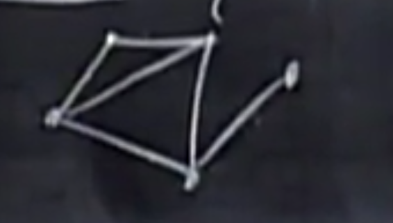

Linear Algebra

<nav style="position: fixed;right:2%;top:7%; z-index: 5">
  <ul>
    <li><a href="#目录">目录</a></li>
  </ul>
</nav>

# 目录
[Lecture 1  线性方程的几何解释](#1线性方程的几何解释)
[Lecture 2  矩阵消元法](#2矩阵消元法)
[Lecture 3  矩阵乘法与逆矩阵](#3矩阵乘法与逆矩阵)
[Lecture 4  A = LU 分解](#4a--lu-分解)
[Lecture 5  转置矩阵、置换矩阵与$R^n$空间](#5转置矩阵、置换矩阵与ℝⁿ空间)
[Lecture 6  列空间与零空间](#6列空间与零空间)
[Lecture 7  求解 Ax = 0：主元变量与特解](#7求解-ax--0主元变量与特解)
[Lecture 8  求解 Ax = b：可解性和解的结构](#8求解-ax--b可解性和解的结构)
[Lecture 9  线性无关、基与维数](#9线性无关、基与维数)
[Lecture 10  四大基本子空间](#10四大基本子空间)
[Lecture 11  矩阵空间、秩1矩阵与小世界图](#11矩阵空间、秩1矩阵与小世界图)
[Lecture 12  图、网络与关联矩阵](#12图、网络与关联矩阵)
[Lecture 13  正交向量与正交子空间](#13正交向量与正交子空间)
[Lecture 14  子空间上的投影](#14子空间上的投影)
[Lecture 15  投影矩阵与最小二乘法](#15投影矩阵与最小二乘法)
[Lecture 16  正交矩阵与格拉姆-施密特正交化](#16正交矩阵与格拉姆-施密特正交化)
[Lecture 17  行列式的性质](#17行列式的性质)
[Lecture 18  行列式的展开式与代数余子式](#18行列式的展开式与代数余子式)
[Lecture 19  克拉默法则、逆矩阵与体积](#19克拉默法则、逆矩阵与体积)
[Lecture 20  特征值与特征向量](#20特征值与特征向量)
[Lecture 21  矩阵对角化与矩阵的幂](#21矩阵对角化与矩阵的幂)
[Lecture 22  微分方程与矩阵指数函数 exp(At)](#22微分方程与矩阵指数函数-expat)
[Lecture 23  马尔可夫矩阵与傅里叶级数](#23马尔可夫矩阵与傅里叶级数)
[Lecture 24  对称矩阵与正定性](#24对称矩阵与正定性)
[Lecture 25  复矩阵与快速傅里叶变换（FFT）](#25复矩阵与快速傅里叶变换（fft）)
[Lecture 26  正定矩阵与极小值](#26正定矩阵与极小值)
[Lecture 27  相似矩阵与若尔当标准形](#27相似矩阵与若尔当标准形)
[Lecture 28  奇异值分解（SVD）](#28奇异值分解（svd）)
[Lecture 29  线性变换及其矩阵表示](#29线性变换及其矩阵表示)
[Lecture 30  基变换与图像压缩](#30基变换与图像压缩)
[Lecture 31  左逆与右逆；伪逆矩阵](#31左逆与右逆；伪逆矩阵)
[术语表](#术语表)

# 1线性方程的几何解释
[返回目录](#目录)
### 1.1二元
$$
\begin{cases} 2x-y = 0 \\
-x+2y=3 
\end{cases}\\
$$
行图像
$$
\left[\begin{matrix}
2&-1 \\
-1&2
\end{matrix}\right]
\left[ \begin{matrix}
x\\
y
\end{matrix} \right]
=
\left[ \begin{matrix}
0\\
3
\end{matrix} \right]
\\
形如
Ax=b
$$
这里求出两条直线的交点

列图像
$$
x
 \left[ \begin{matrix}
2\\-1
\end{matrix} \right]
+
y
\left[ \begin{matrix}
-1\\2
\end{matrix} \right]
=
\left[ \begin{matrix}
0\\3
\end{matrix} \right]
$$

这里所求即为x和y的线性组合，显然，xy的所有线性组合可以表示整个平面（xy不共线）,可以得出等号右侧的全部向量

### 1.2三元
$$
\begin{cases}
2x-y=0\\
-x+2y-z=-1\\
-3y+4z=4
\end{cases}
\\
A=\left[ \begin{matrix}
2&&-1&&0\\
-1&&2&&-1\\
0&&-3&&4
\end{matrix} \right]
b=\left[ \begin{matrix}
0\\-1\\4
\end{matrix} \right]
$$
行图像就是三个不平行不特殊的平面交于一点，此时已经非常难想象了

$$
x\left[ \begin{matrix}
2\\-1\\0
\end{matrix} \right]
+
y\left[ \begin{matrix}
-1\\2\\-3
\end{matrix} \right]
+
z\left[ \begin{matrix}
0\\-1\\4
\end{matrix} \right]
=
\left[ \begin{matrix}
0\\-1\\4
\end{matrix} \right]
$$
等号左侧是三个空间向量的线性组合，以得到等号有右边的向量，
显然当三个向量不共面，矩阵A乘x就能表示所有b。
这种能通过线性组合得到所有b的矩阵叫做***非奇异矩阵***，反之，叫做***奇异矩阵***

### 矩阵乘法
方程组的矩阵形式$Ax=b$
矩阵乘以向量x等于右侧向量b
下面给出矩阵乘以列向量=列向量
(x不为向量而是另一个矩阵的时候，也应该遵守同样的计算方法，而不能交换顺序或把矩阵A拆成向量)
$$
\left[ \begin{matrix}
2&5\\1&3
\end{matrix} \right]
\left[ \begin{matrix}
1\\2
\end{matrix} \right]
$$
第一种计算法，看成列的线性组合，用向量中的数乘以各列
$$
=
1\left[ \begin{matrix}
2\\1
\end{matrix} \right]
+
2\left[ \begin{matrix}
5\\3
\end{matrix} \right]
=
\left[ \begin{matrix}
1\times2+2\times5\\
1\times1+2\times3
\end{matrix} \right]
=
\left[ \begin{matrix}
12\\7
\end{matrix} \right]
$$
第二种计算方法，用每一行乘以向量x,即向量点乘向量
$$
=
\left[ \begin{matrix}
(2,5)\cdot(1,2)\\(1,3)\cdot(1,2)
\end{matrix} \right]
=
\left[ \begin{matrix}
12\\7
\end{matrix} \right]
$$

从外，行向量乘以矩阵=行向量
方法类似，用x向量中的数乘以各**行**

# 2矩阵消元法
[返回目录](#目录)
## 消元法
### 消元
$$
\begin{cases}
x+2y+z=2\\
3x+8y+z=12\\
4y+z=2
\end{cases}
$$
在下面的消元过程中，主元1是1，主元2是2，主元3是5
$$
\left[ \begin{matrix}
[1]&2&1\\
3&8&1\\
0&4&1
\end{matrix} \right]
\rightarrow
\left[ \begin{matrix}
1&2&1\\
0&[2]&-2\\
0&4&1
\end{matrix} \right]
\rightarrow
\left[ \begin{matrix}
1&2&1\\
0&2&-2\\
0&0&[5]
\end{matrix} \right]
$$
最后一个矩阵的形式又称***三角矩阵U***
为矩阵添加一列，该列的值为等号右边的b，此时的矩阵称为***增广矩阵***
$$
\left[ \begin{matrix}
1&2&1&2\\
3&8&1&12\\
0&4&1&2
\end{matrix} \right]
\rightarrow
\left[ \begin{matrix}
1&2&1&2\\
0&2&-2&6\\
0&4&1&2
\end{matrix} \right]
\rightarrow
\left[ \begin{matrix}
1&2&1&2\\
0&2&-2&6\\
0&0&5&-10
\end{matrix} \right]
$$
这时得到的最后一列即为c，c是b的最终结果，就像U对A一样
使用消元法时，主元不能为0，通过换行的方法，可以解决暂时的消元法失效；
当换行时无法避免主元出现0，消元法失效
### 回代
从上面最终得到的矩阵，得到如下方程组
$$
\begin{cases}
x+2y+z=2\\
2y-2z=6\\
5z=-10
\end{cases}
$$

## 矩阵乘法
根据上面的例子，记
$$
\left[\begin{matrix}
1&0&0\\0&1&0\\0&0&1
\end{matrix}\right]

\left[\begin{matrix}
1&0&0\\-3&1&0\\0&0&1
\end{matrix}\right]

\left[\begin{matrix}
1&0&0\\0&1&0\\0&-2&1
\end{matrix}\right]
$$
分别为***单位矩阵I***，既任何矩阵乘以单位矩阵都等于本身；
$E_{21}$和$E_{32}$
则消元的矩阵表达为

$$
E_{32}(E_{21}A)=U
\tag {2.1}
$$

## 矩阵乘法性质
性质1：结合律
其中，$(E_{32}E_{21})$是***初等矩阵E***
$$
(E_{32}E_{21})A = U
\tag {性质1}
$$

性质2：**不**满足交换律
***转置矩阵***是另一类初等矩阵，用于交换行、列，例如
$$
\left[\begin{matrix}
0&1\\1&0
\end{matrix}\right]
$$

行变换是左乘，列变换是右乘，也就是把转置矩阵放在要转换的矩阵的左边和右边

性质3:分配律
$$
A(v+w)=Av+Aw
$$

## 逆变换
找到并乘以一个逆矩阵，即可得到本身
$$
\left[\begin{matrix}
1&0&0\\3&1&0\\0&0&1
\end{matrix}\right]
\left[\begin{matrix}
1&0&0\\-3&1&0\\0&0&1
\end{matrix}\right]
A=A
$$
其中，初等矩阵的***逆矩阵***记为$E^{-1}$

# 3矩阵乘法与逆矩阵
[返回目录](#目录)
## 矩阵乘法
假设$AB=C$均为一般初等矩阵
### 结果C的行列数
若A为$m\times n$，B为$n\times p$
则C为$m\times p$
### 单个元素的求法
例如且C的第3行第4列的元素$C_{34}$
则用A的第3行点乘B的第4列$\sum_k A_{3k}B_{k4}$
B可以考虑成多个列向量或者多个行向量排放在一起，因此，左乘和右乘得到的结果是不同的

### 列向量计算方法
C的每一列都是A的各列的线性组合，B中的列则说明如何组合

### 行向量计算方法
C的每一行都是B的各行的线性组合，A中的行则说明如何组合

### 列乘以行
在第一种方法中，是行乘以列，得到某个元素
如果用A的某列乘以B的某行，则会得到和C相同大小的矩阵
$$
\left[\begin{matrix}
2\\3\\4
\end{matrix}\right]
\left[\begin{matrix}
1&6
\end{matrix}\right]
=
\left[\begin{matrix}
2&12\\
3&18\\
4&24
\end{matrix}\right]
$$

### 分块乘法

## 逆
### 可逆
又称非奇异
有一矩阵$A$
逆矩阵$A^{-1}$乘以$A$得到单位矩阵，逆矩阵还分为左逆和右逆。
方阵矩阵的左逆和右逆是相等的，也就是将$A^{-1}$放在左乘或右乘结果都是单位矩阵

矩阵$A$可逆的充要条件包括：
1. $A$的行列式不为零（$\delta ⁡(A)≠0$）。
1. $A$的列向量（或行向量）线性无关。
1. $A$的秩为 n（即满秩）。
1. 齐次线性方程组 $Ax=0$ 只有零解。
1. $A$可以表示为初等矩阵的乘积。

### 无逆矩阵
又称奇异矩阵
例如
$$
\left[\begin{matrix}
1&3\\2&6
\end{matrix}\right]
$$
* 行列式结果为0
* 存在非零向量x使$Ax=0$
反证：若存在，则$A^{-1}A = I$,$A^{-1}Ax = 0$,则$x = 0$，显然x不为零向量，故不存在逆矩阵

### 求逆矩阵
高斯-若尔当思想
$$
\left[\begin{matrix}
1&3\\2&7
\end{matrix}\right]
\\
\left[\begin{matrix}
1&3|1&0\\
2&7|0&1\\
\end{matrix}\right]
\rightarrow
\left[\begin{matrix}
1&3|1&0\\
0&1|-2&1\\
\end{matrix}\right]
\rightarrow
\left[\begin{matrix}
1&0|7&-3\\
0&1|-2&1\\
\end{matrix}\right]
$$
通过两次消元，将该增广矩阵的左侧转换成单位矩阵，则右侧为原矩阵的逆矩阵

原理：左侧乘以消元矩阵得到单位矩阵，即这些消元矩阵乘积为逆矩阵，那么右侧的单位矩阵乘以相同的消元矩阵，也就得到了逆矩阵

# 4A = LU 分解
[返回目录](#目录)
## $AB$的逆
已知$AB$、$A^{-1}$、$B^{-1}$，则$(AB)^{-1}$为$B^{-1}A^{-1}$
因为
$$
ABB^{-1}A^{-1} = I
\tag {4.1}
$$

## 转置矩阵$A^T$的逆
$$
(A^{-1})^TA^T=I
\tag{4-2}
$$

## $A = LU$
$A$乘以消元矩阵$E$得到$U$(uppertanger)，则$L$(lowertangler)为$E$的逆矩阵

### 为什么用$A=LU$而不是$EA=U$
如果不存在行互换，那么消元乘数，也就是各步的消元矩阵中的消元乘数，可以直接写入$L$中

# 5转置矩阵、置换矩阵与ℝⁿ空间
[返回目录](#目录)
## 置换矩阵$P$
置换矩阵可以用来进行行交换
对于$3\times 3$矩阵，其三行的排列有$A_3^3$也就是算是单位矩阵，有6个置换矩阵
这6个矩阵的矩阵群，两两相乘得到另一个置换矩阵，取逆是其本身的一个转置矩阵，也是置换矩阵

置换矩阵总可逆

## 转置矩阵$A^T$
$$
\left[ \begin{matrix}
1&3\\2&3\\4&1
\end{matrix} \right]^T
=
\left[ \begin{matrix}
1&2&4\\3&3&1
\end{matrix} \right]
$$

转置矩阵
$$
(A^T)_{ij} = A_{ji}
\tag {5.1}
$$

### 对称矩阵
即拥有以下性质，其转置矩阵等于其本身
$$
A^T = A
$$

对于一般***直角矩阵R***，有
$R^TR$一定为对称矩阵

证明：
$$
(R^TR)^T = R^T R^{TT} = R^T R
$$

## 向量空间$R^n$
例如$R^2$表示所有二维向量，也表示x-y平面
$R^3$表示所有三维实向量组成的向量空间

实向量也就是其分量均为实数

### 向量空间的性质
空间中向量两两相加，线性组合，或某向量数乘仍在空间当中

### 子空间
本身是自己的子空间，零空间也是子空间

$R^2$的任意一条过原点的直线都是其向量子空间，
在该直线上任意数乘和线性组合都能保证仍在这条直线上

$R^3$的,过原点的平面和直线是其子空间

任意子空间的交集仍然是子空间

# 6列空间与零空间
[返回目录](#目录)
## 列空间
对于矩阵$A$，其各列看作向量，满足这些向量的所有线性组合的向量集合称为***列向量***，记作$C(A)$

### 列向量与方程
什么样的$b$让方程组有解
$$
\left[\begin{matrix}
1&1&2\\
2&1&3\\
3&1&4\\
4&1&5
\end{matrix}\right]
\left[\begin{matrix}
x_1\\
x_2\\
x_3
\end{matrix}\right]
=
\left[\begin{matrix}
b_1\\
b_2\\
b_3\\
b_4
\end{matrix}\right]
$$
显然有四个方程，三个未知数，
当且仅当$b$属于$C(A)$时,方程总是有解

### 线性相关与线性无关
所有向量之间不能由其它向量的线性组合得到,称这些向量线性无关,反之有关

## 零空间
对于方程$Ax=0$,其解x的集合为零空间
若A为$m\times n$矩阵,则列空间为$R^m$子空间,零空间为$R^n$子空间 

# 7求解 Ax = 0:主元变量与特解
[返回目录](#目录)

$$
\left[\begin{matrix}
1&2&2&2\\
2&4&6&8\\
3&6&8&10
\end{matrix}\right]
$$
通过消元解得$Ax=0$
消元法不影响$x$,也就是解,也就是零空间,只处理$A$
$$
\left[\begin{matrix}
[1]&2&2&2\\
0&0&2&4\\
0&0&2&4
\end{matrix}\right]
\rightarrow
\left[\begin{matrix}
1&2&2&2\\
0&0&[2]&4\\
0&0&0&0
\end{matrix}\right]
$$
本例中只有两个主元
主元的数量称为***秩(rank)***，也等于主变量的数量
主元所在的列称为***主列***，转置矩阵的主列数与原矩阵相同
其它列称为***自由列***，自由列的数乘可以是任意的，在本例中，即$x_2,x_4$可以是任意的，这样的变量称作***自由变量***，只需求解$x_1,x_3$，称作***主变量***

对方程$Ax=0,A:m\times n， x有n变量，rank：r$则自由变量$n-r$个

取不同组自由变量，可以得到特解，有几个自由变量，就有几个特解，特解之间的线性组合的集合就是零空间，即这个方程的一般解

## 简化行阶梯形式R

对于上面得到的矩阵$U$，还能进一步化简为***简化行阶梯形式R***
$$
\left[\begin{matrix}
1&2&2&2\\
0&0&2&4\\
0&0&0&0
\end{matrix}\right]
\rightarrow
\left[\begin{matrix}
1&2&0&-2\\
0&0&2&4\\
0&0&0&0
\end{matrix}\right]
\rightarrow
\left[\begin{matrix}
1&2&0&-2\\
0&0&1&2\\
0&0&0&0
\end{matrix}\right]
$$
在上述的第一步变换中，将主元的上下全部化为0
第二步，用方程除以主元，这不会影响方程的解

在$R$中,主列构成单位矩阵$I$,自由列构成***自由矩阵F***,即

$$
I=
\left[\begin{matrix}
1&0\\0&1
\end{matrix}\right]
F=
\left[\begin{matrix}
2&-2\\0&2
\end{matrix}\right]
$$
全为0的行省略，因为无意义

典型的简化行阶梯矩阵形如
$$R=
\left[\begin{matrix}
I&F\\0&0
\end{matrix}\right]
$$
主变量在前，自由变量在后

对于$Rx=0$，给特解中的自由变量组成的矩阵赋值为单位矩阵(比如说x3=0,x4=1;x3=1,x4=0)，则
可以直接得到***零空间矩阵N***
$$
x = N=

\left[\begin{matrix}
-F\\I
\end{matrix}\right]
\tag {7.1}
$$
$-F$放到主变量的部分，$I$放到自由变量的部分
通过验算，各列是各个特解，该矩阵的各列的线性组合组成零空间

# 8求解 Ax = b:可解性和解的结构
[返回目录](#目录)
以上一节中相同的矩阵$A$为例,方程为$Ax=b$，其增广矩阵和消元如下
$$
\left[\begin{matrix}
1&2&2&2&b_1\\
2&4&6&8&b_2\\
3&6&8&10&b_3
\end{matrix}\right]
\rightarrow

\left[\begin{matrix}
1&2&2&2&b_1\\
0&0&2&4&b_2-2b_1\\
0&0&0&0&b_3-b_2-b_1
\end{matrix}\right]
$$
则，方程有解的条件是
$b_3-b_2-b_1 = 0$
## 可解性
$Ax=b$有解,当且仅当$b$属于$C(A)$,b是A各列的线性组合

或者说，如果A各行的线性组合得到零行，那么b中元素的相同线性组合也必然得到零

## 求解算法
$b$已知，$A$已知且为$m\times n,m<n$，那么方程数小于未知数数，求$Ax=b$的所有解
以下方程为例(已消元)
$$
\left[\begin{matrix}
1&2&2&2\\
0&0&2&4\\
0&0&0&0
\end{matrix}\right]

\left[\begin{matrix}
x_1\\x_2\\x_3\\x_4
\end{matrix}\right]
=
\left[\begin{matrix}
1\\3\\0
\end{matrix}\right]
$$
### 第一步：求一个特解
将所有自由变量设为0，解出主变量
得到特解
$$
x_p=
\left[\begin{matrix}
-2\\0\\{3\over2}\\0
\end{matrix}\right]
$$
### 第二步：求零空间
也就是令$b=0$，求出零空间，在上一节已介绍，这里不赘述
零空间内任意向量为$x_n$

### 第三步
原方程的所有解即为$x_p+x_n$
即本题的通解为
$$
x_{complete}=
\left[\begin{matrix}
-2\\0\\{3\over2}\\0
\end{matrix}\right]
+c_1
\left[\begin{matrix}
-2\\1\\0\\0
\end{matrix}\right]
+c_2
\left[\begin{matrix}
2\\0\\-2\\1
\end{matrix}\right]
$$
在几何空间上，相当于将零空间这一子空间，沿着特解的向量平移

证明：
$$
Ax_p=b\\
Ax_n=0\\
\therefore A(x_p+x_n) = b
$$
## 一般情况
对于$A:m\times n$则$r\leq m,r\leq n$

|秩r|简化行阶梯矩阵R|解x的情况|说明|
|---|---|---|---|
|$r=n=m$|$I$|总有唯一解|称此矩阵为***满秩方阵***，零空间仅包含零向量|
|$r=n<m$|$\left[\begin{matrix}I\\0\end{matrix}\right]$|0或唯一解|称为***列满秩***，这时没有自由变量，零空间仅包含零向量|
|$r=m<n$|$\left[\begin{matrix}I&F\end{matrix}\right]$|总有无穷个解|称为***行满秩***，这时每行都有主元，也就是没有零行，自由变量数为$n-r=n-m$(主列不总是在自由列前面，这里R指的是典型情况)|
|$r<n,r<m$|$\left[\begin{matrix}I&F\\0&0\end{matrix}\right]$|0或无穷个解||

***秩决定了方程组解的数目***

# 9线性无关、基与维数
[返回目录](#目录)
## 线性无关(independent)
向量$x_1,x_2,x_3,x_4,\dots ,x_n$之间线性组合，除了系数全零以外，存在使他们的组合为零向量的组合，则称该向量组线性相关；反之，称为线性无关

向量组内存在一个零向量，则该向量组一定相关 

$Ax=0$，零空间包含非零向量时，该矩阵A的各列一定线性相关
零空间只有零向量时，这些列向量线性无关

秩的角度：
线性无关时，所有列都是主列，有n个主元，秩为n
自由列的实质是主列的一种组合

## 基(basis)
向量组生成一个空间***S***，指的是这个空间包含这些向量的所有线性组合，就像列空间一样
这个空间S是包含这些向量的最小空间

向量空间的一组基是指，一系列的**线性无关**的**能生成整个空间**的向量，是一组向量。这些向量称为*** ***

对于$R^n$内的n个向量组成的$n\times n$方阵，如果能够构成$R^n$的基，那么这个方阵可逆
证明：
如果 $A$ 的列向量线性无关，那么对于任何 $b \in \mathbb{R}^n$，方程 $A x = b$ 有唯一解（因为 $A$ 是满秩的）。特别地，对于 $b = e_i$（单位矩阵的第 $i$ 列），存在唯一的 $x_i$ 使得 $A x_i = e_i$。将这些 $x_i$ 作为列向量构成矩阵 $B$，则有 $A B = I$，即 $A$ 可逆。

对于给定空间，所有基内的向量数量相等，这个数量称为***空间的维数***
## 维数dim
**列空间的**维数和**矩阵**的秩数相等和矩阵主列的数量相等
$dimC(A) = r(A)$
零空间的维数等于自由变量的数目
$dimN(A)= n-r$

# 10四大基本子空间
[返回目录](#目录)
列空间、零空间、行空间、转置的零空间（左零空间）
|空间|在$R^?$中|维数|一组基|
|---|---|---|---|
|零空间|n|n-r|特殊解们，一个自由变量为1，其它为0|
|列空间|m|r|主列|
|行空间|n|r||
|左零空间|m|m-r||
tips：
* A和R的列空间不相等，$C(A)\not= C(R)$
## 行空间
矩阵A的所有行的所有组合生成的空间
等价于
转置矩阵$A^T$的列空间$C(A^T)$

由于行变化，化简是对行的线性组合，因此最终得到的R的行空间不会改变
A和R的行空间相等，$C(A^T)= C(R^T)$
由R的前r行生成，最简洁形式

## 左零空间$N(A^T)$
若$A^Ty=0$,那么y就在转置矩阵的零空间里面

为什么称为左零空间：
$$
A^Ty=0 \rightarrow y^TA=0^T
$$
求基：
第一步：
使用高斯若尔当消元法，求出$EA=R$的E
$$
E
\left[\begin{matrix}
A&I
\end{matrix}\right]
=
\left[\begin{matrix}
R&E
\end{matrix}\right]
$$
第二步：
观察R中的零行
对应的E中的行即为基
> 也就是说，E的这些行左乘A得到零行。上面的过程也就是找出产生零行的行组合
与零空间类似，零空间是找出产生零（列）向量的列组合

# 11矩阵空间、秩1矩阵与小世界图
[返回目录](#目录)
> 将向量空间的概念延伸至矩阵空间，矩阵空间不考虑矩阵相乘

以$3\times 3$矩阵构成的空间**M**为例，
其子空间有
$3\times 3$对称矩阵构成的空间
$3\times 3$上三角矩阵构成的空间
等等

其一组基为
$$
\left[\begin{matrix}
1&0&0\\
0&0&0\\
0&0&0
\end{matrix}\right]
,
\left[\begin{matrix}
0&1&0\\
0&0&0\\
0&0&0
\end{matrix}\right]
,
\left[\begin{matrix}
0&0&1\\
0&0&0\\
0&0&0
\end{matrix}\right]
,\ldots ,
\left[\begin{matrix}
0&0&0\\
0&0&0\\
0&0&1
\end{matrix}\right]
$$
共有九个矩阵，因此维度是9

对称矩阵S组成的子空间的基有6个，是6维
上三角矩阵U的子空间基有6个，是6维
对称矩阵空间与上三角矩阵空间的交集是对角矩阵空间，基3个，3维，仍是原空间的子空间
但并集不是子空间

## 和空间
$S+U$
表示S中的任意矩阵加U中的任意矩阵组成的新矩阵，这个矩阵仍是原空间的子空间
其维度为9

不难注意到，
$$
dim(S)+dim(U) = dim(S\cap U) + dim(S+U)
\tag{11.1}
$$

## 秩1矩阵
所有秩1矩阵都可以表示为$A = uv^T$
即一维列向量乘一维行向量（$v^T$用转置表示行向量）

两个矩阵的和的秩$\leq$两个矩阵秩的和

显然所有的小于等于某秩的矩阵不能组成子空间，因为他们的和的秩很可能大于某秩

所有v1+v2+v3+v4=0的向量$\left[\begin{matrix}v_1\\v_2\\v_3\\v_4\end{matrix}\right]$能组成一个$R^4$的子空间，因为任意向量相加，都满足分量和为0.
这样的向量空间，是$\left[\begin{matrix}1&1&1&1\end{matrix}\right]$的零空间

## 图

图包含节点node和边edge
上面这幅图有五点六边
一个$5\times 6$矩阵就可以表示这幅图的所有信息

# 12图、网络与关联矩阵
[返回目录](#目录)
## 图
一个图包含**节点**和**边**

如图，n=4,表示4个结点，m=5，表示5条边，
给定方向，用于参考正负，同向为正反向为负，对此可以构造一个$m\times n$的矩阵，这个矩阵称为***关联矩阵***
$$
A=
\left[\begin{matrix}
-1&1&0&0\\
0&-1&1&0\\
-1&0&1&0\\
-1&0&0&1\\
0&0&-1&1
\end{matrix}\right]
$$

将其关联于电路图：
1. 方向表示电流参考方向
2. $Ax$中的x向量作为各个节点的电势
3. $Ax$结果得到各边的电势差
4. 零空间表示节点电势都是由一个常数决定
5. 零空间一维，即一个自由变量，在这里是设其中一个电势，才能求出其它节点的电势
6. 欧姆定律$y = Ce$,e表示电势差，即$Ax$，C是电导，
7. $A^Ty=0$是基尔霍夫定律，中y为各边电流，A转置的各行表示节点，则y1乘一行，得到的是该节点的基尔霍夫定律
8. 如果有外加电源，则基尔霍夫定律表示为$A^Ty = f$， f是外加电流大小

其中，4列对应4个节点，各行对应各条边
1. 第一行表示这条边是由节点1指向节点2，与节点3，4无关
2. 非零元素只有2m个，每行只有两个
3. 零空间是$c\left[\begin{matrix}1\\1\\1\\1\end{matrix}\right]$
4. 秩为3
5. 转置的零空间$\left[\begin{matrix}\end{matrix}\right]$

其中，前三条边又能组成一个***回路(loop)***, 又是一个子图
1. 回路意味着相关，如矩阵前三行组成的回路，行1+行2＝行3；无法组成回路，说明无关
2. 无法组成回路的图成为**树**

1. 左零空间的维数是m-r
2. 独立回路的数量等于m-n+1
3. 秩是节点数n-1

## 欧拉公式
$$
nodes - edges + loops = 1
\tag {12.1}
$$
任何图都符合这一公式

# 13正交向量与正交子空间
[返回目录](#目录)
# 14子空间上的投影
[返回目录](#目录)
# 15投影矩阵与最小二乘法
[返回目录](#目录)
# 16正交矩阵与格拉姆-施密特正交化
[返回目录](#目录)
# 17行列式的性质
[返回目录](#目录)
# 18行列式的展开式与代数余子式
[返回目录](#目录)
# 19克拉默法则、逆矩阵与体积
[返回目录](#目录)
# 20特征值与特征向量
[返回目录](#目录)
# 21矩阵对角化与矩阵的幂
[返回目录](#目录)
# 22微分方程与矩阵指数函数 exp(At)
[返回目录](#目录)
# 23马尔可夫矩阵与傅里叶级数
[返回目录](#目录)
# 24对称矩阵与正定性
[返回目录](#目录)
# 25复矩阵与快速傅里叶变换（FFT）
[返回目录](#目录)
# 26正定矩阵与极小值
[返回目录](#目录)
# 27相似矩阵与若尔当标准形
[返回目录](#目录)
# 28奇异值分解（SVD）
[返回目录](#目录)
# 29线性变换及其矩阵表示
[返回目录](#目录)
# 30基变换与图像压缩
[返回目录](#目录)
# 31左逆与右逆；伪逆矩阵
[返回目录](#目录)

|block multiplication|分块乘法|

# 术语表
[返回目录](#目录)
|英文|中文|
|---|---|
| Solution vector x                   | 解向量 x（明确是向量的解）             |
| Forward elimination and back substitution | 前向消元和回代（线性方程组求解的标准术语） |
| Inverse matrix                      | 逆矩阵                                 |
| Particular solution                 | 特解（非齐次方程的特解）               |
| Nullspace solution                  | 零空间解（齐次方程的解空间）           |
| Column space                        | 列空间                                 |
| Nullspace                           | 零空间                                 |
| Invariant subspace                  | 不变子空间                             |
| Subspaces                           | 子空间                                 |
