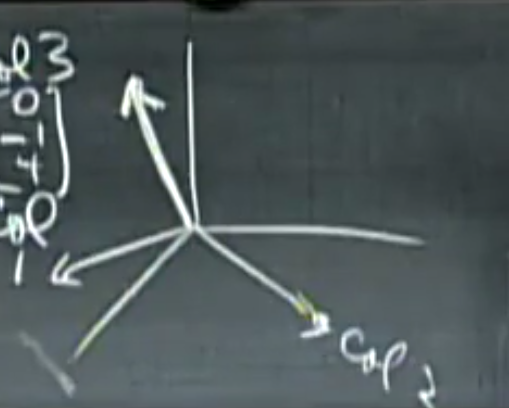
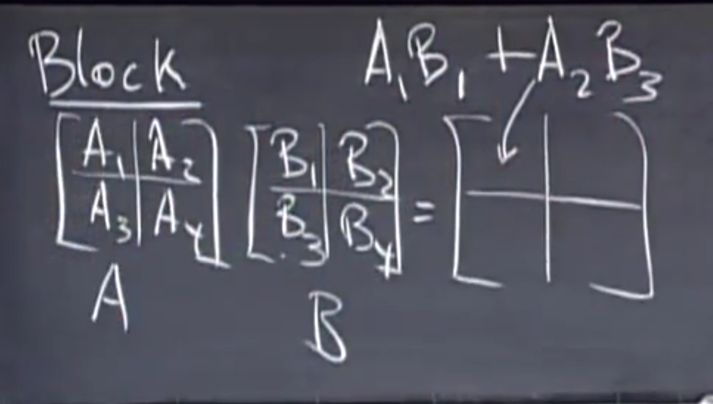
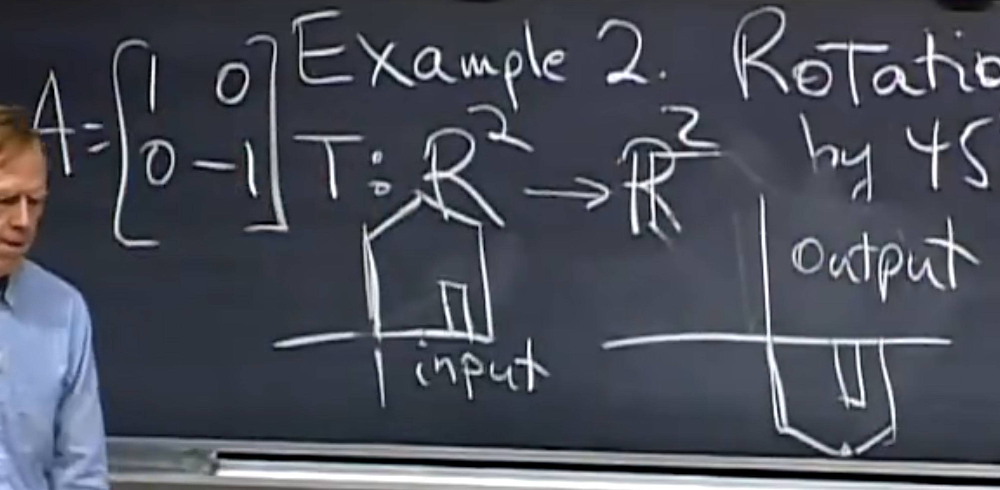

Linear Algebra

<nav style="position: fixed;right:2%;top:7%; z-index: 5">
  <ul>
    <li><a href="#目录">目录</a></li>
  </ul>
</nav>

# 目录
[Lecture 1  线性方程的几何解释](#1线性方程的几何解释)
[Lecture 2  矩阵消元法](#2矩阵消元法)
[Lecture 3  矩阵乘法与逆矩阵](#3矩阵乘法与逆矩阵)
[Lecture 4  A = LU 分解](#4a--lu-分解)
[Lecture 5  转置矩阵、置换矩阵与$R^n$空间](#5转置矩阵、置换矩阵与ℝⁿ空间)
[Lecture 6  列空间与零空间](#6列空间与零空间)
[Lecture 7  求解 Ax = 0：主元变量与特解](#7求解-ax--0主元变量与特解)
[Lecture 8  求解 Ax = b：可解性和解的结构](#8求解-ax--b可解性和解的结构)
[Lecture 9  线性无关、基与维数](#9线性无关、基与维数)
[Lecture 10  四大基本子空间](#10四大基本子空间)
[Lecture 11  矩阵空间、秩1矩阵与小世界图](#11矩阵空间、秩1矩阵与小世界图)
[Lecture 12  图、网络与关联矩阵](#12图、网络与关联矩阵)
[Lecture 13  正交向量与正交子空间](#13正交向量与正交子空间)
[Lecture 14  子空间上的投影](#14子空间上的投影)
[Lecture 15  投影矩阵与最小二乘法](#15投影矩阵与最小二乘法)
[Lecture 16  正交矩阵与格拉姆-施密特正交化](#16正交矩阵与格拉姆-施密特正交化)
[Lecture 17  行列式的性质](#17行列式的性质)
[Lecture 18  行列式的展开式与代数余子式](#18行列式的展开式与代数余子式)
[Lecture 19  克拉默法则、逆矩阵与体积](#19克拉默法则、逆矩阵与体积)
[Lecture 20  特征值与特征向量](#20特征值与特征向量)
[Lecture 21  矩阵对角化与矩阵的幂](#21矩阵对角化与矩阵的幂)
[Lecture 22  微分方程与矩阵指数函数 exp(At)](#22微分方程与矩阵指数函数-expat)
[Lecture 23  马尔可夫矩阵与傅里叶级数](#23马尔可夫矩阵与傅里叶级数)
[Lecture 24  对称矩阵与正定性](#24对称矩阵与正定性)
[Lecture 25  复矩阵与快速傅里叶变换（FFT）](#25复矩阵与快速傅里叶变换（fft）)
[Lecture 26  正定矩阵与极小值](#26正定矩阵与极小值)
[Lecture 27  相似矩阵与若尔当标准形](#27相似矩阵与若尔当标准形)
[Lecture 28  奇异值分解（SVD）](#28奇异值分解（svd）)
[Lecture 29  线性变换及其矩阵表示](#29线性变换及其矩阵表示)
[Lecture 30  基变换与图像压缩](#30基变换与图像压缩)
[Lecture 31  左逆与右逆；伪逆矩阵](#31左逆与右逆；伪逆矩阵)
[术语表](#术语表)

# 1线性方程的几何解释
[返回目录](#目录)
### 1.1二元
$$
\begin{cases} 2x-y = 0 \\
-x+2y=3 
\end{cases}\\
$$
行图像
$$
\left[\begin{matrix}
2&-1 \\
-1&2
\end{matrix}\right]
\left[ \begin{matrix}
x\\
y
\end{matrix} \right]
=
\left[ \begin{matrix}
0\\
3
\end{matrix} \right]
\\
形如
Ax=b
$$
这里求出两条直线的交点

列图像
$$
x
 \left[ \begin{matrix}
2\\-1
\end{matrix} \right]
+
y
\left[ \begin{matrix}
-1\\2
\end{matrix} \right]
=
\left[ \begin{matrix}
0\\3
\end{matrix} \right]
$$

这里所求即为x和y的线性组合，显然，xy的所有线性组合可以表示整个平面（xy不共线）,可以得出等号右侧的全部向量

### 1.2三元
$$
\begin{cases}
2x-y=0\\
-x+2y-z=-1\\
-3y+4z=4
\end{cases}
\\
A=\left[ \begin{matrix}
2&&-1&&0\\
-1&&2&&-1\\
0&&-3&&4
\end{matrix} \right]
b=\left[ \begin{matrix}
0\\-1\\4
\end{matrix} \right]
$$
行图像就是三个不平行不特殊的平面交于一点，此时已经非常难想象了

$$
x\left[ \begin{matrix}
2\\-1\\0
\end{matrix} \right]
+
y\left[ \begin{matrix}
-1\\2\\-3
\end{matrix} \right]
+
z\left[ \begin{matrix}
0\\-1\\4
\end{matrix} \right]
=
\left[ \begin{matrix}
0\\-1\\4
\end{matrix} \right]
$$
等号左侧是三个空间向量的线性组合，以得到等号有右边的向量，
显然当三个向量不共面，矩阵A乘x就能表示所有b。
这种能通过线性组合得到所有b的矩阵叫做***非奇异矩阵***，反之，叫做***奇异矩阵***

### 矩阵乘法
方程组的矩阵形式$Ax=b$
矩阵乘以向量x等于右侧向量b
下面给出矩阵乘以列向量=列向量
(x不为向量而是另一个矩阵的时候，也应该遵守同样的计算方法，而不能交换顺序或把矩阵A拆成向量)
$$
\left[ \begin{matrix}
2&5\\1&3
\end{matrix} \right]
\left[ \begin{matrix}
1\\2
\end{matrix} \right]
$$
第一种计算法，看成列的线性组合，用向量中的数乘以各列
$$
=
1\left[ \begin{matrix}
2\\1
\end{matrix} \right]
+
2\left[ \begin{matrix}
5\\3
\end{matrix} \right]
=
\left[ \begin{matrix}
1\times2+2\times5\\
1\times1+2\times3
\end{matrix} \right]
=
\left[ \begin{matrix}
12\\7
\end{matrix} \right]
$$
第二种计算方法，用每一行乘以向量x,即向量点乘向量
$$
=
\left[ \begin{matrix}
(2,5)\cdot(1,2)\\(1,3)\cdot(1,2)
\end{matrix} \right]
=
\left[ \begin{matrix}
12\\7
\end{matrix} \right]
$$

从外，行向量乘以矩阵=行向量
方法类似，用x向量中的数乘以各**行**

# 2矩阵消元法
[返回目录](#目录)
## 消元法
### 消元
$$
\begin{cases}
x+2y+z=2\\
3x+8y+z=12\\
4y+z=2
\end{cases}
$$
在下面的消元过程中，主元1是1，主元2是2，主元3是5
$$
\left[ \begin{matrix}
[1]&2&1\\
3&8&1\\
0&4&1
\end{matrix} \right]
\rightarrow
\left[ \begin{matrix}
1&2&1\\
0&[2]&-2\\
0&4&1
\end{matrix} \right]
\rightarrow
\left[ \begin{matrix}
1&2&1\\
0&2&-2\\
0&0&[5]
\end{matrix} \right]
$$
最后一个矩阵的形式又称***三角矩阵U***
为矩阵添加一列，该列的值为等号右边的b，此时的矩阵称为***增广矩阵***
$$
\left[ \begin{matrix}
1&2&1&2\\
3&8&1&12\\
0&4&1&2
\end{matrix} \right]
\rightarrow
\left[ \begin{matrix}
1&2&1&2\\
0&2&-2&6\\
0&4&1&2
\end{matrix} \right]
\rightarrow
\left[ \begin{matrix}
1&2&1&2\\
0&2&-2&6\\
0&0&5&-10
\end{matrix} \right]
$$
这时得到的最后一列即为c，c是b的最终结果，就像U对A一样
使用消元法时，主元不能为0，通过换行的方法，可以解决暂时的消元法失效；
当换行时无法避免主元出现0，消元法失效
### 回代
从上面最终得到的矩阵，得到如下方程组
$$
\begin{cases}
x+2y+z=2\\
2y-2z=6\\
5z=-10
\end{cases}
$$

## 矩阵乘法
根据上面的例子，记
$$
\left[\begin{matrix}
1&0&0\\0&1&0\\0&0&1
\end{matrix}\right]

\left[\begin{matrix}
1&0&0\\-3&1&0\\0&0&1
\end{matrix}\right]

\left[\begin{matrix}
1&0&0\\0&1&0\\0&-2&1
\end{matrix}\right]
$$
分别为***单位矩阵I***，既任何矩阵乘以单位矩阵都等于本身；
$E_{21}$和$E_{32}$
则消元的矩阵表达为

$$
E_{32}(E_{21}A)=U
\tag {2.1}
$$

## 矩阵乘法性质
性质1：结合律
其中，$(E_{32}E_{21})$是***初等矩阵E***
$$
(E_{32}E_{21})A = U
\tag {性质1}
$$

性质2：**不**满足交换律
***转置矩阵***是另一类初等矩阵，用于交换行、列，例如
$$
\left[\begin{matrix}
0&1\\1&0
\end{matrix}\right]
$$

行变换是左乘，列变换是右乘，也就是把转置矩阵放在要转换的矩阵的左边和右边

左乘是把矩阵放在原来的矩阵的左边

性质3:分配律
$$
A(v+w)=Av+Aw
$$

## 逆变换
找到并乘以一个逆矩阵，即可得到本身
$$
\left[\begin{matrix}
1&0&0\\3&1&0\\0&0&1
\end{matrix}\right]
\left[\begin{matrix}
1&0&0\\-3&1&0\\0&0&1
\end{matrix}\right]
A=A
$$
其中，初等矩阵的***逆矩阵***记为$E^{-1}$

# 3矩阵乘法与逆矩阵
[返回目录](#目录)
## 矩阵乘法
假设$AB=C$均为一般初等矩阵
### 结果C的行列数
若A为$m\times n$，B为$n\times p$
则C为$m\times p$
### 单个元素的求法
例如且C的第3行第4列的元素$C_{34}$
则用A的第3行点乘B的第4列$\sum_k A_{3k}B_{k4}$
B可以考虑成多个列向量或者多个行向量排放在一起，因此，左乘和右乘得到的结果是不同的

### 列向量计算方法
C的每一列都是A的各列的线性组合，B中的列则说明如何组合

### 行向量计算方法
C的每一行都是B的各行的线性组合，A中的行则说明如何组合

### 列乘以行
在第一种方法中，是行乘以列，得到某个元素
如果用A的某列乘以B的某行，则会得到和C相同大小的矩阵
$$
\left[\begin{matrix}
2\\3\\4
\end{matrix}\right]
\left[\begin{matrix}
1&6
\end{matrix}\right]
=
\left[\begin{matrix}
2&12\\
3&18\\
4&24
\end{matrix}\right]
$$

### 分块乘法

## 逆
### 可逆
又称非奇异
有一矩阵$A$
逆矩阵$A^{-1}$乘以$A$得到单位矩阵，逆矩阵还分为左逆和右逆。
方阵矩阵的左逆和右逆是相等的，也就是将$A^{-1}$放在左乘或右乘结果都是单位矩阵

矩阵$A$可逆的充要条件包括：
1. $A$的行列式不为零（$\delta ⁡(A)≠0$）。
1. $A$的列向量（或行向量）线性无关。
1. $A$的秩为 n（即满秩）。
1. 齐次线性方程组 $Ax=0$ 只有零解。
1. $A$可以表示为初等矩阵的乘积。

### 无逆矩阵
又称奇异矩阵
例如
$$
\left[\begin{matrix}
1&3\\2&6
\end{matrix}\right]
$$
* 行列式结果为0
* 存在非零向量x使$Ax=0$
反证：若存在，则$A^{-1}A = I$,$A^{-1}Ax = 0$,则$x = 0$，显然x不为零向量，故不存在逆矩阵

### 求逆矩阵
高斯-若尔当思想
$$
\left[\begin{matrix}
1&3\\2&7
\end{matrix}\right]
\\
\left[\begin{matrix}
1&3|1&0\\
2&7|0&1\\
\end{matrix}\right]
\rightarrow
\left[\begin{matrix}
1&3|1&0\\
0&1|-2&1\\
\end{matrix}\right]
\rightarrow
\left[\begin{matrix}
1&0|7&-3\\
0&1|-2&1\\
\end{matrix}\right]
$$
通过两次消元，将该增广矩阵的左侧转换成单位矩阵，则右侧为原矩阵的逆矩阵

原理：左侧乘以消元矩阵得到单位矩阵，即这些消元矩阵乘积为逆矩阵，那么右侧的单位矩阵乘以相同的消元矩阵，也就得到了逆矩阵

# 4A = LU 分解
[返回目录](#目录)
## $AB$的逆
已知$AB$、$A^{-1}$、$B^{-1}$，则$(AB)^{-1}$为$B^{-1}A^{-1}$
因为
$$
ABB^{-1}A^{-1} = I
\tag {4.1}
$$

## 转置矩阵$A^T$的逆
$$
(A^{-1})^TA^T=I
\tag{4-2}
$$

## $A = LU$
$A$乘以消元矩阵$E$得到$U$(uppertanger)，则$L$(lowertangler)为$E$的逆矩阵

### 为什么用$A=LU$而不是$EA=U$
如果不存在行互换，那么消元乘数，也就是各步的消元矩阵中的消元乘数，可以直接写入$L$中

# 5转置矩阵、置换矩阵与ℝⁿ空间
[返回目录](#目录)
## 置换矩阵$P$
置换矩阵可以用来进行行交换
对于$3\times 3$矩阵，其三行的排列有$A_3^3$也就是算是单位矩阵，有6个置换矩阵
这6个矩阵的矩阵群，两两相乘得到另一个置换矩阵，取逆是其本身的一个转置矩阵，也是置换矩阵

置换矩阵总可逆

## 转置矩阵$A^T$
$$
\left[ \begin{matrix}
1&3\\2&3\\4&1
\end{matrix} \right]^T
=
\left[ \begin{matrix}
1&2&4\\3&3&1
\end{matrix} \right]
$$

转置矩阵
$$
(A^T)_{ij} = A_{ji}
\tag {5.1}
$$

### 对称矩阵
即拥有以下性质，其转置矩阵等于其本身
$$
A^T = A
$$

对于一般***直角矩阵R***，有
$R^TR$一定为对称矩阵

证明：
$$
(R^TR)^T = R^T R^{TT} = R^T R
$$

## 向量空间$R^n$
例如$R^2$表示所有二维向量，也表示x-y平面
$R^3$表示所有三维实向量组成的向量空间

实向量也就是其分量均为实数

### 向量空间的性质
空间中向量两两相加，线性组合，或某向量数乘仍在空间当中

### 子空间
本身是自己的子空间，零空间也是子空间

$R^2$的任意一条过原点的直线都是其向量子空间，
在该直线上任意数乘和线性组合都能保证仍在这条直线上

$R^3$的,过原点的平面和直线是其子空间

任意子空间的交集仍然是子空间

# 6列空间与零空间
[返回目录](#目录)
## 列空间
对于矩阵$A$，其各列看作向量，满足这些向量的所有线性组合的向量集合称为***列向量***，记作$C(A)$

### 列向量与方程
什么样的$b$让方程组有解
$$
\left[\begin{matrix}
1&1&2\\
2&1&3\\
3&1&4\\
4&1&5
\end{matrix}\right]
\left[\begin{matrix}
x_1\\
x_2\\
x_3
\end{matrix}\right]
=
\left[\begin{matrix}
b_1\\
b_2\\
b_3\\
b_4
\end{matrix}\right]
$$
显然有四个方程，三个未知数，
当且仅当$b$属于$C(A)$时,方程总是有解

### 线性相关与线性无关
所有向量之间不能由其它向量的线性组合得到,称这些向量线性无关,反之有关

## 零空间
对于方程$Ax=0$,其解x的集合为零空间
若A为$m\times n$矩阵,则列空间为$R^m$子空间,零空间为$R^n$子空间 

# 7求解 Ax = 0:主元变量与特解
[返回目录](#目录)

$$
\left[\begin{matrix}
1&2&2&2\\
2&4&6&8\\
3&6&8&10
\end{matrix}\right]
$$
通过消元解得$Ax=0$
消元法不影响$x$,也就是解,也就是零空间,只处理$A$
$$
\left[\begin{matrix}
[1]&2&2&2\\
0&0&2&4\\
0&0&2&4
\end{matrix}\right]
\rightarrow
\left[\begin{matrix}
1&2&2&2\\
0&0&[2]&4\\
0&0&0&0
\end{matrix}\right]
$$
本例中只有两个主元
主元的数量称为***秩(rank)***，也等于主变量的数量
主元所在的列称为***主列***，转置矩阵的主列数与原矩阵相同
其它列称为***自由列***，自由列的数乘可以是任意的，在本例中，即$x_2,x_4$可以是任意的，这样的变量称作***自由变量***，只需求解$x_1,x_3$，称作***主变量***

对方程$Ax=0,A:m\times n， x有n变量，rank：r$则自由变量$n-r$个

取不同组自由变量，可以得到特解，有几个自由变量，就有几个特解，特解之间的线性组合的集合就是零空间，即这个方程的一般解

## 简化行阶梯形式R

对于上面得到的矩阵$U$，还能进一步化简为***简化行阶梯形式R***
$$
\left[\begin{matrix}
1&2&2&2\\
0&0&2&4\\
0&0&0&0
\end{matrix}\right]
\rightarrow
\left[\begin{matrix}
1&2&0&-2\\
0&0&2&4\\
0&0&0&0
\end{matrix}\right]
\rightarrow
\left[\begin{matrix}
1&2&0&-2\\
0&0&1&2\\
0&0&0&0
\end{matrix}\right]
$$
在上述的第一步变换中，将主元的上下全部化为0
第二步，用方程除以主元，这不会影响方程的解

在$R$中,主列构成单位矩阵$I$,自由列构成***自由矩阵F***,即

$$
I=
\left[\begin{matrix}
1&0\\0&1
\end{matrix}\right]
F=
\left[\begin{matrix}
2&-2\\0&2
\end{matrix}\right]
$$
全为0的行省略，因为无意义

典型的简化行阶梯矩阵形如
$$R=
\left[\begin{matrix}
I&F\\0&0
\end{matrix}\right]
$$
主变量在前，自由变量在后

对于$Rx=0$，给特解中的自由变量组成的矩阵赋值为单位矩阵(比如说x3=0,x4=1;x3=1,x4=0)，则
可以直接得到***零空间矩阵N***
$$
x = N=

\left[\begin{matrix}
-F\\I
\end{matrix}\right]
\tag {7.1}
$$
$-F$放到主变量的部分，$I$放到自由变量的部分
通过验算，各列是各个特解，该矩阵的各列的线性组合组成零空间

# 8求解 Ax = b:可解性和解的结构
[返回目录](#目录)
以上一节中相同的矩阵$A$为例,方程为$Ax=b$，其增广矩阵和消元如下
$$
\left[\begin{matrix}
1&2&2&2&b_1\\
2&4&6&8&b_2\\
3&6&8&10&b_3
\end{matrix}\right]
\rightarrow

\left[\begin{matrix}
1&2&2&2&b_1\\
0&0&2&4&b_2-2b_1\\
0&0&0&0&b_3-b_2-b_1
\end{matrix}\right]
$$
则，方程有解的条件是
$b_3-b_2-b_1 = 0$
## 可解性
$Ax=b$有解,当且仅当$b$属于$C(A)$,b是A各列的线性组合

或者说，如果A各行的线性组合得到零行，那么b中元素的相同线性组合也必然得到零

## 求解算法
$b$已知，$A$已知且为$m\times n,m<n$，那么方程数小于未知数数，求$Ax=b$的所有解
以下方程为例(已消元)
$$
\left[\begin{matrix}
1&2&2&2\\
0&0&2&4\\
0&0&0&0
\end{matrix}\right]

\left[\begin{matrix}
x_1\\x_2\\x_3\\x_4
\end{matrix}\right]
=
\left[\begin{matrix}
1\\3\\0
\end{matrix}\right]
$$
### 第一步：求一个特解
将所有自由变量设为0，解出主变量
得到特解
$$
x_p=
\left[\begin{matrix}
-2\\0\\{3\over2}\\0
\end{matrix}\right]
$$
### 第二步：求零空间
也就是令$b=0$，求出零空间，在上一节已介绍，这里不赘述
零空间内任意向量为$x_n$

### 第三步
原方程的所有解即为$x_p+x_n$
即本题的通解为
$$
x_{complete}=
\left[\begin{matrix}
-2\\0\\{3\over2}\\0
\end{matrix}\right]
+c_1
\left[\begin{matrix}
-2\\1\\0\\0
\end{matrix}\right]
+c_2
\left[\begin{matrix}
2\\0\\-2\\1
\end{matrix}\right]
$$
在几何空间上，相当于将零空间这一子空间，沿着特解的向量平移

证明：
$$
Ax_p=b\\
Ax_n=0\\
\therefore A(x_p+x_n) = b
$$
## 一般情况
对于$A:m\times n$则$r\leq m,r\leq n$

|秩r|简化行阶梯矩阵R|解x的情况|说明|
|---|---|---|---|
|$r=n=m$|$I$|总有唯一解|称此矩阵为***满秩方阵***，零空间仅包含零向量|
|$r=n<m$|$\left[\begin{matrix}I\\0\end{matrix}\right]$|0或唯一解|称为***列满秩***，这时没有自由变量，零空间仅包含零向量|
|$r=m<n$|$\left[\begin{matrix}I&F\end{matrix}\right]$|总有无穷个解|称为***行满秩***，这时每行都有主元，也就是没有零行，自由变量数为$n-r=n-m$(主列不总是在自由列前面，这里R指的是典型情况)|
|$r<n,r<m$|$\left[\begin{matrix}I&F\\0&0\end{matrix}\right]$|0或无穷个解||

***秩决定了方程组解的数目***

# 9线性无关、基与维数
[返回目录](#目录)
## 线性无关(independent)
向量$x_1,x_2,x_3,x_4,\dots ,x_n$之间线性组合，除了系数全零以外，存在使他们的组合为零向量的组合，则称该向量组线性相关；反之，称为线性无关

向量组内存在一个零向量，则该向量组一定相关 

$Ax=0$，零空间包含非零向量时，该矩阵A的各列一定线性相关
零空间只有零向量时，这些列向量线性无关

秩的角度：
线性无关时，所有列都是主列，有n个主元，秩为n
自由列的实质是主列的一种组合

## 基(basis)
向量组生成一个空间***S***，指的是这个空间包含这些向量的所有线性组合，就像列空间一样
这个空间S是包含这些向量的最小空间

向量空间的一组基是指，一系列的**线性无关**的**能生成整个空间**的向量，是一组向量。这些向量称为*** ***

对于$R^n$内的n个向量组成的$n\times n$方阵，如果能够构成$R^n$的基，那么这个方阵可逆
证明：
如果 $A$ 的列向量线性无关，那么对于任何 $b \in \mathbb{R}^n$，方程 $A x = b$ 有唯一解（因为 $A$ 是满秩的）。特别地，对于 $b = e_i$（单位矩阵的第 $i$ 列），存在唯一的 $x_i$ 使得 $A x_i = e_i$。将这些 $x_i$ 作为列向量构成矩阵 $B$，则有 $A B = I$，即 $A$ 可逆。

对于给定空间，所有基内的向量数量相等，这个数量称为***空间的维数***
## 维数dim
**列空间的**维数和**矩阵**的秩数相等和矩阵主列的数量相等
$dimC(A) = r(A)$
零空间的维数等于自由变量的数目
$dimN(A)= n-r$

# 10四大基本子空间
[返回目录](#目录)
列空间、零空间、行空间、转置的零空间（左零空间）
|空间|在$R^?$中|维数|一组基|
|---|---|---|---|
|零空间|n|n-r|特殊解们，一个自由变量为1，其它为0|
|列空间|m|r|主列|
|行空间|n|r||
|左零空间|m|m-r||
tips：
* A和R的列空间不相等，$C(A)\not= C(R)$
## 行空间
矩阵A的所有行的所有组合生成的空间
等价于
转置矩阵$A^T$的列空间$C(A^T)$

由于行变化，化简是对行的线性组合，因此最终得到的R的行空间不会改变
A和R的行空间相等，$C(A^T)= C(R^T)$
由R的前r行生成，最简洁形式

## 左零空间$N(A^T)$
若$A^Ty=0$,那么y就在转置矩阵的零空间里面

为什么称为左零空间：
$$
A^Ty=0 \rightarrow y^TA=0^T
$$
求基：
第一步：
使用高斯若尔当消元法，求出$EA=R$的E
$$
E
\left[\begin{matrix}
A&I
\end{matrix}\right]
=
\left[\begin{matrix}
R&E
\end{matrix}\right]
$$
第二步：
观察R中的零行
对应的E中的行即为基
> 也就是说，E的这些行左乘A得到零行。上面的过程也就是找出产生零行的行组合
与零空间类似，零空间是找出产生零（列）向量的列组合

# 11矩阵空间、秩1矩阵与小世界图
[返回目录](#目录)
> 将向量空间的概念延伸至矩阵空间，矩阵空间不考虑矩阵相乘

以$3\times 3$矩阵构成的空间**M**为例，
其子空间有
$3\times 3$对称矩阵构成的空间
$3\times 3$上三角矩阵构成的空间
等等

其一组基为
$$
\left[\begin{matrix}
1&0&0\\
0&0&0\\
0&0&0
\end{matrix}\right]
,
\left[\begin{matrix}
0&1&0\\
0&0&0\\
0&0&0
\end{matrix}\right]
,
\left[\begin{matrix}
0&0&1\\
0&0&0\\
0&0&0
\end{matrix}\right]
,\ldots ,
\left[\begin{matrix}
0&0&0\\
0&0&0\\
0&0&1
\end{matrix}\right]
$$
共有九个矩阵，因此维度是9

对称矩阵S组成的子空间的基有6个，是6维
上三角矩阵U的子空间基有6个，是6维
对称矩阵空间与上三角矩阵空间的交集是对角矩阵空间，基3个，3维，仍是原空间的子空间
但并集不是子空间

## 和空间
$S+U$
表示S中的任意矩阵加U中的任意矩阵组成的新矩阵，这个矩阵仍是原空间的子空间
其维度为9

不难注意到，
$$
dim(S)+dim(U) = dim(S\cap U) + dim(S+U)
\tag{11.1}
$$
## 秩1矩阵
所有秩1矩阵都可以表示为$A = uv^T$
即一维列向量乘一维行向量（$v^T$用转置表示行向量）

两个矩阵的和的秩$\leq$两个矩阵秩的和

显然所有的小于等于某秩的矩阵不能组成子空间，因为他们的和的秩很可能大于某秩

所有v1+v2+v3+v4=0的向量$\left[\begin{matrix}v_1\\v_2\\v_3\\v_4\end{matrix}\right]$能组成一个$R^4$的子空间，因为任意向量相加，都满足分量和为0.
这样的向量空间，是$\left[\begin{matrix}1&1&1&1\end{matrix}\right]$的零空间

## 图

图包含节点node和边edge
上面这幅图有五点六边
一个$5\times 6$矩阵就可以表示这幅图的所有信息

# 12图、网络与关联矩阵
[返回目录](#目录)
## 图
一个图包含**节点**和**边**

如图，n=4,表示4个结点，m=5，表示5条边，
给定方向，用于参考正负，同向为正反向为负，对此可以构造一个$m\times n$的矩阵，这个矩阵称为***关联矩阵***
$$
A=
\left[\begin{matrix}
-1&1&0&0\\
0&-1&1&0\\
-1&0&1&0\\
-1&0&0&1\\
0&0&-1&1
\end{matrix}\right]
$$
将其关联于电路图：
1. 方向表示电流参考方向
2. $Ax$中的x向量作为各个节点的电势
3. $Ax$结果得到各边的电势差
4. 零空间表示节点电势都是由一个常数决定
5. 零空间一维，即一个自由变量，在这里是设其中一个电势，才能求出其它节点的电势
6. 欧姆定律$y = Ce$,e表示电势差，即$Ax$，C是电导，
7. $A^Ty=0$是基尔霍夫定律，中y为各边电流，A转置的各行表示节点，则y1乘一行，得到的是该节点的基尔霍夫定律
8. 如果有外加电源，则基尔霍夫定律表示为$A^Ty = f$， f是外加电流大小

其中，4列对应4个节点，各行对应各条边
1. 第一行表示这条边是由节点1指向节点2，与节点3，4无关
2. 非零元素只有2m个，每行只有两个
3. 零空间是$c\left[\begin{matrix}1\\1\\1\\1\end{matrix}\right]$
4. 秩为3
5. 转置的零空间$\left[\begin{matrix}\end{matrix}\right]$

其中，前三条边又能组成一个***回路(loop)***, 又是一个子图
1. 回路意味着相关，如矩阵前三行组成的回路，行1+行2＝行3；无法组成回路，说明无关
2. 无法组成回路的图成为**树**

1. 左零空间的维数是m-r
2. 独立回路的数量等于m-n+1
3. 秩是节点数n-1

## 欧拉公式
$$
nodes - edges + loops = 1
\tag {12.1}
$$
任何图都符合这一公式

# 13正交向量与正交子空间
[返回目录](#目录)

如图图表示行空间和零空间正交，列空间和左零空间正交

## 正交的向量
正交是垂直的别称。
向量的点乘等于0的向量正交
点乘的矩阵乘法写成$X^TY$

零向量与任何向量都正交

## 子空间正交
子空间S与子空间T正交：S中的每个向量和T中每个向量正交

两个子空间正交，一定不会交于非零向量

矩阵的行空间与零空间正交，
矩阵的每一行乘向量X就可以看作点乘的矩阵乘法形式，因此每一行乘向量X都等于0，
证明x与行空间中的任意向量都正交：
$$
c_1(row1)^Tx = 0\\
c_2(row2)^Tx = 0\\
\therefore (c_1(row1) + c_2(row2))^Tx = 0 
$$
## 正交补
n维空间内维数为r的子空间，其正交补为维数n-r的所有垂直于该空间的向量的子空间

## 如何求一个无解的方程组的解
当$Ax=b$无解时，怎么求解？

当b中出现一些坏数据时，可能导致方程无解，但又无法高效找出哪些数据有问题，这种情况下，我们找其最优解

方程两边同时左乘A的转置
$A^TAx_{best} = A^Tb$
这时得到的x与原方程的x不会相同

$A^TA$是对称的，但不总是可逆的
其秩，零空间于A相同
当且仅当零空间内只有零向量，也就是A各列线性无关时，$A^TA$可逆

# 14子空间上的投影
[返回目录](#目录)

如图，a是直线，b是点
p是b在a上的投影，当然，也可以说向量，所以$e=b-p$
p就在a上，因此$p=xa$
a和e垂直，因此$a^T(b-xa) = 0$
下面化简
$$
x={a^Tb\over a^Ta}\\
又\because p=ax\\
\therefore p=a{a^Tb\over a^Ta}\\
p=Pb
$$
可以看到，投影是由矩阵得来的，将这个进行投影变换的矩阵称为***投影矩阵P***(projection)

## 投影矩阵
$aa^t\over a^Ta$的分母是一个常数，而分子是一个秩1矩阵(在本例中)

P是个对称矩阵$P^T=P$

若投影两次，结果还是p点,也就是$P^2=P$

## 为什么要投影向量？
在上一节中说到，$Ax=b$不一定有解，这时要对b微调，求出最优解，而解一定在A的列空间上，因此将问题转换为求解有解的$Ax_{best}=p$,p是b在列空间上的投影

## 三维

有一以a1，a2为基的平面，b是不再平面内一向量，
$A=\left[\begin{matrix}&\\a_1&a_2\\&\end{matrix}\right]$
$e=p-b\\p=x_1a_1+x_2a_2=Ax_{best}$

显然，e垂直于该面，因此e于这两个基向量正交，即
$$
\begin{cases}
a_1^T(b-Ax)=0\\
a_2^T(b-Ax)=0
\end{cases}
$$
写成一个矩阵方程是
$$
\left[\begin{matrix}
a_1^T\\a_2^T
\end{matrix}\right]
(b-Ax)=
\left[\begin{matrix}
0\\0
\end{matrix}\right]
\\

A^T
(b-Ax)=
\left[\begin{matrix}
0\\0
\end{matrix}\right]
\\

A^TAx_{best} = A^Tb
$$
显然，e在A的左零空间，也就是e垂直于A的列空间，误差e垂直于A的列空间

上面的过程可以推广至更高维

最终解为
$x_{best} = (A^TA)^{-1}A^Tb$
投影为
$p = Ax_{best}=A(A^TA)^{-1}A^Tb$
投影矩阵为
$P=A(A^TA)^{-1}A^T$

性质：
1. $P^T=P$
2. $p^2 = P$

# 15投影矩阵与最小二乘法
[返回目录](#目录)
## 另一个分量的投影
上一节中说到投影矩阵P，p=Pb，那么该向量的另一个分量的投影矩阵是$I-P$，与P有完全相同的性质

## 最小二乘法
通过最小二乘法线性拟合

$$
\left[\begin{matrix}
1&1\\
1&2\\
1&3
\end{matrix}\right]
\left[\begin{matrix}
C\\D
\end{matrix}\right]
=
\left[\begin{matrix}
1\\2\\2
\end{matrix}\right]
$$
显然这个方程组，这个矩阵方程无解，但是可以找出最优解

最小二乘法就是要$(y{预期}-y{实际})^2$的值最小，在矩阵方程中就是Ax-b的长度最小，记为***误差向量e***，长度$|e|$

图中，记各点和拟合线的误差分别为e1,e2,e3,则总误差为$e_1^2+e_2^2+e_3^2+$，

用公式$A^TAx=A^Tb$得
$$
\left[\begin{matrix}
1&1&1\\
1&2&3
\end{matrix}\right]

\left[\begin{matrix}
1&1&|&1\\
1&2&|&2\\
1&3&|&2
\end{matrix}\right]
=

\left[\begin{matrix}
3&6&|&5\\
6&14&|&11
\end{matrix}\right]

\\

\begin{cases}
3C+6D=5\\
6C+14D=11
\end{cases}
$$
称为***正规方程组***
即可得最优解

误差向量有
1. $b=p+e$
2. p与e正交，e垂直于列空间

## 最小二乘法成立的前提
如果矩阵A各列线性无关，那么$A^TA$是可逆的，
证明：
$$
即证，对A^TAx=\vec 0,有且仅有\vec x=\vec 0

\\（1）\\
x^TA^TAx=0\\
(Ax)^T(Ax)=0\\
\because \vec y^T \vec y=|y|^2\\
\therefore A\vec x=\vec 0 \\
又\because A各列线性无关 \\
\therefore \vec x=\vec 0
$$
# 16正交矩阵与格拉姆-施密特正交化
[返回目录](#目录)

## 正交基
一组基内的向量两两相互垂直，内积为0
### 标准正交基
这些正交基向量都是单位向量

假设有一组标准正交基，q1,q2,q3,...,qn
其方阵矩阵$Q=\left[\begin{matrix}q_1&\ldots &q_n \end{matrix}\right], Q^T=\left[\begin{matrix}q_1\\ \ldots \\q_n \end{matrix}\right]$
则$Q^TQ$得到的是单位矩阵，即$Q^T=Q^{-1}$

## 应用
有一标准正交列矩阵Q
假设要投影到其列空间中
那么其投影矩阵$P=Q(Q^TQ)^{-1}Q^T\\=QQ^T=I$

## 格拉姆施密特正交化法$A=QU$
目的是使列向量标准正交
### 两列

如图，将线性无关的向量a，b转化得到正交向量A,B，再除以长度得到标准正交向量q1，q2
$$
A=a，q_1={A  \over |A|}\\
b减去在a上的分量得正交于a的向量
B=b-p=b-{A^Tb\over A^TA}A\\
q_2={B\over |B|}
$$
假设有第三个线性无关的向量c，
同理
$$
C = c-p_1-p_2\\
=c-{A^Tc\over A^TA}A-{B^Tc\over B^TB}B\\
p_3 = {C \over |C|}
$$
$A=QU$表示一个各列线性无关的矩阵与其标准正交矩阵通过一个上上三角矩阵联系

# 17行列式的性质
[返回目录](#目录)
行列式是对一个 n×n的方阵 A而言
矩阵A的行列式表示为$\det A$或$|A|$
## 性质1：单位矩阵的行列式值为1
$\begin{vmatrix} 1&0\\0&1 \end{vmatrix} = 1$

## 性质2：交换行，行列式的值的符号会相反
$\begin{vmatrix} 0&1\\1&0 \end{vmatrix} = -1$

## 性质3
性质a:行乘以一个数，其行列式的值乘以相同的数
$\begin{vmatrix} ta&tb\\c&d \end{vmatrix} = t \begin{vmatrix} a&b\\c&d \end{vmatrix}$
推论：
$\det {kA} = k^n \det A$

性质b:保持其余n-1行不变，只改变第一行(也可以是其他行，利用性质二，但是只能改变一行)，行的线性
$\begin{vmatrix} a+a' & b + b' \\ c&d \end{vmatrix} = \begin{vmatrix} a&b\\c&d \end{vmatrix} + \begin{vmatrix} a'&b'\\c&d \end{vmatrix}$

## 性质4：如果两行相等，行列式为0
$\begin{vmatrix} a&b\\a&b \end{vmatrix} = 0$

## 性质5：
从行k减去n倍行i，行列式的值不会的改变
$$
\begin{vmatrix} a&b\\c-na&d-nb \end{vmatrix} 
\\= \begin{vmatrix} a&b\\c&d \end{vmatrix} + \begin{vmatrix} a&b\\-na&-nb \end{vmatrix} 
\\= \begin{vmatrix} a&b\\c&d \end{vmatrix} -n \begin{vmatrix} a&b\\a&b \end{vmatrix} 
\\= \begin{vmatrix} a&b\\c&d \end{vmatrix} - 0
$$
## 性质6
有一行为0，那么行列式的值为0
用性质3a证明，将某行乘以0，结果一定为0

## 性质7
通过消元法总能得到三角矩阵
有一三角矩阵U，其主元为d1，d2，d3，……，dn
$U = \begin{bmatrix} d_1&*&*&*&*\\0&d_2&*&*&*\\0&0&d_3&*&*\\0&0&0&d_4&*\\0&0&0&0&d_n \end{bmatrix}$

行列式的值为对角线上的值的乘积$|U| = d_1d_2d_3d_4d_5\ldots d_n$
当然，如果消元过程中有换行，那么符号也应该相应地改变

证明：
通过性质5，将除对角外的部分全部化为0，
再通过性质3a，把每一行的主元提出,,此时矩阵只剩单位矩阵

## 性质8
当且仅当A是奇异矩阵，有$\det A = 0$
否则A是非奇异矩阵

## $2\times 2$矩阵
性质7可得
$\begin{vmatrix} a&b\\c&d \end{vmatrix} = ad-bc (a\not = 0)$

## 性质9
矩阵 A 和 B 必须是同阶的方阵，有
$\det {AB} = (\det A)(\det B)$
推论：
$\det A^{-1} = {\det I \over \det A} = {1 \over \det A}(显然A可逆，其行列式不为0)$

证明：
将AB都化为只有对角线上的主元
利用矩阵乘法单个元素的求法，求出对角线上的主元，

## 性质10
$\det A^T = \det A$
利用这个性质，可以对A进行列交换
推论：
如果有全0列，那么行列式也为0（结合性质6）

证明：
$$
|A^T|= |A|\\
|U^TL^T|=|LU|(转换)\\
|U^T||L^T|=|L||U|(9)\\
L是下三角，对角线为1，因此行列式为1\\
|U^T|=|U|
$$
# 18行列式的展开式与代数余子式
[返回目录](#目录)
## 求解公式
### 2阶方阵
$$
\begin{vmatrix}
a&b\\
c&d
\end{vmatrix}
=
\begin{vmatrix}
a&0\\
c&d
\end{vmatrix}
+
\begin{vmatrix}
0&b\\
c&d
\end{vmatrix}
\\
=
\begin{vmatrix}
a&0\\
c&0
\end{vmatrix}
+
\begin{vmatrix}
a&0\\
0&d
\end{vmatrix}
+
\begin{vmatrix}
0&b\\
c&0
\end{vmatrix}
+
\begin{vmatrix}
0&b\\
0&d
\end{vmatrix}
$$
结合性质3，将方阵拆成如上四个行列式
第一个和第四个存在零列，行列式为0
对第三个换行
得到最终结果$ad-bc$

### 3阶方阵
同理可得，通过观察发现，行列式非0的项即每列每行都有,因此项数应该是$A^n_n$
$$
\begin{vmatrix}
a_{11}&a_{12}&a_{13}\\
a_{21}&a_{22}&a_{23}\\
a_{31}&a_{32}&a_{33}
\end{vmatrix}
\\=
\begin{vmatrix}
a_{11}&0&0\\
0&a_{22}&0\\
0&0&a_{33}
\end{vmatrix}
+
\begin{vmatrix}
a_{11}&0&0\\
0&0&a_{23}\\
0&a_{32}&0
\end{vmatrix}
\\[2ex]+
\begin{vmatrix}
0&a_{12}&0\\
a_{21}&0&0\\
0&0&a_{33}
\end{vmatrix}
+
\begin{vmatrix}
0&a_{12}&0\\
0&0&a_{23}\\
a_{31}&0&0
\end{vmatrix}
\\[2ex]+
\begin{vmatrix}
0&0&a_{13}\\
a_{21}&0&0\\
0&a_{32}&0
\end{vmatrix}
+
\begin{vmatrix}
0&0&a_{13}\\
0&a_{22}&0\\
a_{31}&0&0
\end{vmatrix}
$$
**对于3阶行列式**
其公式可以记为
正对角线上为正，副对角线上为负

### n阶方阵
有$A^n_n$项，一半为正一半为负
$$
\det A = \sum \pm a_{1\alpha }a_{2\beta }a_{3\gamma }a_{4\delta }a_{5\psi }\ldots a_{n\omega }
\\
\tag {18.1}
$$
希腊字母表示列下标，
这个公式表示每行都选择某一列的元素

## 代数余子式
以上面3阶方阵行列式为例，行列式可以整理成如下三项相加
$a_{11}(a_{22}a_{33}-a_{23}a_{32})$ $a_{12}(-a_{21}a_{33}+a_{23}a_{31})$ $a_{13}(a_{21}a_{32}-a_{22}a_{31})$
括号内的式子称为***代数余子式C***

代数余子式是某个元素的代数余子式
比如说$a_{11}$的代数余子式是$a_{22}a_{33}-a_{23}a_{32}$,记为$C_{11}$

不难发现，代数余子式就是除了i行j列的所有元素组成的矩阵的行列式

代数余子式的正负由ij决定，$i+j$为偶数时，代数余子式为正；为奇数时，代数余子式为负

去掉符号的部分称为余子式

### 行列式的代数余子式公式

沿第一行展开的式子
$$
\det A = a_{11}C_{11}+a_{12}C_{12}+\ldots +a_{1n}C_{1n}
\\
\tag {18.2}
$$
### 三对角矩阵（Tridiagonal Matrix）
三对角矩阵是一种特殊的稀疏矩阵，其非零元素仅出现在主对角线及其相邻的两条对角线上，其余位置的元素均为零。具体形式如下：
$$
A = \begin{pmatrix}
a_1 & b_1 & 0 & \cdots & 0 \\
c_1 & a_2 & b_2 & \ddots & \vdots \\
0 & c_2 & a_3 & \ddots & 0 \\
\vdots & \ddots & \ddots & \ddots & b_{n-1} \\
0 & \cdots & 0 & c_{n-1} & a_n
\end{pmatrix}
$$
当非零元素全为1时，
$$
A = \begin{pmatrix}
1 & 1 & 0 & \cdots & 0 \\
1 & 1 & 1 & \ddots & \vdots \\
0 & 1 & 1 & \ddots & 0 \\
\vdots & \ddots & \ddots & \ddots & 1 \\
0 & \cdots & 0 & 1 & 1
\end{pmatrix}
$$
有如下性质
1. $|A_n| = |A_{n-1}|-|A_{n-1}|$
2. |An|组成的数列是$1、0、-1、-1、0、1$六个数为周期的周期数列

# 19克拉默法则、逆矩阵与体积
[返回目录](#目录)
本节内容是行列式的应用

## 逆矩阵公式
矩阵A的 代数余子式组成的矩阵称为***代数余子式矩阵C***，其转置又称为***伴随矩阵$C^T$***

逆矩阵公式为
$$
A^{-1} = {1\over \det A}C^T\\
\tag {19.1}
$$
证明：
[公式18.2](#formu18.2)
$$
即证：AC^T = (\det A)I\\
\begin{bmatrix}
a_{11} & \cdots & a{1n}\\
\vdots & \vdots & \vdots\\
a_{n1} & \cdots & a{nn}
\end{bmatrix}
\begin{bmatrix}
c_{11} & \cdots & c{n1}\\
\vdots & \vdots & \vdots\\
c_{1n} & \cdots & c{nn}
\end{bmatrix}
\\结合公式18.2可得两矩阵相乘的第一个元素是沿第一行展开的式子，也就是A的行列式的值，同理可得对角线上的元素均为\det A
\\[3ex]
而其它元素全为0，\\
先证明其它元素全为0：\\
其它元素是矩阵A的一行乘以非对应的一列代数余子式得到的，a_{11}c_{21}\\
这一列代数余子式包含矩阵A的该行，也就是说，c_{21}包含a_{11}\\
同样，这仍然是某个矩阵B的行列式的代数余子式表达式，可以推出，B存在两行相等，也就是不可逆等性质，\det B = 0\\[3ex]

\therefore AC^T = \det A I
$$
### 2阶矩阵
$$
\begin{bmatrix}
a&b\\c&d
\end{bmatrix}^{-1}
=
{1 \over ad-bc}
\begin{bmatrix}
d&-b\\-c&a
\end{bmatrix}
$$
## 克拉姆法则
由求逆公式
$Ax=b \rightarrow x=A^{-1}b ={1 \over \det A} C^Tb$
$C^Tb$又得到$\begin{bmatrix} \det B_1 \\ \det B_2 \\ \vdots \end{bmatrix}$
其中$B_j$是某些矩阵

比如说，B1就是将A的第一列替换成向量b
沿着被替换的这一列，使用代数余子式展开得到
$c_{11}b{1}+c_{21}b{2}+c_{31}b{3}+\ddots$

一般而言，$B_j$等于A的第j列用b来替换

总之，克拉姆法则提供了一种用代数式表达x的方法

## 体积
> 并不指狭义的体积，如2阶方阵的行列式表示面积，3阶表示体积

如图，有一个3阶方阵
其行向量指向空间内三个点，三个行向量表示三条边，作出一个平行六面体

那么行列式的值的绝对值为这个体的体积，行列式的符号表示这个“箱子”是左手系还是右手系，即旋转顺序

### 单位矩阵
单位矩阵对应的箱子是一个单位立方体

### 正交矩阵Q
正交矩阵的向量都是单位正交向量
对应的箱子应该是一个立方体，可能是一个旋转后的立方体
其体积必然为1，行列式的值为1或-1

证明：
$$
Q^TQ=I\\
\det {Q^TQ} = 1\\
\det Q^T \det Q =1\\
\because \det Q^T = \det Q\\
\therefore (\det Q)^2=1\\
\therefore \det Q = \pm 1
$$
### 长方体
长方体可以看做是正方体的边长乘了某些倍数，一边（行向量）double，则体积也double
对应于行列式，利用性质3a，可得，行列式的值夜double

# 20特征值与特征向量
[返回目录](#目录)
对方阵而言

## 特征向量
给定矩阵A，矩阵作用在向量x上，得到向量Ax。
对于多数x而言，Ax与x并不平行

但有特定的向量x能使Ax平行于x，即$Ax=\lambda x$，这些向量就是特征向量,$\lambda$是特征值，可以为0或负数，甚至复数。这样的向量能够反应矩阵的特征。

### 投影矩阵
投影矩阵P
满足特征向量的向量有两种，一种是在投影面上，一中是垂直于投影面，特征值分别是1和0

### 转置的矩阵
$A=\begin{bmatrix}0 & 1 \\ 1 & 0 \end{bmatrix}$

特征向量可以取（1，1），这样特征值就是1
（1，-1）， 这样特征值就是-1

### $Ax= \lambda	x$
如何求一般的矩阵的特征向量和特征值
$$
Ax= \lambda	x\\
(A-\lambda I)x=0 \\
$$
先解特征值
对于新矩阵$(A-\lambda I)$，显然，如果要存在x为非零向量的解，那么这个新矩阵必须是奇异的

又奇异矩阵的行列式为0
得特征方程
$$
\therefore \det {(A-\lambda I)} = 0
$$
以$A = \begin{bmatrix} 3&1\\3&1 \end{bmatrix}$为例
$$
\det {(A-\lambda I)} 
=
 \begin{vmatrix} 3-\lambda & 1 \\1 & 3-\lambda \end{vmatrix}
 =\\
(3-\lambda )^2-1 = \lambda ^2 - 6\lambda + 8 = 0 \\
$$
其中， 一次项系数绝对值为A的对角线元素和，也就是迹；常数项也就是A的行列式的值，也是特征值的积

解得特征值为4和2

再求特征向量
将特征值回代原方程
，解得x1 = （1，1），x2 = （-1，1）

不难发现，这个例子中的矩阵是上面的转置的矩阵+3I，
而它的特征值都＋3，特征向量不变

### 特征值为复数
矩阵$Q=\begin{bmatrix} 0 & -1 \\ 1 & 0 \end{bmatrix}$
显然，这个矩阵会将向量x顺时针旋转90度，
通过上面的计算方法可以得到，特征值为i和-i

### 特征值重复
矩阵$\begin{bmatrix} 3&1\\0&3 \end{bmatrix}$
特征值为3、3， 只能得到一个特征向量

这样矩阵称为退化矩阵

 

## 性质
性质1：
对于n阶方阵有n个特征值$\lambda$
$\lambda$的和=方阵对角线元素的和，这个和叫做***迹***
方阵的行列式等于特征值的乘积

性质2：
矩阵加减单位向量，特征值同加减单位
$(A+nI)x = \lambda x + nx = (\lambda + n)x$
因为单位矩阵的特征值总为1，特征向量可以为任意向量

性质3:
三角矩阵的特征值是对角线上的元素

性质4：
矩阵的幂次，其特征值同样幂次，特征向量不变
$$
if : Ax = \lambda x \\
\therefore A^2 x = \lambda Ax = \lambda ^2 x
$$
可见$A^2$的特征值是$\lambda ^2$
特征向量不变

性质5:
A转置和A的特征值是相同的

# 21矩阵对角化与矩阵的幂
[返回目录](#目录)

将矩阵A的特征向量按列组成***特征向量矩阵S***

## 矩阵对角化

$S^{-1}AS$
**注意到S的逆存在，因此需要n个无关特征向量**
**有重复特征值不一定没有n个线性无关的特征向量** 
**没有重复特征值一点有n个线性无关的特征向量** 
$$
AS = A
\begin{bmatrix}
x_1&x_2&\ldots &x_n
\end{bmatrix}
\\=
\begin{bmatrix}
\lambda _1 x_1&\ldots & \lambda _n x_n 
\end{bmatrix}
\\[3ex]=

\begin{bmatrix}
x_1&x_2&\ldots &x_n
\end{bmatrix}

\begin{bmatrix}
\lambda _1&0&0\\
\vdots &\ddots & \vdots\\
0&0&\lambda _n
\end{bmatrix}=S\Lambda
$$
其中对角线上为特征值的对角矩阵叫***做特征值矩阵$\Lambda$***
$$
AS=S\Lambda \\
S^{-1}AS = \Lambda \\
A = S\Lambda S^{-1} \\[2ex]

A^2 = S\Lambda S^{-1}S\Lambda S^{-1}\\
=S\Lambda ^2 S^{-1} 
$$
验证了性质4，同时，这是计算矩阵幂的方法

## 矩阵的幂
计算法：
$A^k = S\Lambda ^kS^{-2}$

如果没有n个无关特征向量，这个方法是不成立的   

## 应用
有一初始向量u0，u0由矩阵A的特征向量线性组合得到，即$u_0 = c_1x_1 + c_2x_2 + c_3x_3 + c_4x_4 + \ldots$
那么$Au_0 = c_1Ax_1 + c_2Ax_2 + c_3Ax_3 + c_4Ax_4 + \ldots \\ = c_1 \lambda _1 x_1 + c_2 \lambda _2 x_2 + c_3 \lambda _3 x_3 + c_4 \lambda _4 x_4 + \ldots$
假设$u_k = Au_{k-1}$,那么$u_k = A^{100}u_0 = c_1 \lambda _1^{100} x_1 + c_2 \lambda _2^{100} x_2 + c_3 \lambda _3^{100} x_3 + c_4 \lambda _4^{100} x_4 + \ldots$

### 以斐波那契数列为例

斐波那契数列表示为$f_k = f_{k-1}+f_{k-2}$
0、1、1、2、3、5、……
求第100项的近似值

**构造**
$$
\begin{cases}
f_{k+2} = f_{k+1}+f_k\\
f_{k+1} = f_{k+1}
\end{cases}
,令
u_k = 
\begin{bmatrix}
f_{k+1}\\f_k
\end{bmatrix}
，则
u_0=
\begin{bmatrix}
1\\0
\end{bmatrix}
,
u_{k+1} = 
\begin{bmatrix}
1&1\\1&0
\end{bmatrix}
u_k
$$

得到矩阵A，算出特征值$\lambda _1,\lambda _2$
求出特征向量$x_1,x_2$

分解$u_0 = c_1x_1+c_2x_2$
找出c1，c2

接下来就可以套公式求出$u_100 = A^{100}u_0$

构造出的矩阵A的特征值将反应u最终趋于无穷还是趋于0

# 22微分方程与矩阵指数函数 exp(At)
[返回目录](#目录)

## 例
有一阶常系数微分方程组
$$
\begin{cases}
\frac{du_1}{dt}=-u_1+2u_2 \\
\frac{du_2}{dt}=u_1-2u_2
\end{cases}\\
系数写成矩阵\\
A=
\begin{bmatrix}
-1&2\\1&-2
\end{bmatrix}
\\
求出特征值0和-3
\\
特征向量x_1 = 
\begin{bmatrix}
2\\1
\end{bmatrix}
\\
x_2=
\begin{bmatrix}
1\\-1
\end{bmatrix}
$$

假设向量$u = \begin{bmatrix}u_1\\u_2\end{bmatrix}$
给出一个初值，在t=0时，$u(0) = \begin{bmatrix}1\\0\end{bmatrix}$

由特征值和特征向量可以写出通解为
$u(t) = c_1e^{\lambda _1 t}x_1 + c_2e^{\lambda _2 t}x_2$
(注意这里x是向量)

由初值可以找出特解常数c1c2
$c_1\begin{bmatrix}2\\1\end{bmatrix}+c_2 \begin{bmatrix}1\\-1\end{bmatrix} =  \begin{bmatrix}1\\0\end{bmatrix}$
c1=c2=1/3

最终解为$u(t) = {1\over 3}e^{0} \begin{bmatrix}2\\1\end{bmatrix} + {1\over 3}e^{-3t} \begin{bmatrix}1\\-1\end{bmatrix}$

可见达到稳态时，$u(\infin) ={1\over3} \begin{bmatrix}2\\1\end{bmatrix}$

## 特征值与稳态
虚部对结果无影响
|特征值|$u(t),\rightarrow \infin$|
|---|---|
|特征值全部为负数|趋于0，称为稳定性|
|特征值有为0，其它为负数|趋于某个值，称为稳态|
|特征值有正数|发散|

### 二阶
对于二阶的稳定性
因为对角线和为特征值和，行列式等于特征值乘积
所以，二阶的对角线和为负数，且行列式值为正数时，对应的方程解具有稳定性

## 解耦
在上面的例子中
$\frac{u}{t} = Au$(u是向量)
矩阵A表明如何耦合u1，u2

令$u = Sv$(S是特征向量矩阵),代入上式
$$
S\frac{v}{t} = ASv \\ 
\frac{v}{t} = S^{-1}ASv = \Lambda v
$$
这个新方程实现了解耦合
写成方程组形式
$\begin{cases} \frac{v_1}{t}=\lambda _1v1 \\\frac{v_2}{t}=\lambda _2v2  \end{cases}$
解就是
$v(t) = e^{\Lambda t}v(0)$
$u(t) = Se^{\Lambda t}S^{-1}$

## 矩阵指数
$e^{At} = Se^{\Lambda t}S^{-1}$
矩阵指数，也就是指数是一个矩阵

$e^{At} = I + At + {(At)^2 \over 2!} + {(At)^3 \over 3!} + \ldots$
这些展开对矩阵指数同样使用，
当A可以对角化的时候
$= SS^{-1} + S\Lambda S^{-1}t + \ldots\\=S(1+\Lambda + \ldots)S^{-1}=Se^{\Lambda t}S^{-1}$

### $e^{\Lambda t}$
$$
e^{\Lambda t}
=
\begin{bmatrix}
e^{\lambda _1 t} & 0\\
 \ddots\\
0 & e^{\lambda _n t}
\end{bmatrix}
$$

## 二阶线性微分方程
$y''+by'+ky = 0$
添加$y' = y'$以构造
令$u = \begin{bmatrix}y'\\y\end{bmatrix}$
则$u' = \begin{bmatrix}y''\\y' \end{bmatrix}=Au$
写出$A = \begin{bmatrix} -b & -k \\ 1 & 0 \end{bmatrix}$

对于更高阶的方程
一般第一行是原方程的系数
往下每行含有一个1表示其余方程
$\begin{bmatrix}-&-&-&-&- \\ 1 \\0&1\\0&0&1\\0&0&0&1\\0&0&0&0&1 \end{bmatrix}$
这样就转化为了一阶向量方程，然后根据矩阵的特征值特征向量求解

# 23马尔可夫矩阵与傅里叶级数
[返回目录](#目录)

## 马尔科夫矩阵
> 马尔科夫矩阵描述了一个概率问题

特征
1. 所有元素≥0
2. 列元素和为1
3. 矩阵幂后，仍是马尔科夫矩阵

特征值
1. 必然存在一个特征值为1
2. 所有其它特征值的绝对值小于1

稳态
根据公式
$u_k = A^ku_0 = c_1\lambda _1^k x_1 + \ldots$
k趋于无穷时，其它特征值的幂趋于零，也就是，uk最终趋于u0的x1部分，c1x1 

特征向量
特征值1对应的特征向量的分量都是正值

$u_{k+1} = Au_k$
$u = (P_C, P_B)$u表示两个城市的人口
$A = \begin{bmatrix} 0.9 & 0.2 \\ 0.1 &0.8 \end{bmatrix}$表示C市每年90%人口留在C市，10%人口流向B市；B市每年20%人口流向C市，80%人口留在B市

## 傅里叶级数

讨论有标准正交基的投影

n维空间标准正交基q1,q2,q3,...qn，可以表示n维空间的任意向量v

$v = x_1q_1 + \ldots + x_nq_n$
左右同时点乘q1
$q^Tv = x_1$
写成矩阵形式就是
$Qx = v$
$x = Q^{-1}v = Q^Tv$

### 傅里叶级数
$f(x) = a_0 + a_1\cos{x} + b_1\sin{x} + a_2\cos{2x} + b_2\sin{2x} + \ldots$ 

这是各无穷维的展开，同样的，正交性对sin和cos成立
基是1,cosx,sinx,cos2x,sin2x,...

函数的点积
f(x)和g(x)的点积类比于向量的点积，应该是f(x)g(x)求和，而x是连续的，所以是积分
$\int f(x)g(x)dx$
在傅里叶级数展开中，积分的上下限是$(0,2\pi)$
任意两个基的点积都是0

计算a1
每一项和cosx求点积
$\int ^{2\pi}_0f(x)cosx dx = a_1 \int ^{2\pi}_0 (\cos x)^2 dx = a_1 \pi$

这就是傅里叶系数公式

# 24对称矩阵与正定性
[返回目录](#目录)

## 对称矩阵
特征
1. 特征值为实数
2. 特征向量正交，特征值重复时，至少存在一组
3. 对于一般可对角化的矩阵有$A = S \Lambda S^{-1}$
对于对称矩阵而言，其特征向量矩阵可以写成正交矩阵，有$A = Q\Lambda Q^{-1}$,这个分解的转置仍是它本身，在数学上叫做谱定理、又可以将乘法乘开写成$\lambda _1 q_1 q^T_1 + \ldots$

这里讨论实对称矩阵
特征1：
$$
Ax = \lambda x\\
\downarrow 取共轭\\
A\overline x =\overline \lambda \overline x\\
\downarrow 转置\\
\overline x^TA = \overline x^Y \overline \lambda
$$
对第一个式子乘x共轭转置，第三个式子乘x
$$

\overline x^T A x = \lambda \overline x^T x \\
\overline x^T A x = \overline x^T \overline \lambda x\\
\downarrow\\
\lambda \overline x^T x = \overline x^T \overline \lambda x\\
\because \overline x^T x = 
\begin{bmatrix}
\overline x_1 & \ldots
\end{bmatrix}
\begin{bmatrix}
x_1\\\vdots
\end{bmatrix}
> 0
\\
\therefore \lambda = \overline \lambda\\
\therefore \lambda 是实数
$$

### 特征值的正负
对称矩阵的 主元符号数 和其 特征值的符号数 相同
之后通过将矩阵平移单位向量，直至改变主元符号，这时就可以推出特征值是多少

## 正定矩阵
正定矩阵首先是对称矩阵
1. 所有特征值为正实数，也即所有主元为正
2. 行列式及其子行列式为正

# 25复矩阵与快速傅里叶变换（FFT）
[返回目录](#目录)

## 模
复向量$z = \begin{bmatrix}z_1\\z_2\\z_3\\z_4\\z_n\end{bmatrix}$,属于$C^n$。复向量的模长不能用$z^Tz$来求

而是要$\overline z^T z = |z|^2$这样可以保证虚部部分相乘结果为正。当且仅当该复向量为零向量时，模长为0，否则一定为正数

$\overline z^Tz$又可以记为$z^Hz$
$z^Hz = |z_1|^2+|z_2|^2+|z_n|^2$

## 内积
同理，两个复向量x，y，其内积表示为$y^Hx$

## 埃米尔特矩阵
对于实矩阵，对称矩阵是$A^T = A$
推广到复矩阵，对称矩阵是满足$Z^H = Z$
又称为埃米尔特矩阵
其对角线上一定是实数，特征值是实数

## 酉矩阵
对于实矩阵，正交矩阵的定义是，一个方阵，列向量之间两两垂直，因此满足$Q^TQ = I$

对于复矩阵，应该满足$Q^HQ = I$,又称为酉矩阵
 
## 傅里叶矩阵
### n阶傅里叶矩阵
$$
\begin{bmatrix}
1 &1 &1 &1 &1 &1\\
1 &w^1 &w^2 &w^3 &w^4 &w^{n-1}\\
1 &w^2 &w^4 &w^6 & &w^{2(n-1)}\\
1 &w^3 &w^6 &w^9 & &\\
1 &w^{n-1} &w^{2(n-1)} &w^{3(n-1)} & &w^{(n-1)^2}\\
\end{bmatrix}
$$
傅里叶矩阵也是一个酉矩阵，指数从0到n-1，w的n次方正好是1，也就是说，w是在复平面单位圆上的值，如图是6阶傅里叶矩阵的w

图中6个点可以看做是1的6个6次方根，w是第一个，又称为原根

### 4阶傅里叶矩阵
$$
F_4 = {1\over2}
\begin{bmatrix}
1 &1 &1 &1 \\
1 &i &-1 &-i \\
1 &-1 &1 &-1 \\
1 &-i &-1 &i \\
\end{bmatrix}
$$

其逆矩阵也就是$F_4^H$

## 快速傅里叶变换
左乘傅里叶矩阵称为傅里叶变换，左乘傅里叶矩阵的逆矩阵称为傅里叶逆变换。复杂度是$O(n^2)$

傅里叶矩阵中的元素，或者称为旋转因子，具有周期性和对称性，以64阶为例，将其拆解为32阶矩阵
$$
\begin{bmatrix}
F_{64}
\end{bmatrix}
=
\begin{bmatrix}
I&D\\
I&-D
\end{bmatrix}

\begin{bmatrix}
F_{32} & 0 \\
0 & F_{32}
\end{bmatrix}

\begin{bmatrix}
1&0&0&0&0&0\\
0&0&1&0&0&0\\
0&0&0&0&1&0\\
0&1&0&0&0&0\\
0&0&0&1&0&0\\
0&0&0&0&0&1\\
\end{bmatrix}
$$
其中，右乘的修正矩阵是一个奇偶置换矩阵P，将所有奇数列（下标为偶数）移至偶数列前面
D是对角矩阵，
$$
D = 
\begin{bmatrix} 
1&&&&\\
&w&&&\\
&&w^2&&\\
&&&w^3&\\
&&&&w^{32}
\end{bmatrix}
$$
因此是32次数值乘法

有两个32阶，因此为2*(32)^2
这样就将64^2次转化为了2*(32)^2 + 32 次

接下来递归分解，

继续分解下去，
左侧修正矩阵为16*2，8*4，都为32次，共有log64个修正矩阵，也就是6个
中间的矩阵越来越简单直至直至只剩修正矩阵

因此，最后化为6*32次运算，即
$$
{1\over2}n log_2n
$$
# 26正定矩阵与极小值
[返回目录](#目录)

## 2阶矩阵
判断一个2阶方阵为正定矩阵的方法有
1. 两个特征值大于0
2. 行列式的值，子矩阵的行列式的值都大于零
3. 主元都大于0
4. $x^TAx>0$x为任意非零向量(新定义)

对于2阶正定矩阵$\begin{bmatrix}a&b\\b&c\end{bmatrix}$
假设向量$x = \begin{bmatrix}x\\y \end{bmatrix}$
那么$x^TAx>0$得到的结果为$ax^2 + 2bxy + cy^2$
只要存在一组xy使得结果非正，那么就不是正定矩阵；反之是正定矩阵

以$\begin{bmatrix}2&6\\6&20\end{bmatrix}$为例
$z=f(x,y)=2x^2 + 12xy + 20y^2 = 2(x^2 + 6xy + 10y^2)$表示该正定矩阵表示的函数，
而该正定矩阵又是这个函数的二阶导数矩阵，$\begin{bmatrix}f_{xx}&f_{xy}\\f_{yx}&f_{yy}\end{bmatrix}$

### 极小值
反过来说，该函数的二阶导数矩阵是正定矩阵，那么这个函数有唯一极小值，在(0,0)处

### 配方与消元
函数可以配成$2(x+3y)^2 + 2y^2$
矩阵的消元$\begin{bmatrix}2&6\\6&20\end{bmatrix}\begin{bmatrix}1&0\\3&1\end{bmatrix}$
平方项里面是消元因子，也就是消元矩阵里的倍数
而括号外的系数是主元

## 正定矩阵变化
### 逆矩阵
逆矩阵的特征值等于原矩阵特征值的倒数
因此可以快速判断，正定矩阵的逆矩阵也一定是正定矩阵
### A+B
$$
x^TAx>0\\
x^TBx>0\\
\downarrow \\
x^T(A+B)x>0\\
$$
因此A，B均为正定矩阵，那么A+B也是正定矩阵

## 正定矩阵从何来？
有一个完全一般的长方形矩阵A，
那么变换得到$A^TA$的有对称性，且是方阵，
$$
x^TA^TAx = (Ax)^T(Ax) = |Ax|^2 \geq 0 
$$
再保证Ax在x为非零向量是一定不为0，也就是矩阵的秩等于n，A的各列线性无关

# 27相似矩阵与若尔当标准形
[返回目录](#目录)

## 相似矩阵
有两个方阵A，B，如果存在可逆矩阵M，满足$B=M^{-1}AM$，那么称A和B相似

## 相似矩阵的性质
互为相似矩阵的两个矩阵的特征值相同（特征值相等不一定互为相似）
证明：
$$
Ax=\lambda x \\
(M^{-1}AM)M^{-1}x = \lambda M^{-1}x \\
也就是，\lambda 依然是B的特征值
$$

## 特例: $\lambda _1 = \lambda _2$特征值相等
### 单位矩阵
对于单位矩阵以及单位矩阵的倍数的矩阵，自成一类，因为无论M为什么，结果都得到单位矩阵本身

### 若尔当块
对角线上为相同的特征值，次对角线上为1，其余元素为0的方阵。每个若尔当块只有一个特征向量

### 若尔当标准型
若尔当标准型是在方阵相似变换下的最简形式，由对角线上若干个若尔当块组成，每一块对应一个特征向量

由定义，若尔当标准型是最简形式，所以如果两个矩阵的若尔当标准型相同，那么这两个矩阵相似

例如，$\begin{bmatrix} 3&1\\0&3\end{bmatrix}$就是由一个二阶若尔当块构成的若尔当标准型

$\begin{bmatrix}0&1&0&0\\0&0&1&0\\0&0&0&0&\\0&0&0&0&\end{bmatrix}$和$\begin{bmatrix}0&1&0&0\\0&0&0&0\\0&0&0&1&\\0&0&0&0&\end{bmatrix}$
分别由一个三阶一个一阶，两个二阶若尔当块组成

$\begin{bmatrix}2&1&0&0\\0&2&0&0\\0&0&3&1&\\0&0&0&3&\end{bmatrix}$由两个特征值不同的若尔当块组成 
# 28奇异值分解（SVD）
[返回目录](#目录)
> 矩阵最后和最好的分解

$A = u \Sigma v^T$
A可以使任何矩阵
其中分解因子分别是，正交矩阵，对角矩阵，正交矩阵

一个过去讲过的特例是对称正定矩阵的奇异值分解
$A = Q \Lambda Q^T$

以一个将行空间的标准正交基向量转换到列空间正交基向量过程为例

r维行空间中的向量记为v1，变换到列空间的某向量，记为u1，所以$\sigma _1 u_1 = A v_1$
其中$\sigma$称为**伸缩因子**

在svd中，要找的是行空间中的一组正交基，然后变换成列空间中的一组正交基，另一个向量记为$\sigma _2 u_2 = A v_2$

零空间体现在对角矩阵$\Sigma$中是0,如果存在零空间，那么就从零空间中找出一组基，与行空间的正交基组成n个正交基

$A \begin{bmatrix}v_1&v_2&v_r\end{bmatrix} =\begin{bmatrix}u_1&u_2&u_r\end{bmatrix} \begin{bmatrix}\sigma _1 \\ &\sigma _2 \\ &&\sigma _r\end{bmatrix}$
即$Av=u\Sigma\\A = u \Sigma v^{-1} = u \Sigma v^T$

接下来消去u，找出v
$A^TA = v \Sigma ^T u^T u \Sigma v^T = v \Sigma ^T \Sigma v^T = v \Sigma ^2 v^T$
即得到$A^TA = v \Sigma ^2 v^T$，右边是$A^TA$的特征值和特征向量形式$Q \Lambda Q^T$

同理，A右乘转置，可以消去v，找出u

## svd实例
### 例1
对$\begin{bmatrix}4&4\\-3&3\end{bmatrix}$svd分解

$$
A^TA = \begin{bmatrix}
25&7\\7&25
\end{bmatrix}
$$
特征值是32和18，写出一组标准正交特征向量为$\begin{bmatrix}{1\over \sqrt 2}\\{1\over \sqrt 2}\end{bmatrix}\begin{bmatrix}{1\over \sqrt 2}\\-{1\over \sqrt 2}\end{bmatrix}$

$$
AA^T = \begin{bmatrix}32&0\\0&18\end{bmatrix}
$$
特征值是32和18
写出两个特征向量
$\begin{bmatrix}1\\0\end{bmatrix}\begin{bmatrix}0\\1\end{bmatrix}$

得到
$$
A = u \Sigma v^T \\
\begin{bmatrix}4&4\\-3&3\end{bmatrix} = 
\begin{bmatrix}1&0\\0&1\end{bmatrix}

\begin{bmatrix}\sqrt {32} &0 \\ 0 & \sqrt{18}\end{bmatrix}

\begin{bmatrix}{1\over \sqrt 2}&{1\over \sqrt 2}\\{1\over \sqrt 2}&-{1\over \sqrt 2}\end{bmatrix}
$$

### 例2
奇异矩阵$\begin{bmatrix}4&3\\8&6\end{bmatrix}$
行空间标准基$\begin{bmatrix}0.8 \\ 0.6\end{bmatrix}$
零空间标准基$\begin{bmatrix}0.6 \\ -0.8\end{bmatrix}$

列空间标准基（提出$1 \over\sqrt 5$）$\begin{bmatrix}1\\2\end{bmatrix}$
左零空间标准基（提出$1 \over\sqrt 5$）$\begin{bmatrix}2\\-1\end{bmatrix}$

通过$A^TA$求出特征值0，125

即
$$
\begin{bmatrix}
4&3\\8&6
\end{bmatrix}
={1\over \sqrt 5}
\begin{bmatrix}
1&2 \\ 2&-1
\end{bmatrix}

\begin{bmatrix}
\sqrt {125} & 0 \\ 0&0
\end{bmatrix}

\begin{bmatrix}
0.8&0.6 \\ 0.6&-0.8
\end{bmatrix}

$$
# 29线性变换及其矩阵表示
[返回目录](#目录)
线性变换有几个特征
1. T(v=V+W) = T(V) + T(W)
2. T(cV) = cT(V)
3. T(0) = 0

***所有的线性变换都可以用一个矩阵来表示***

example1

如图，有一个二维房子，看做一个点集。对这个房子乘以矩阵A，进行线性变换，x坐标不变，y坐标取倒数

example2
将一个三维向量映射成二维向量，只需乘一个2x3的矩阵

对于一个输入的向量空间，只需要求出$T(v_{基向量})$即可得到该变换对该向量空间的影响，因为当中的任意向量都可以通过基向量的线性组合得到

## 坐标
坐标源于基
比如说，三维坐标通常是默认三个正交的标准基
本质上应该是$v = c_1v_1 + c_2 + v_2 + \ldots$

当我们给定另一组基，那么坐标也会相应变化

假设有一矩阵A，对输入做线性变换，得到输出
其中，输入基是v1,v2,v3,...
输出基是w1,w2,w3,...

假设已知$T(v_1) = a_{11}w_1 + a_{21}w_2 + \ldots \\ T(v_1) = a_{12}w_1 + a_{22}w_2 + \ldots$
则系数（坐标）分别是矩阵A的第一列，第二列，……
这样能得到一个矩阵A
这时，对于任何输入坐标，乘以A后，总能得到正确的输出坐标

## 求导
假设输入是$c_1 + c_2x + c_3 x^2$,基是一些简单的幂函数$1,x,x^2$
输出是$c_2 + 2c_3 x$,基是1，x

也就是从三维输入到一个二维输出，
显然，映射关系是$A\begin{bmatrix}c_1 \\ c_2 \\ c_3\end{bmatrix} = \begin{bmatrix}c_2 \\ 2c_3\end{bmatrix}$
不难看出，$A = \begin{bmatrix}0&1&0\\0&0&2\end{bmatrix}$

## 矩阵运算与线性变换运算
矩阵的逆相当于线性变换的逆
矩阵的乘积相当于线性变换的乘积

# 30基变换与图像压缩
[返回目录](#目录)
## 图像
假设有一个512*512的黑白图像
那么这个图像可以用一个512*512维的向量表示，每个值从0到255表示灰度

对于这样的图像，最极端的情况是用256个标准基来表示

当一幅图所有像素一致时，用一个全1的向量就能做基，称为常数向量
还有如1，-1交替的向量；一半1，一半-1的向量

## 基变换
已知旧基下的向量x，转换成新基下的向量c
假设W是的列向量是新基的向量
那么$x = Wc$

旧基下是矩阵A，新基下是矩阵B
那么A和B相似

# 31左逆与右逆；伪逆矩阵
[返回目录](#目录)

## 逆
当r=m=n时
$AA^{-1} = I = A^{-1}A$

## 左逆
列满秩r=n
$A^TA$有A所有的性质
有
$$
(A^TA)^{-1}A^TA = I
$$
其中$(A^TA)^{-1}A^T$称为A的左逆，记为$A^{-1}_{left}$
(放到右边就成了投影矩阵而不是单位矩阵)

## 右逆
行满秩r=m
$$
A A^T (AA^T)^{-1} = I
$$

## 伪逆
r<m,r<n
零空间和左零空间都存在

行空间中存在一个向量x，用A乘它，得到的Ax一定在列空间内。**且是一一映射**

也就是存在一个映射$x\rightarrow Ax$
那么它的反方向，逆映射$Ax \rightarrow A^+Ax$就是A的伪逆，记为$A^+$

### 找出伪逆
way1：svd
$A = u \Sigma v^T$
对角矩阵中有特征值为0，
取其伪逆矩阵，也就是直接特征值取倒数
$A^+ = v \Sigma ^+ u^t$

|block multiplication|分块乘法|
# [now](#now)
# 术语表
[返回目录](#目录)
|英文|中文|
|---|---|
| Solution vector x                   | 解向量 x（明确是向量的解）             |
| Forward elimination and back substitution | 前向消元和回代（线性方程组求解的标准术语） |
| Inverse matrix                      | 逆矩阵                                 |
| Particular solution                 | 特解（非齐次方程的特解）               |
| Nullspace solution                  | 零空间解（齐次方程的解空间）           |
| Column space                        | 列空间                                 |
| Nullspace                           | 零空间                                 |
| Invariant subspace                  | 不变子空间                             |
| Subspaces                           | 子空间                                 |
